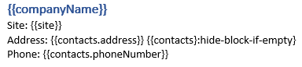

Conditionally hide blocks in DOCX templates
===========================================

There are two types of blocks for hiding: single and repeatable.
Use a `hide-block-if`_ formatter for the single blocks and a filter_ operation for the repeatable ones.
Here, we will learn how it works, but additionally, review the demo_ for such case. 

.. contents::
    :local:
    :depth: 1    

.. _hide-table-rows:

Hide table rows
---------------

Let us assume we have a collection of employees.
We want to render a table with information about them, but we want to hide employees from a specific department (``development``).

This is JSON representation of employees data:

.. code:: json

    {           
        "employees": [
            {
                "name": "Derek Clark",
                "department":"marketing"
            },
            {
                "name": "Jessica Adams",
                "department":"sales"
            },
            {
                "name": "Anil Mittal",
                "department":"development"        
            }
        ]
    }

We will use the template like this:

|table-template|

The filter_ operation should be placed before the table:

``{{nonDev = employees|filter(value.department != "development")}}``

The token ``{{nonDev}}`` does not contain the object of Anil Mittal.
He was excluded because working in the development department.
After that, the alias token can be used for rendering `table rows`_.

The result table will look like this:

|table-result|

Hide bullet list items
----------------------

We will use the same JSON data as in the example for table rows above.

Our template will look like this:

|list-template|

The filter_ operation should be placed before the list:

``{{nonDev = employees|filter(value.department != "development")}}``

The token ``{{nonDev}}`` does not contain the object of Anil Mittal.
He was excluded because working in the development department.
After that, the alias token can be used for rendering `list items`_.

The result list will look like this:

|list-result|

Hide arbitrary block
--------------------

If you want to hide arbitrary section that is not a table row or a bullet list item, we recommend you to wrap it into a table cell with invisible borders.

In this example, we will use information about a company as a source data for the template and a specific case of the formatter: `hide-block-if-empty formatter <../common-docx-xlsx/formatters.html#hhide-block-if-empty>`_.
The formatter hides parts of a document if some value or collection of values is null, empty or empty array.

This is JSON representation of company data:

.. code:: json

    {       
        "companyName": "Plumsail",    
        "site": "http://plumsail.com",
        "contacts": null    
    }

We want to display company name, site and contacts and hide contacts if they are empty. We will just wrap all text related to contacts into a table cell with transparent borders:

As you can see, we added this string to the template for contact information: :code:`{{contacts}:hide-block-if-empty}`. The :code:`hide-block-if-empty` formatter works the same way as in `the example for table rows <#hide-table-rows>`_ above.

The result will look like this:

.. image:: ../../_static/img/document-generation/hide-arbitrary-block-result.png
    :alt: hide arbitrary block result

.. _hide-block-if: ../common-docx-xlsx/formatters.html#hide
.. _filter: ../common-docx-xlsx/operations.html
.. _demo:  ./demos.html#conditionally-hide-blocks
.. _table rows: ./tables.html
.. _list items: ./lists.html

