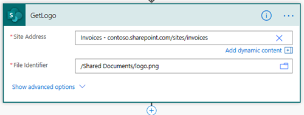

Pictures in DOCX templates
==========================

DOCX templates have multiple `value formatters <../common-docx-xlsx/formatters.html>`_. One of them is `picture formatter <../common-docx-xlsx/formatters.html#picture>`_. You can use it to dynamically insert pictures into DOCX documents. 

.. note:: :code:`picture` formatter can be used with resizing options, for example,  :code:`{{value}:picture(100,100)}` .
Also you can specify only the width parameter and height will be calculated automatically to keep the image proportions. For example, :code:`{{value}:picture(50)}` .

Let us review a few cases examples:

.. contents::
    :local:
    :depth: 1

Insert pictures from public URL
-------------------------------

The formatter accepts URLs. The URL must be publicly anonymously available (no authentication).

For the template from the picture above to work you need to use JSON object like this:

.. code-block:: json

  {                     
      "publicUrl": "https://plumsail.com/docs/documents/v1.x/_images/plumsail-logo.png"
  }

Insert pictures from Base64 string
----------------------------------

Also, the formatter supports Base64 strings as pictures. Thus, for the template from the picture above to work you will need to pass something like this:

.. code-block:: json

  {                     
      "base64String": "data:image/png;base64,iVBORw0KGgoAAAANSUhEUgAAAIoAAAAyCAYAAACDHkN8AAAACXBIWXMAAA7EAAAOxAGVKw4bAAAAB3RJTUUH5AYDDA8z7aYtxwAACOdJREFUeJztnG9sE/cZx79JuByJTVKKXajjkhSnEknAFgxthKglVdaQjgotlaq9AaSplVZ4NQl4OQ3EqxVV24uJPxLbC4I0oTCYMpgWV5Q0IwTU/JkNdgjxQZy4dpwzJJc4di7nP3vh2LNjOzn77pcSdB/JSnz3u9/z2P7e83ue584uiEajUSgorEDhj+2AwtpAEYqCKNaRNtDzVxvGBiZRsVMDQ4MOFTs2kTapQADiQhHmw5gYnsLE8BT6r4+gtrkS9UdrULa5lLRpBRkhvvQI86GU53azE+0nuvG0+wfSphVkZBWEEk7bNuMN4PbZh4pY1hDEhRLiQ1n33T77EI4eN2kXFGTgR4koydy7/BizkwHSbihIhLhQgtP8svunXH7cu2wj7YaCRIgLZdozt+KYJ3fH8ej2c9KuKEiAqFACUzyEYPYcJRlFKK82RIUy7fGLHusdmVbE8gpDVCice+VlJxlFKK8uZIUiIj9JxjsyDY/9JSFvFKRAVCgTT6ZyPsYzpAjlVYSsUIZz/9A99hcEPInhsrDoOP0ALgtLzMZawGZ24i9H/p3TMcQuCnKeOQS5hZyPExtReL8A9hmXtp1WUdAayjMeM27xgelxY3erIWe/1iosw4FWUykXYe2dTsxM5NbkJCaUieHclx0AmGWDWAiEUFy6vGssM432k//Jul9v0qL+yHboTdq8/HgdYBkOV7+8A1pN4fO2FtBqKu+5iAlFyhLi9wXx5tYNosfvPVKT+H/GG4DLwsJlYdFuYXH4YlPWCPO6w/sXFv8K4OeEV1Moo32TeR/rf5GbUOqP1qRt6zzXD7vZiY7Tvfi8rSVvX9YyepMWhy82pS09+UAkmfU9n8HU+Gzex/t985J9aDxmBICc1+LXDa2hXJabxIhElLEBr6Tj/b6gZB+Sw6zLwmbNVWxmJ+zmMTQeM2ZcorrOW8E+41L2Mz1u2L4Zw+5WA3i/gK6L1oQg9SYtDp3eC1pNgWU4dF2wJqosvUmb0c6DtiEM3HCA9wsAYh9udYMOu1qr05aLuL/xOeNj48uvzexEXXNlYvzgTQc4TwCNx43i37wMEBGKsz+/ZYdWU9j/GyPqWipXHrwCM97/R5LlEtqZiVhOE1/Pl8Iy03BZfSn7B2444LL6QKso2M1OlG0uhd6oSeRH7Se7ceDUHrSf7AaigN6oAT8nJPYlJ5Zd560YvOmA1lAOQ6sOvF+Ay8qi98oQilUUdn9anbDbcfoBmB43aBWVEJHLEhsbv6+HVlEpQuk6b4XeqMnvTUxCdqGMDUxi9PvcI4rxk3ex90gNVG+uR2j0FtZVfZK3DyzDofNcHwDAsO/tvOdZCbvZiV2t1YmzlfcLuPrlHbAMh47TvTDs06HxmDEhivYT3XBZfXDcdyc+zLhIDl9sSpmb6XHD0KBLPO+9MgSmxw29UYNDZ+qTIk0NbGYnzOf6AUAWUWRCdqHYzc6cxmu2lWPv4e147/0KRF48An/vMgo3mXKaI7lM5v0LYJlYf0VrKMeBU3tymisX9EZNSkin1RQM+3QYvOkAPyukiAQAdn9aDZfVl5Y38XMCeH9qVZIskhlvAA/ahkCrqCUiiVHXXAnWwWHwpkPul5hAVqF4n05h6M64qLFlb5Wi7uMq7PqlAcXF81iw/BGC7RKiQRYlzQdzspvcaaVVFPTG2FdD6porJZWEK1F7IH2JjNurzWA7ky+1zZWwL3ZKqxt0MOzTpUXB8cXXZ2jQZX091Q1vrx2hDPx9ZUc36tXY0VKFHR9XYX1ZMULPbiD4+AIi7EBiTIFaL9qm3qjBZ19/kJe/UilfppoQK9B4dWY3O2HrjD1odSw3iSeo8Qi0XPVCurEom1Ac99x48m32aKLZVr4okEpQ69chPPk95vvOI/S8I21sgUq8UNY6tJrCgVM/QeMxIxz33WB63GDue9B7ZQjRaKxHFBddcoK+lPhySwrZhNLf/jTjdl3dJtR8tBU7WqpQWFSA8GQf+L42CMNXM44v3FCFguIyudwSzSTDpZ2VM94AXFbfqtin1bFqpa65EizDof1ENwZvOlB/tAZvLZbTLmv2i5njhC90ytJwu332IdxL7iN57/0KHDpTj1/9aT+MB99FlO3F/HfHEPzngawiAYCiikY5XBLNO6ZYlcDc96Rs5/0COhcrCZJkihJaQznKtpQm+ip6kzZWfk8E8N0Fa8Y5HrQNEfVTckTpPNef+CIXraZQ8/OtqGnaii3bNwIAwj/chTB8FaHn/xA132oLRWt4A2WbSxO3IMTPXpvZCX5WgN6oIRZVeL8Q67UgVrloDW8kbLMMl1LqNh43of1ENwZuOMB5A3jHpEHZZhVcFhY2sxNY/PESfk4g4qskoXRfegTXf1nUNG1Fxc5NqPrpFmzQlgAAQmOdCD29ipDzX+InLFyHIt1+KS7lDK2OlZwdv++N5QdJjavPvv4Ak4sNN84bAInMaVdrNQZvONB7JTUixPslcbSGchy+1ITOr/pS/IzvO3SmHl3nLXBZfGmlthwU5PtDOnf/bIHepIHeqEFJOQ0ACLu7ERr/BuFxMyJc7qVaUcWHKGm5no87shAvs8u2qFIqDJbhiF+BZhku0f1dan8pvF8Ay0ynjZ3xBkCrKCItgbyEEhYiKKJi6U3Y+xCh0VsIj95CxD8myZniPb9Dsem3kuZQIENuS080jMhLO6JTdvBsP0LPbyEalHYBMMWZitVddhTEs6xQQqO3EZmyIfLyMSIvbYjMjJJzpPIXKNTsIja/gjSWLY8LNTsR4RwxwRAUCQCs29ZKdH4FaYjKUYSRv2Fh4CtEJeYg2SjaUo+Sg7eIzK0gD6KT2WhwEiHHNQgj1xCZkre5U9JyHUUVH8o6p4K85F71RCMQHNcQGrmGsCf7XfBioXYcB/2zs5LnUSBL3n0UAAi7vkXY24vwROyRK1TtF6Dr/5CveYVVRJJQkokucAh7ehD29CDC9iEyO4ZoMPMtkYUbt4Oq/QLU9l/LYVphFZBNKAqvN8ovVyuIQhGKgigUoSiIQhGKgigUoSiIQhGKgij+B4V7vYMAPildAAAAAElFTkSuQmCC"
  }  

Insert picture from Base64 string in Power Automate
---------------------------------------------------

A common situation is getting photos from the camera in PowerApps or pen input for signatures, converting it to Base64, and then inserting it into a docx template.
In general, you can insert any image if you can get its Base64 code in Power Automate flow or even using some third-party services.

Let's check out the next example.

We will create an invoice from the DOCX template, insert a logo, and convert the result to PDF.

The invoice template and logo reside in a SharePoint document library.

We will use two Plumsail actions in my flow: `Create DOCX from template <../../flow/actions/document-processing.html#create-docx-document-from-template>`_ and `Convert DOCX to PDF <../../flow/actions/document-processing.html#convert-docx-to-pdf>`_.

We keep the DOCX template and the Logo in a SharePoint library.

This action gets the template from the document library:

And this action gets the picture logo from the document library:

Then we use `Create DOCX from template`_ action to create an invoice from the template.

In the template we need to add the tag:

.. code::

    {{img}:picture}

to the place where we need to insert the logo.

To correctly insert the Logo to the invoice we convert the SharePoint action result into base 64 code.
To achieve this we can use next expression

.. code::

    base64(body('GetLogo'))

This is the JSON:

.. code:: json

  {
      "img":"base64(body('GetLogo'))",
      "invoiceNumber": "432",
      "company": {
          "email": "sales@sample.com",
          "address": "3 Main St.New York NY 97203 USA",
          "phone": "202-555-0131"
      },
      "date": "2018-05-21",
      "items": [
          {
              "product": {
                  "name": "Monitor",
                  "price": 99
              },
              "quantity": 10,
              "cost": 990
          },
          {
              "product": {
                  "name": "Stepler",
                  "price": 12.44
              },
              "quantity": 1000,
              "cost": 12440
          }
      ],
      "total": 18872.94
  }

On the next step, we need to use `Convert DOCX to PDF`_  action and create a file in the SharePoint library.

This is the resulting PDF with the company logo

You can download the DOCX template `here <../../_static/files/document-generation/demos/invoice-template-picture-test.docx>`_.