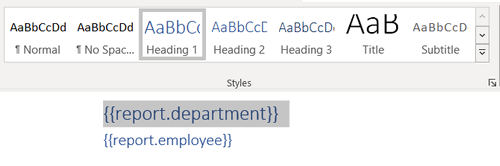
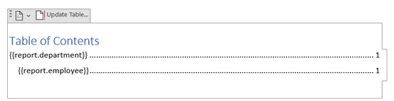
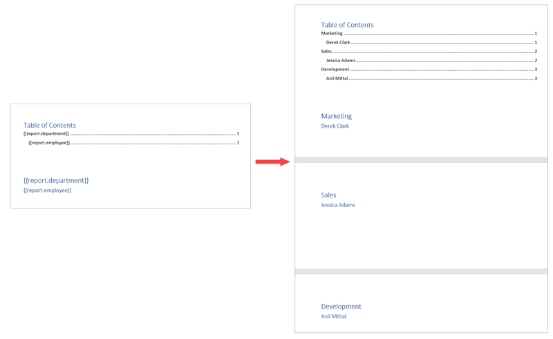
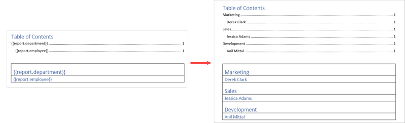
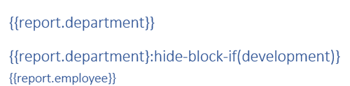
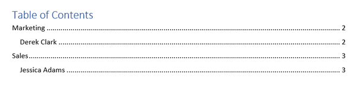
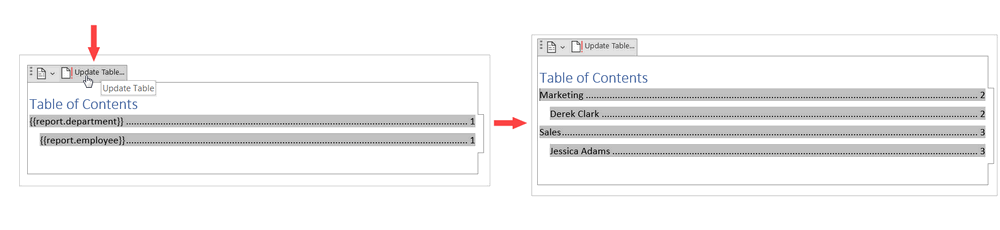

Table of contents
=================

`Plumsail Documents <https://plumsail.com/documents/>`_ DOCX templates support table of contents. It's possible to tag template tokens as headings to dynamically generate new sections of a document, or hide some of them conditionally. A table of contents will be updated accordingly. 

To better understand how it works, let's take a look at a couple of examples. 

.. contents:: 
    :local:
    :depth: 1

How it works
------------

You don't need to declare any loops. The templating engine is smart enough to understand the structure of the source object applied to your document. 
If you refer to an object property inside a collection, it understands that we need to iterate it.

Let us say you're working on a company report, and you need to dynamically create document sections for every department and its employees. JSON representation of the object is:

.. code:: json

    {
      "report": [
        {
          "department": "Marketing",
          "employee": "Derek Clark"
        },
        {
          "department": "Sales",
          "employee": "Jessica Adams"
        },
        {
          "department": "Development",
          "employee": "Anil Mittal"
        }
      ]
    }

Tokens in the template will look like this:

:code:`{{report.department}} {{report.employee}}`

Just tag them as H1 and H2:

Add a table of contents:

The template on the left side will result in the document on the right side:

To start the first section on the separate page, just add a page break under the table of contents in the template.

To avoid appearing sections on separate pages, you can place the tokens inside the table. You can use invisible borders. We kept them for the picture to show how it works:

Conditionally hide sections
---------------------------

You can use `hide-block-if formatter <./conditionally-hide-blocks.html>`_ to hide entire sections based on a particular condition. A table of contents will get updated accordingly. 

For instance, you'd like to hide sections on the development department and not include them in the table of contents.

To achieve that, add :code:`{{report.department}:hide-block-if(development)}` to the main token and tag as H1:

As a result, the entire section for the development department will be hidden and not reflected in the table of contents:

.. note:: You may need to update the table of content in the resulting document manually. Just select your TOC and click on *Update table*.

