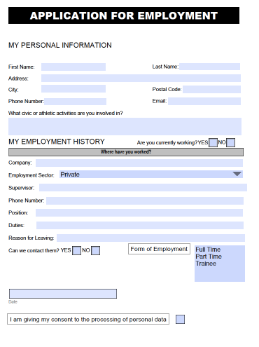

Create fillable PDF
===================

You can use `Nitro Pro <https://www.gonitro.com/nps/pro/create-pdf-creator>`_ or some other PDF editors to create your own PDF file with a form. This article describes how to create a fillable PDF using Nitro Pro.

First, we need to create a new PDF file:

Then we need to add text which will indicate a field name (click on Type Text in Home section):

.. image:: ../../_static/img/document-generation/fill-in-pdf-form-nitro-add-text.png
    :alt: Nitro Pro add text

After that, we should add a field to our PDF file (Forms section):

.. image:: ../../_static/img/document-generation/fill-in-pdf-form-nitro-add-field.png
    :alt: Nitro Pro add field

Finally, we should specify this field's name which we could use later on in the action (click on the field -> Properties section):

`Download the example of fillable PDF <../../_static/files/document-generation/demos/fill-in-pdf-form-template.pdf>`_ for this article.

