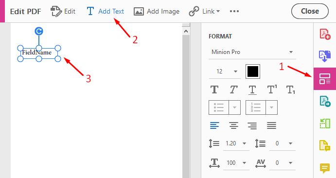
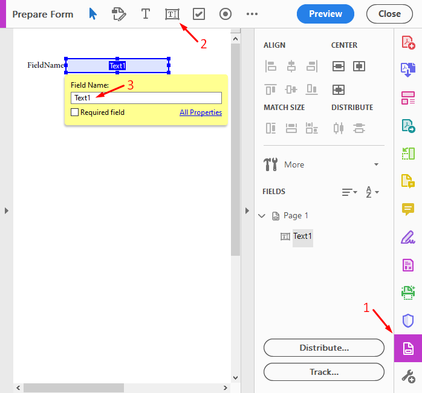

Create fillable PDF
===================

You can populate fillable PDF forms using Plumsail Documents. There are at least two ways to do this:

- `Create a process <../../user-guide/processes/index.html>`_ and start it using Power Automate (Microsoft Flow), Web form or REST API
- Or `use rich REST API directly <../../getting-started/use-as-rest-api.html>`_

You can use `Adobe Acrobat Pro <https://acrobat.adobe.com/us/en/acrobat/acrobat-pro.html>`_ or any other 
PDF editor to work with your PDF file. This article describes how to create a fillable PDF 
using Acrobat Pro. Alternatively, please see `this instruction <nitro.html>`_ to create a fillable 
PDF with Nitro Pro

.. contents::
    :local:
    :depth: 1

Create new PDF file
-------------------

First, we need to create a new blank PDF file.
Click on **Create PDF** button in the menu and choose **Blank page**.

.. image:: ../../_static/img/document-generation/fill-in-pdf-form-acrobat-new.png
    :alt: Acrobat new

We need to add text which will indicate a field title on our form (click on **Edit Pdf** and then **Add Text** in the menu):

Create form fields
------------------
After that, we should add fields to our PDF file (**Prepare Form** button in the menu).
We should specify the field's name. Later you will want to automatically populate values to this form. That is why it is important 
to assign the correct field name. When populating the form you will submit some object with values. 
The field name has to match property names in this object. 

For example, you have a field with the name "Text1". In this case, you will need to submit an object with 
the structure like this to fill this field:

.. code:: json

    {
      "Text1": "Some value"
    }

Click on the field -> Properties section to change field name:

Create checkbox field
---------------------

You can add and edit specific fields like **checkboxes** and **radio buttons** the same way. 
To check a box, you'll need to submit an object with a **true** or **false** value. Use the following structure:

.. code:: json

    {
      "Checkbox1": true
    }

Create group of checkboxes
--------------------------

The **checkbox group** allows selecting only one option in it, i.e. works like radio buttons.
To create the one, add several checkboxes with the same name.
They will be displayed in the list of fields with their indexes after the hash character.

For each checkbox from the group, set a different **export value** in properties and submit it as a string to check the accordant box.

.. code:: json

    {
      "Checkbox1": "0"
    }

Create radio-button field
-------------------------

To choose a **radio button**, you'll need to create a **radio-button group** in your pdf. To do this, 
just give the same **Name** to several radio-button fields and a group will be created automatically. 
Then you need to specify the "Radio Button Choice" field for each option of the radio-button group.
This is the value you need to submit to check the radio button. Please note that you can style radio buttons 
as checkboxes for a better "paper-like" visualization:

.. image:: ../../_static/img/document-generation/fill-in-pdf-style-radio button.png
    :alt: Style radio buttons

Example
--------

`Download the example of a fillable PDF <../../_static/files/document-generation/demos/fill-in-pdf-form-template.pdf>`_ for this article.

.. image:: ../../_static/img/document-generation/fill-in-pdf-form-template.png
    :alt: Fillable PDF example

Here is the example of the data object that could be used for populating this form:

.. code:: json

  {
  	"FirstName": "David",
  	"LastName": "Navarro",
  	"Address": "3 Main St.",
  	"City": "New York",
  	"PostalCode": "972013",
  	"PhoneNumber": "202-555-0131",
  	"Email": "david@sample.com",
  	"Activities": "Sports: football, basketball, volleyball",
  	"CurrentlyWorking": "No",
  	"HistoryCompany": "Acme Corp",
  	"HistoryEmploymentSector": "Public",
  	"HistorySupervisor": "Derek Clark",
  	"HistoryPhoneNumber": "555-777-9999",
  	"HistoryPosition": "Marketing director",
  	"HistoryDuties": "Developing marketing strategy",
  	"HistoryLeaving": "Moving to another city",
  	"HistoryContact": "Yes",
  	"HistoryEmploymentForm": "Trainee",
  	"Date": "06/30/2019", 
  	"PersonalDataConsent" : false
  }

Use cases
---------
Please review examples to learn how to set up an automatically Fillable pdf:

- Using `Microsoft PowerAutomate <https://plumsail.com/docs/documents/v1.x/flow/how-tos/documents/fill-pdf-form.html>`_
- Using `Plumsail Processes <https://plumsail.com/docs/documents/v1.x/user-guide/processes/examples/fill-pdf-form-processes.html>`_
