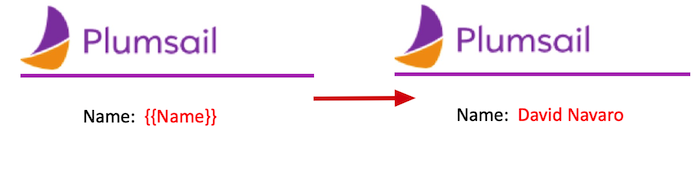
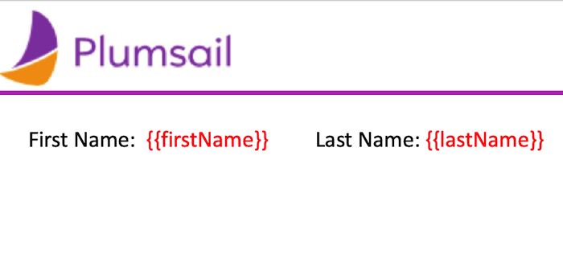

How PowerPoint PPTX templates work
==================================

PowerPoint PPTX templates in Plumsail Documents uses a minimal amount of syntax to make your work done. 
Plumsail Documents analyses your presentation templates and locates the tags within the document. 
Let us start with basics and move to more advanced scenarios.

First of all, pick how you will apply templates:

- `Create a process <../../user-guide/processes/index.html>`_ and start it using Power Automate (Microsoft Flow), Web form or REST API
- Or `use rich REST API directly <../../getting-started/use-as-rest-api.html>`_

Basic syntax
------------

Let's start with the simple data object that we want to apply to our presentation.

JSON representation of the object:

.. code:: json

    {
        "name": "David Navarro"
    }

We aim for inserting the name in a single presentation. 
Do do this, we need to surround the property ("name") with "{{}}" braces. 
The template is on the left side, the result is on the right side:

Add slides
----------

To create slides, you just need to pass a collection of objects. There's no need to declare any loops. 
The templating engine is smart enough to understand the structure of source object applied to your document.
Thus, if you refer a property of an object inside a collection, 
it understands that we need to iterate it.
In this example, we'll use a collections of names to create a series of slides for each person:

.. code:: json

    [
        {        
            "firstName": "Efren",
            "lastName": "Gaskill"
        }, {        
            "firstName": "Sanly",
            "lastName": "Keyme"            
        }, {        
            "firstName": "Mark",
            "lastName": "Nigma"            
        }        
    ]

Here's the template:

As a result, three slides were populated with data: 

.. image:: ../../_static/img/document-generation/pptx-template-simple-slide-dublicate-result.png
   :width: 600
   :alt: PowerPoint slide dublicate result

Make sure that you **do not** place your tags inside of a list or a table to create one more slide. 
If the tags are placed inside of a list or a table, a list item or a table row would be added instead (see below).

Please review `Slides <./slides.html>`_ for a more detailed explanation.

Simple lists and tables
-----------------------

Just place a tag inside a list item to 
As with slides, you don't need to declare any loops.  

We'll use the collection of names from the previous example. JSON representation of the object:

.. code:: json

    [
        {        
            "firstName": "Efren",
            "lastName": "Gaskill"
        }, {        
            "firstName": "Sanly",
            "lastName": "Keyme"            
        }, {        
            "firstName": "Mark",
            "lastName": "Nigma"            
        }        
    ]

The template on the left side will result in the slide on the right side:

Review `Lists <./lists.html>`_ for more advances scenarios.

The same approach works for tables:

.. image:: ../../_static/img/document-generation/simple-table-template-result.png
   :alt: Simple table template

Review `Tables <./tables.html>`_ for more complex scenarios.

Advanced scenarios
------------------

Now, when you know how to create basic templates, it is time to review more advanced scenarios:
                              
- `Slides <slides.html>`_
- `Lists <lists.html>`_
- `Notes <notes.html>`_
- `Tables <tables.html>`_
- `Loops and nesting <loops-and-nesting.html>`_
- `Conditionally hide blocks <conditionally-hide-blocks.html>`_
- `Value formatters <../common-docx-xlsx/formatters.html>`_