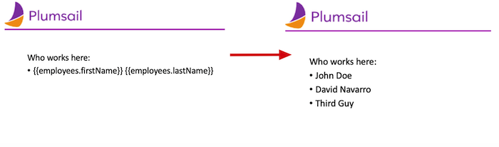
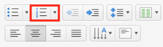

Lists in PPTX templates
=======================

.. contents:: Content
    :local:
    :depth: 1

.. _bullet:
.. _numbered-lists:
.. _multilevel-lists:

You can create all types of structured lists in your PowerPoint template. 
You don't need to declare any loops, the templating engine is smart enough to 
understand the structure of source object applied to your document. 
Thus, if you refer to a property of an object inside a collection, it understands 
that it needs to iterate it.

.. 

Bullet lists
------------

To create a list of employees, you can use a collection of objects:

.. code:: json

    [
        {
            "firstName": "Efren",
            "lastName": "Gaskill"
        }, {
            "firstName": "Sanly",
            "lastName": "Keyme"
        }, {
            "firstName": "Mark",
            "lastName": "Nigma"
        }
    ]

To create a simple bullet-list, you need to insert the tags in the bullet-list item:
:code:`{{firstName}} {{lastName}}`
When you create a slide, usually a bullet-item is selecte automatically. 
To select it manually, put a cursor on the line with the tags and click on 
the **Bullets** button on the ribbon:

The template on the left side will result in the slide on the right side:

Numbered lists
--------------

Numbered lists are created similarly, the only difference is that you need to chose the numbered list
on the ribbon in the PowerPoint template.
We'll use the same object with employees list:

.. code:: json

    [
        {
            "firstName": "Efren",
            "lastName": "Gaskill"
        }, {
            "firstName": "Sanly",
            "lastName": "Keyme"
        }, {
            "firstName": "Mark",
            "lastName": "Nigma"
        }
    ]

Select the line with the tags and change it into a numbered list by clicking the **Numbering** button:

Multilevel lists
----------------
Common use case for lists is pairing it with deep nesting.
You can create nested multilevel lists for complex nested objects using the template syntax. 
Let's take a look at the following object:

.. code:: json

  [ 
    {
	"title": "Romeo and Juliet",
	"characters": [{
		"name": "Romeo",
		"actions": [{
			"description": "Falls in love with Juliet"
			},
			{
			"description": "Kills Tybalt"
			},
			{
			"description": "Kills himself"
			}
		]
		},
		{
		"name": "Juliet",
		"actions": [{
			"description": "Falls in love with Romeo"
			},
			{
			"description": "Kills herself"
			}
		]
		},
		{
		"name": "Tybalt",
		"actions": [{
			"description": "Dies"
		}]
	  }
	]},
	{
	"title": "Hamlet",
	"characters": [{
		"name": "Hamlet, prince of Danemark",
		"actions": [{
			"description": "Gets upset over the death of his father"
			},
			{
			"description": "Kills his fiancee's husband"
			},
			{
			"description": "Kills his fiancee's brother"
			},
			{
			"description": "Kills his uncle"
			},
			{
			"description": "Gets killed himself and dies"
			}
		]}
    ]}
  ]

This is a collection of books by Shakespear. Each book has a collection of characters.

The source template for this structure will look like this:

You can refer a property inside a collection and a property inside collection nested in another collection.

Tags:

- The :code:`{{charactes}}` and :code:`{{characters.actions}}` tags let the engine know that we want to render the list of countries and its population.
- The :code:`{{citcharacters.name}}` tag lets the engine know that we want to render the list of character names in a book.
- The :code:`{{characters.actions.description}}` tag lets the engine know that we want to list what the character does.

You can learn more about `loops and nesting <./loops-and-nesting.html>`_ in other sections of the documentation.

To create the template turn the lines with the tags into a multilevel list using **Multilevel List** button:

.. image:: ../../_static/img/document-generation/multilevel-button.png
    :alt: Multilevel List button

This template will result in the the following slide:

.. image:: ../../_static/img/document-generation/pptx-multilevel-list-template-result.png
    :alt: Multilevel list template
