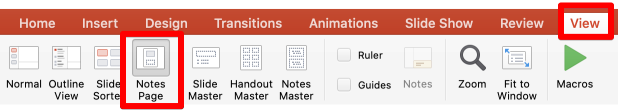
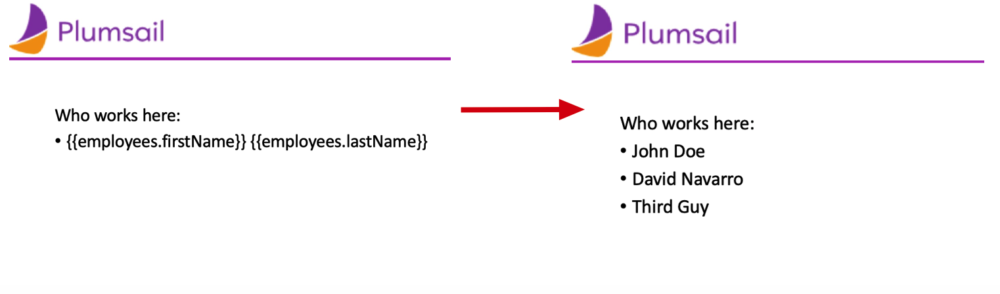

Notes in PPTX templates
=======================

Each slide can have notes attached to it. Notes are used to provide contextual information for a slide
and have reduced feature set. If tag is detected within a list inside notes, resizing will only
affect the specific list, while otherwise resize will affect the entire slide.
To open the presentation notes in PowerPoint, click on **View** -> **Notes**:

You add the tags in the notes the same way as in the text fields:

