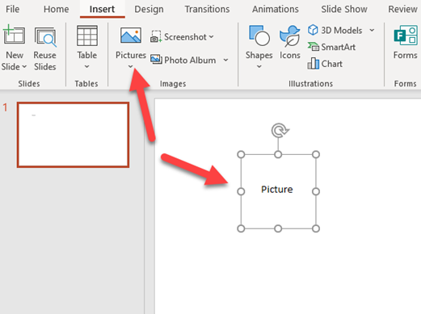
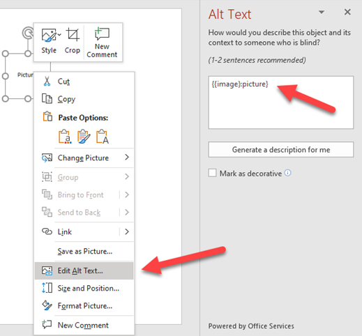
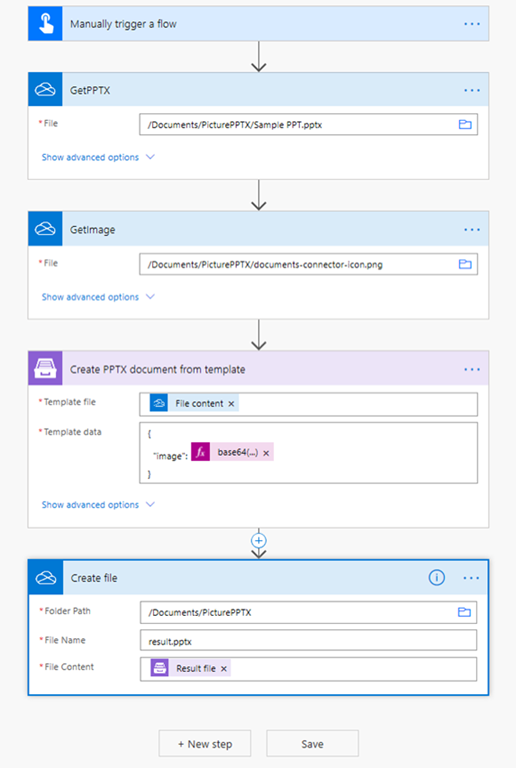
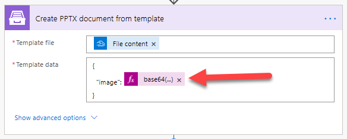
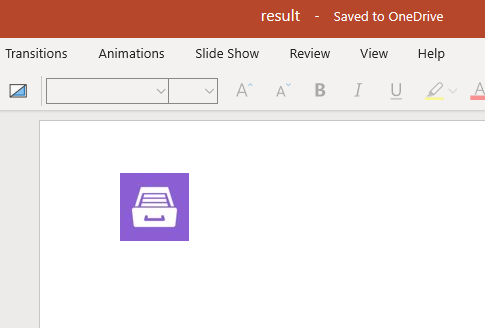

Pictures in PPTX templates
==========================

You can use `picture formatter <../common-docx-xlsx/formatters.html#picture>`_ to dynamically insert pictures into PPTX documents. 

.. contents::
    :local:
    :depth: 1

Prepare PPTX template
-------------------------------

There are some steps you need to do to use the piсture tag. Let's take a look.

Firstly, I insert a dummy picture to the template.

Then I place the picture tag into AltText section of the dummy image.

.. code::

    {{image}:picture}

.. note:: Resizing of the image is not supported for PPTX templates yet.

After I run the Microsoft flow, the dummy picture will be replaced with a real one.

Insert pictures from public URL
-------------------------------

.. image:: ../../_static/img/document-generation/public-url-to-picture.png
   :alt: Library

The formatter accepts URLs. The URL must be publicly anonymously available (no authentication).

For the template from the picture above to work you need to use JSON object like this:

.. code-block:: json

  {                     
      "publicUrl": "https://plumsail.com/docs/documents/v1.x/_images/plumsail-logo.png"
  }

Insert pictures from Base64 string
----------------------------------

.. image:: ../../_static/img/document-generation/base64-to-picture.png
   :alt: Library

Also, the formatter supports Base64 strings as pictures. Thus, for the template from the picture above to work you will need to pass something like this:

.. code-block:: json

  {                     
      "base64String": "data:image/png;base64,iVBORw0KGgoAAAANSUhEUgAAAIoAAAAyCAYAAACDHkN8AAAACXBIWXMAAA7EAAAOxAGVKw4bAAAAB3RJTUUH5AYDDA8z7aYtxwAACOdJREFUeJztnG9sE/cZx79JuByJTVKKXajjkhSnEknAFgxthKglVdaQjgotlaq9AaSplVZ4NQl4OQ3EqxVV24uJPxLbC4I0oTCYMpgWV5Q0IwTU/JkNdgjxQZy4dpwzJJc4di7nP3vh2LNjOzn77pcSdB/JSnz3u9/z2P7e83ue584uiEajUSgorEDhj+2AwtpAEYqCKNaRNtDzVxvGBiZRsVMDQ4MOFTs2kTapQADiQhHmw5gYnsLE8BT6r4+gtrkS9UdrULa5lLRpBRkhvvQI86GU53azE+0nuvG0+wfSphVkZBWEEk7bNuMN4PbZh4pY1hDEhRLiQ1n33T77EI4eN2kXFGTgR4koydy7/BizkwHSbihIhLhQgtP8svunXH7cu2wj7YaCRIgLZdozt+KYJ3fH8ej2c9KuKEiAqFACUzyEYPYcJRlFKK82RIUy7fGLHusdmVbE8gpDVCice+VlJxlFKK8uZIUiIj9JxjsyDY/9JSFvFKRAVCgTT6ZyPsYzpAjlVYSsUIZz/9A99hcEPInhsrDoOP0ALgtLzMZawGZ24i9H/p3TMcQuCnKeOQS5hZyPExtReL8A9hmXtp1WUdAayjMeM27xgelxY3erIWe/1iosw4FWUykXYe2dTsxM5NbkJCaUieHclx0AmGWDWAiEUFy6vGssM432k//Jul9v0qL+yHboTdq8/HgdYBkOV7+8A1pN4fO2FtBqKu+5iAlFyhLi9wXx5tYNosfvPVKT+H/GG4DLwsJlYdFuYXH4YlPWCPO6w/sXFv8K4OeEV1Moo32TeR/rf5GbUOqP1qRt6zzXD7vZiY7Tvfi8rSVvX9YyepMWhy82pS09+UAkmfU9n8HU+Gzex/t985J9aDxmBICc1+LXDa2hXJabxIhElLEBr6Tj/b6gZB+Sw6zLwmbNVWxmJ+zmMTQeM2ZcorrOW8E+41L2Mz1u2L4Zw+5WA3i/gK6L1oQg9SYtDp3eC1pNgWU4dF2wJqosvUmb0c6DtiEM3HCA9wsAYh9udYMOu1qr05aLuL/xOeNj48uvzexEXXNlYvzgTQc4TwCNx43i37wMEBGKsz+/ZYdWU9j/GyPqWipXHrwCM97/R5LlEtqZiVhOE1/Pl8Iy03BZfSn7B2444LL6QKso2M1OlG0uhd6oSeRH7Se7ceDUHrSf7AaigN6oAT8nJPYlJ5Zd560YvOmA1lAOQ6sOvF+Ay8qi98oQilUUdn9anbDbcfoBmB43aBWVEJHLEhsbv6+HVlEpQuk6b4XeqMnvTUxCdqGMDUxi9PvcI4rxk3ex90gNVG+uR2j0FtZVfZK3DyzDofNcHwDAsO/tvOdZCbvZiV2t1YmzlfcLuPrlHbAMh47TvTDs06HxmDEhivYT3XBZfXDcdyc+zLhIDl9sSpmb6XHD0KBLPO+9MgSmxw29UYNDZ+qTIk0NbGYnzOf6AUAWUWRCdqHYzc6cxmu2lWPv4e147/0KRF48An/vMgo3mXKaI7lM5v0LYJlYf0VrKMeBU3tymisX9EZNSkin1RQM+3QYvOkAPyukiAQAdn9aDZfVl5Y38XMCeH9qVZIskhlvAA/ahkCrqCUiiVHXXAnWwWHwpkPul5hAVqF4n05h6M64qLFlb5Wi7uMq7PqlAcXF81iw/BGC7RKiQRYlzQdzspvcaaVVFPTG2FdD6porJZWEK1F7IH2JjNurzWA7ky+1zZWwL3ZKqxt0MOzTpUXB8cXXZ2jQZX091Q1vrx2hDPx9ZUc36tXY0VKFHR9XYX1ZMULPbiD4+AIi7EBiTIFaL9qm3qjBZ19/kJe/UilfppoQK9B4dWY3O2HrjD1odSw3iSeo8Qi0XPVCurEom1Ac99x48m32aKLZVr4okEpQ69chPPk95vvOI/S8I21sgUq8UNY6tJrCgVM/QeMxIxz33WB63GDue9B7ZQjRaKxHFBddcoK+lPhySwrZhNLf/jTjdl3dJtR8tBU7WqpQWFSA8GQf+L42CMNXM44v3FCFguIyudwSzSTDpZ2VM94AXFbfqtin1bFqpa65EizDof1ENwZvOlB/tAZvLZbTLmv2i5njhC90ytJwu332IdxL7iN57/0KHDpTj1/9aT+MB99FlO3F/HfHEPzngawiAYCiikY5XBLNO6ZYlcDc96Rs5/0COhcrCZJkihJaQznKtpQm+ip6kzZWfk8E8N0Fa8Y5HrQNEfVTckTpPNef+CIXraZQ8/OtqGnaii3bNwIAwj/chTB8FaHn/xA132oLRWt4A2WbSxO3IMTPXpvZCX5WgN6oIRZVeL8Q67UgVrloDW8kbLMMl1LqNh43of1ENwZuOMB5A3jHpEHZZhVcFhY2sxNY/PESfk4g4qskoXRfegTXf1nUNG1Fxc5NqPrpFmzQlgAAQmOdCD29ipDzX+InLFyHIt1+KS7lDK2OlZwdv++N5QdJjavPvv4Ak4sNN84bAInMaVdrNQZvONB7JTUixPslcbSGchy+1ITOr/pS/IzvO3SmHl3nLXBZfGmlthwU5PtDOnf/bIHepIHeqEFJOQ0ACLu7ERr/BuFxMyJc7qVaUcWHKGm5no87shAvs8u2qFIqDJbhiF+BZhku0f1dan8pvF8Ay0ynjZ3xBkCrKCItgbyEEhYiKKJi6U3Y+xCh0VsIj95CxD8myZniPb9Dsem3kuZQIENuS080jMhLO6JTdvBsP0LPbyEalHYBMMWZitVddhTEs6xQQqO3EZmyIfLyMSIvbYjMjJJzpPIXKNTsIja/gjSWLY8LNTsR4RwxwRAUCQCs29ZKdH4FaYjKUYSRv2Fh4CtEJeYg2SjaUo+Sg7eIzK0gD6KT2WhwEiHHNQgj1xCZkre5U9JyHUUVH8o6p4K85F71RCMQHNcQGrmGsCf7XfBioXYcB/2zs5LnUSBL3n0UAAi7vkXY24vwROyRK1TtF6Dr/5CveYVVRJJQkokucAh7ehD29CDC9iEyO4ZoMPMtkYUbt4Oq/QLU9l/LYVphFZBNKAqvN8ovVyuIQhGKgigUoSiIQhGKgigUoSiIQhGKgij+B4V7vYMAPildAAAAAElFTkSuQmCC"
  }  

Insert picture from Base64 string in Power Automate
---------------------------------------------------

You can insert any image if you can get its Base64 code in Power Automate flow or even using some third-party services.

Let's check out the next example.

I download the PPTX template and the Image from OneDrive folder. The PPTX template was prepared as described in the previous part of the article.

Then I add the action `Create PPTX document from template <../../flow/actions/document-processing.html#create-pptx-document-from-template>`_ to my flow.

I use this code in the JSON  to convert the uploaded image into base64 format:

.. code::

    base64(body('GetImage'))

This is the resulting PPTX file 

You can download the PPTX template `here <../../_static/files/document-generation/demos/sample-ppt.pptx>`_.