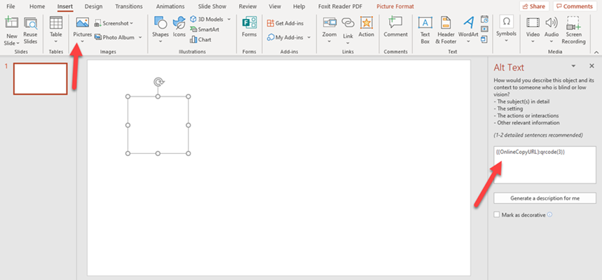
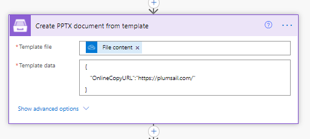
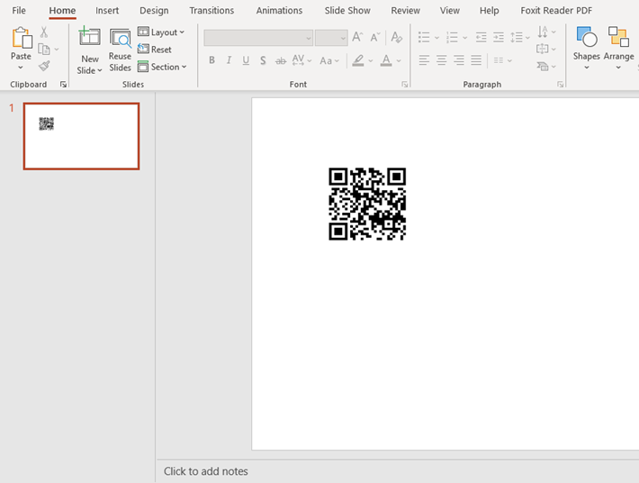

QRCodes and barcodes in PPTX templates
======================================

You can use `qrcode formatter <../common-docx-xlsx/formatters.html#qrcode>`_ or `barcode formatter <../common-docx-xlsx/formatters.html#barcode>`_ to dynamically insert the codes into PPTX documents. 

There are some steps you need to do to use the codes tags. I'll show an example with QRcode; the same steps work for Barcode formatter. Let's take a look.

It will not work if you just insert a tag with a QR code/barcode in the pptx templates. We need to insert a dummy picture to the template and place the qrcode tag into AltText section of the dummy image.

.. code::

    {{OnlineCopyURL}:qrcode(3)}

After I run the Microsoft flow, the dummy picture will be replaced with a qrcode.

This is how the action looks:

and the result

You can download the PPTX template `here <../../_static/files/document-generation/demos/sample-ppt-qrcode.pptx>`_.