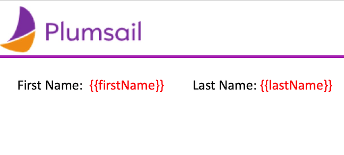
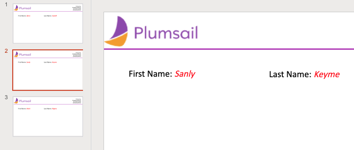
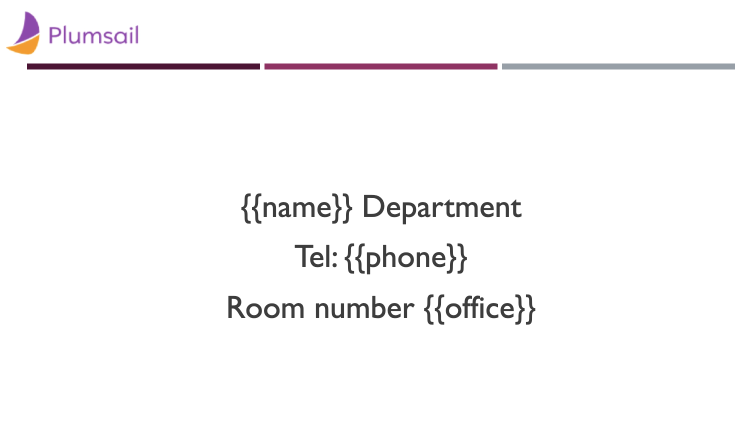
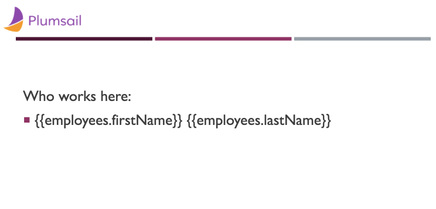

Slides in PPTX templates
=======================

.. contents:: Content
    :local:
    :depth: 1

.. _add-slides:
.. _organize-slides:

Add slides
-----------

To create slides, you just need to pass a collection of objects. There's no need to declare any loops. 
The templating engine is smart enough to understand the structure of source object applied to your document.
Thus, if you refer a property of an object inside a collection, 
it understands that we need to iterate it.
In this example, we'll use a collections of names to create a series of slides for each person:

.. code:: json

    [
        {        
            "firstName": "Efren",
            "lastName": "Gaskill"
        }, {        
            "firstName": "Sanly",
            "lastName": "Keyme"            
        }, {        
            "firstName": "Mark",
            "lastName": "Nigma"            
        }        
    ]

Here's the template:

As a result, three slides were populated with data: 

Make sure that you **do not** place your tags inside of a list or a table to create one more slide. 
If the tags are placed inside of a list or a table, a `list <./lists.html>`_ item  or a `table <./tables.html>`_ row would be added instead.

Organize slides
---------------
You can use the PPTX template to organize the slides in a speciphic order, for example, if you want your information to
be composed of groups of slides, each group representing a particular item.
For this example, we'll use an object containing information on two particular departments. Each department has
three employees. Here's the data object:

.. code:: json

    [
        {
            "name": "Sales",
            "office": "307",
            "phone": "1-234-56-78",
            "employees": [
           {        
               "firstName": "Efren",
               "lastName": "Gaskill"
            }, {        
                "firstName": "Sanly",
                "lastName": "Keyme"            
            }, {        
               "firstName": "Mark",
               "lastName": "Nigma"            
                }           
            ] 
        }, {
            "name": "Marketing",
            "office": "321",
            "phone": "1-876-54-32",
            "employees": [
           {        
               "firstName": "John",
               "lastName": "Doe"
            }, {        
                "firstName": "David",
                "lastName": "Navarro"            
            }, {        
               "firstName": "Third",
               "lastName": "Guy"            
                }           
          ] 
        }
    ]

The template consists of two slides: first one for the general Department info, 
second one with the lists of employees:

You can see that the tags :code:`{{firstName}} {{lastName}}` are put inside the bullet-list item to build 
a list of employees in the resulting document. You can find more informatino about structuring the lists
in your template in a `separate article on lists <./lists.html>`_

