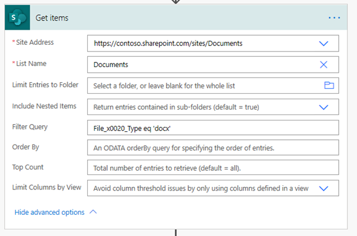
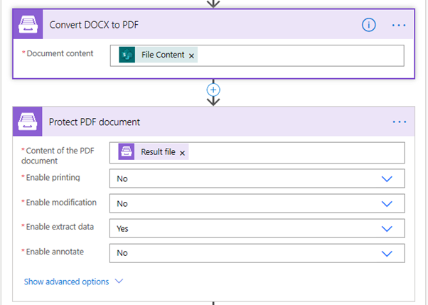

.. title:: How to batch convert Word documents to PDF using Power Automate, Azure Logic Apps, or PowerApps

.. meta::
   :description: batch convert Word documents to PDF using Power Automate (Microsoft Flow), Azure Logic Apps, or PowerApps

Batch convert Word documents to PDF using Power Automate
================================================================

This article demonstrates how to batch convert many DOCX files to PDF with the help of the `Plumsail Documents <https://plumsail.com/documents/>`_ connector for Power Automate (Microsoft Flow).
Let us say you have a SharePoint library containing Word documents. You need to pick all of them up and bulk convert to pixel-perfect PDFs.

.. contents::
    :local:
    :depth: 1

Microsoft Flow details
~~~~~~~~~~~~~~~~~~~~~~

This is the library with DOCX documents in my SharePoint tenant:

To reach the mentioned goal, I constructed this Microsoft Flow:

.. image:: ../../../_static/img/flow/how-tos/batch-convert-docx-to-pdf-flow.png
   :alt: Microsoft Flow

On the first step, I get all items from the folder with docx documents using the standard SharePoint action **Get Items**:

.. note:: I use Odata filter **File_x0020_Type eq 'docx'** to get only DOCX files from the library that could contain other formats.

Then I need to check all the items received on the first step. For this, I use **Apply to each** cycle.
I use **Get File Content** action from the standard SharePoint connector to get the file content and pass it to the Plumsail Documents action - **Convert DOCX to PDF**.

After converting, I save the new PDF to PDFs folder in my SharePoint tenant and I use the available dynamic values from the **Get Items** action to name each file. Check it out:

.. image:: ../../../_static/img/flow/how-tos/batch-convert-docx-to-pdf-apply-to-each.png
   :alt: Microsoft Flow

All the PDF results reside in a folder in my SharePoint tenant:

.. image:: ../../../_static/img/flow/how-tos/pdfs-library.png
   :alt: PDFs

You can find more detailed information about **Convert DOCX to PDF** action `here <https://plumsail.com/docs/documents/v1.x/flow/actions/document-processing.html#convert-docx-to-pdf>`_.

Protect the resulting PDF files
~~~~~~~~~~~~~~~~~~~~~~~~~~~~~~~

Additionally, you can protect the resulting PDF files using another Plumsail action `Protect PDF Document <https://plumsail.com/docs/documents/v1.x/flow/actions/document-processing.html#protect-pdf-document>`_ .

It has several options that allow you to protect the PDF  flexibly. Check it out:

Conclusion
~~~~~~~~~~

That is all, the flow is configured. These few simple steps can help to ease the work with documents.

.. hint::
  You may also be interested in `this article <https://plumsail.com/docs/documents/v1.x/flow/how-tos/documents/convert-word-to-pdf.html>`_ explaining how to convert a docx document to PDF in Power Automate (Microsoft Flow) and Azure Logic Apps.