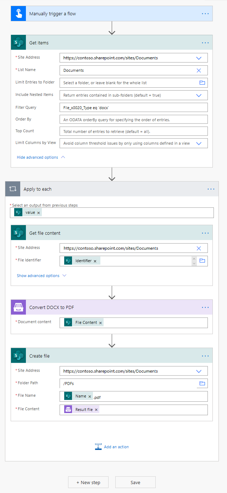

How to batch convert DOCX to PDF
==================================

This article demonstrates how to batch convert many DOCX files to PDF in Power Automate (Microsoft Flow). 

Let's say you have a folder with DOCX files and you need to batch convert them to PDF.

.. image:: ../../../_static/img/flow/how-tos/documents-library.png
   :alt: Documents

To reach the goal I constructed this Microsoft Flow

Microsoft Flow details
==================================

On the first step I get all items from the folder with docx documents using the standart SharePoint action **Get Items**

.. image:: ../../../_static/img/flow/how-tos/batch-comvert-docx-to-pdf-get-items.png
   :alt: Microsoft Flow

Then I need to check all the items received on the first step. For this, I use **Apply to each** cycle.
I use **Get File Content** action from the standard SharePoint connector to get the file content and pass it to Plumsail action **Convert DOCX to PDF**.

After converting I save the new PDF to PDFs folder in my SharePoint tenant and I use the available dynamic values from **Get Items** action to name each file. Check it out

All the PDF results reside in a folder in my SharePoint tenant.

You can find more detailed information about **Convert DOCX to PDF** action `here <https://plumsail.com/docs/documents/v1.x/flow/actions/document-processing.html#convert-docx-to-pdf>`_.

Protecting the resulting PDF files
==================================

Additionally you can protect the resulting PDF files using another Plumsail action `Protect PDF Document <https://plumsail.com/docs/documents/v1.x/flow/actions/document-processing.html#protect-pdf-document>`_
It has several options that allow you to protect the PDF  flexibly. Check it out

.. image:: ../../../_static/img/flow/how-tos/batch-convert-docx-to-pdf-protect-pdf.png
   :alt: Protect PDF action

Conclusion
----------

That is all, the flow is configured. These few simple steps can help to ease the work with documents.

.. hint::
  You may also be interested in `this article <https://plumsail.com/docs/documents/v1.x/flow/how-tos/documents/convert-word-to-pdf.html>`_ explaining how to create docx document from template in Power Automate (Microsoft Flow) and Azure Logic Apps.