.. title:: Convert Microsoft Forms with attachments to PDF in Power Automate Flow

.. meta::
   :description: Easily convert Microsoft Forms with upload file fields to PDF format. Tty Plumsail Documents connector for Power Automate Flow.

How to convert Microsoft Forms responses with attachments to PDF using Power Automate
=====================================================================================

In this article, we'll go into how to convert `Microsoft Forms <https://forms.office.com/>`_ responses containing attachments to one PDF document. We'll use the `Plumsail Documents <https://plumsail.com/documents/>`_ connector for Power Automate to do the main job.

To the joy of many clients, Microsoft Forms now provides an ability to upload files into form responses. 
The feature is still restricted as it works only for respondents within one organization. 

Let us say you have a Microsoft form with attachments fields to gather order requests submitted by a sales team. An attachment is required to be a DOCX file with customer company details. You need to merge the form responses with the attachment as a single PDF.

Here is how to achieve the goal in Power Automate Flow. 

.. contents::
    :local:
    :depth: 2

Prepare Microsoft form
~~~~~~~~~~~~~~~~~~~~~~

Before creating the Flow, let's have a look at the form we've prepared to demonstrate the case. Here is how it looks:

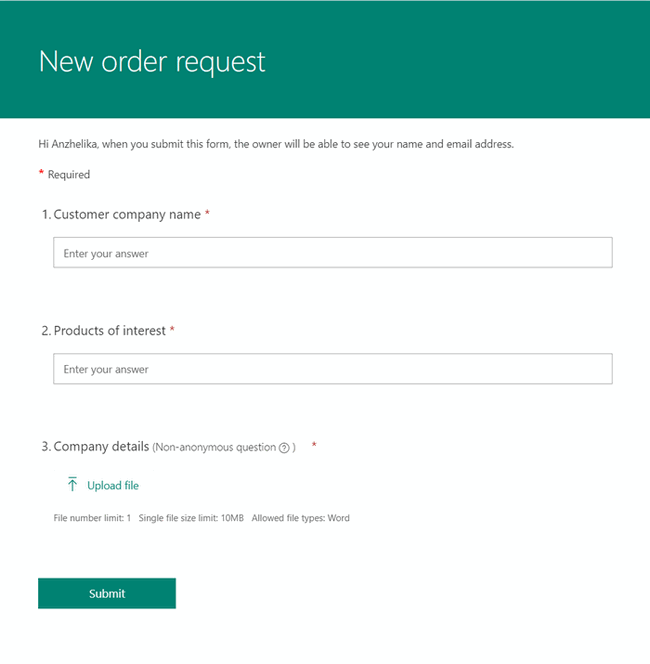

You can use this particular form for testing purposes. Use `this link to duplicate the form <https://forms.office.com/Pages/ShareFormPage.aspx?id=sw17qLgWx0qMVHqdDlcIbmR30TR_6NdLl37R-A7gviRURVJXQ0ZSSzY4WUJEQ1dVSjBPOFUzT0ZRUC4u&sharetoken=8HgHlwCBjBKojcN1oSOS>`_ in your Microsoft Forms account.

To create Microsoft Forms from scratch, follow `the instructions <https://support.office.com/en-gb/article/create-a-form-with-microsoft-forms-4ffb64cc-7d5d-402f-b82e-b1d49418fd9d>`_.

Create Flow
~~~~~~~~~~~

Here is the picture of the complete Flow, and under it, you'll find all the steps in detail.

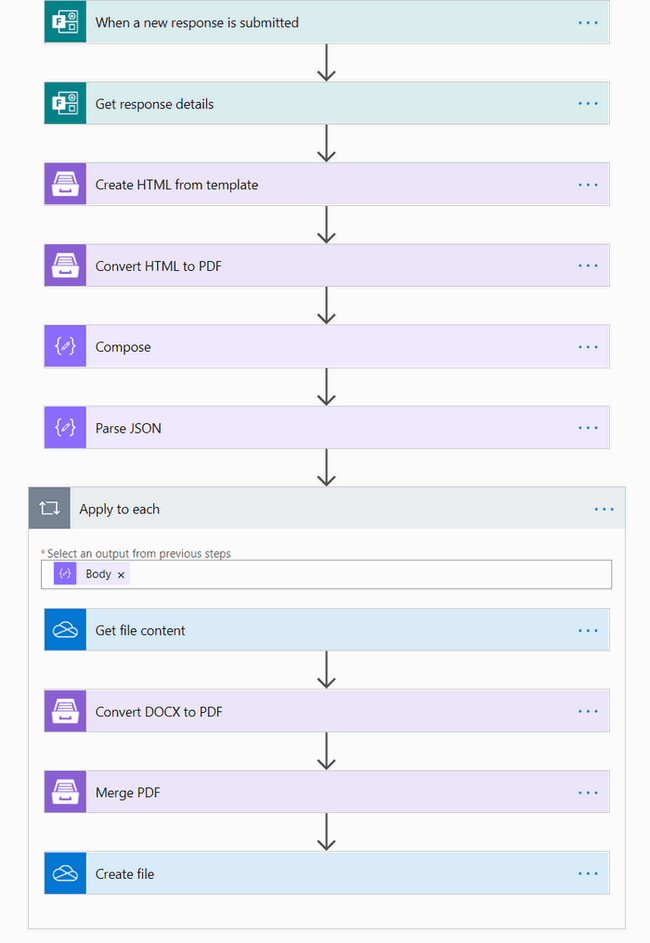

When a new response is submitted
--------------------------------

Our Flow is automated to start on a Microsoft form submission. Search for **Microsoft Forms** in Power Automate and select **When a response is submitted** as a Flow trigger.

If this is your first Flow with Microsoft Forms, on this step, sign in to your Microsoft Forms Account from Power Automate to use your forms inside Flows.

Then, pick the form to track from the dropdown.

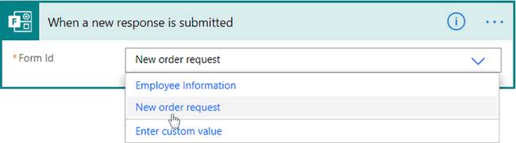

Get response details
--------------------

To use the submitted data further in the Flow, add this action - **Get response details** - from the Microsoft Forms connector. 

For the Form Id, select the same form as in the trigger. For the Response Id, select List of response notifications - Response Id in the Dynamic content menu on the right:

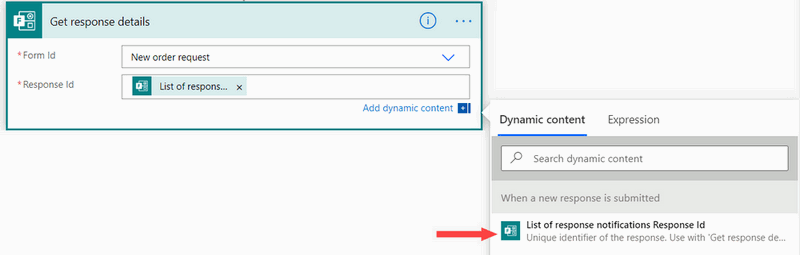

Create HTML from template
-------------------------

We need to create 2 PDFs: One is from the attachment data, the second - from other fields.

We'll start from the non-attachment fields. First, we'll create HTML, and in the next action will convert it to PDF. 
We'll use actions both from the `Plumsail Documents connector <https://emea.flow.microsoft.com/en-us/connectors/shared_plumsail/plumsail-documents/>`_.

The first is **Create HTML from template**. In our case, it's simple.

In Source HTML, we just added text HTML template for our order request - Customer company name and Products of interest. You may see :code:`{{curly}}` braces - they represent tokens that will be replaced by the response data:

.. code:: text

    <h1>Order Request</h1>
    Customer company name: {{company}} 
    Products of interest: {{products}} 

.. note:: Please, get acquainted with `how Plumsail Documents HTML templates work <../../../document-generation/html/index.html>`_ to compose your customized templates.

In Template data, we used Dynamic content from the previous step to specify values with the submitted form data.

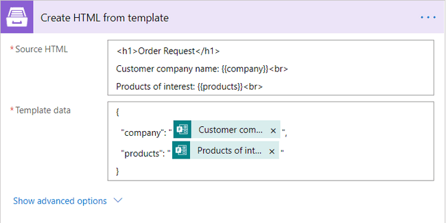

Convert HTML to PDF
-------------------

This action is from the Plumsail connector as well. It converts HTML we've composed on the previous step to PDF. 

Put :code:`Result HTML` - the output of Create HTML from template - into Source HTML:

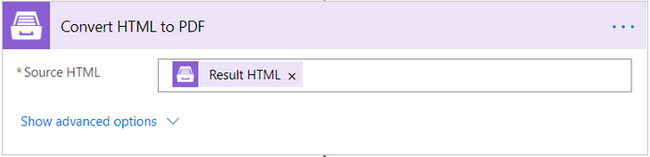

Now, that we have text questions converted to PDF, it's time to move to attachments.

Compose
-------

This action is needed to get the sample JSON payload for the next action - **Parse JSON**. 
Place the output representing the attachment into Inputs. 

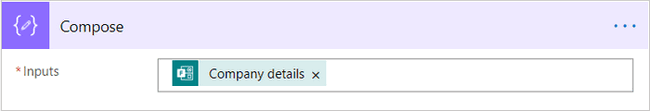

You can delete this action from the Flow once you've got the sample payload.

To get it, you need to run the Flow. For that, submit the Microsoft Form with attachments. 

After it ran successfully, copy *Outputs*:

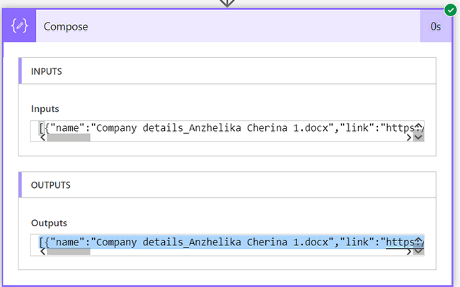

Parse JSON
----------

Add the **Parse JSON** action next. It has two parameters:

- Content. Place the attachment output from the *Get response details*.
- Schema. Click *Generate from sample* and paste there the Outputs that you've copied previously. 

You should receive the schema like this one:

.. code:: json 

    {
        "type": "array",
        "items": {
            "type": "object",
            "properties": {
                "name": {
                    "type": "string"
                },
                "link": {
                    "type": "string"
                },
                "id": {
                    "type": "string"
                },
                "type": {},
                "size": {
                    "type": "integer"
                },
                "referenceId": {
                    "type": "string"
                },
                "driveId": {
                    "type": "string"
                },
                "status": {
                    "type": "integer"
                },
                "uploadSessionUrl": {}
            },
            "required": [
                "name",
                "link",
                "id",
                "type",
                "size",
                "referenceId",
                "driveId",
                "status",
                "uploadSessionUrl"
            ]
        }
    }

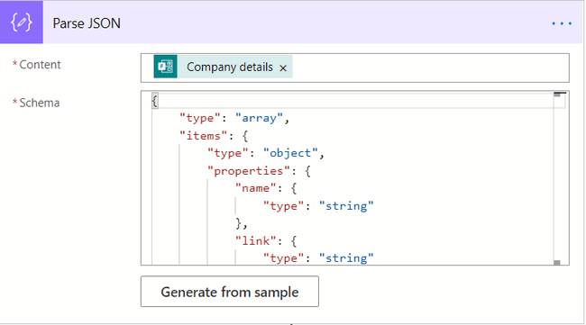

Get file content
----------------

The next step is to get the attachments content for its further conversion to PDF. This is the action from the *OneDrive for Business* connector. 

Add :code:`id` output from the *Parse JSON* action. 'Apply to each' loop will automatically appear:

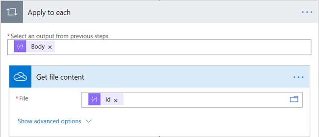

Convert DOCX to PDF
-------------------

One more action from the Plumsail Documents connector. It will convert our DOCX Word attachment to PDF. 

For Document content, insert :code:`File content` output of the previous step.

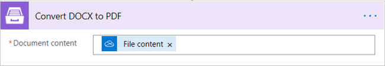

Merge PDF
---------

Now we need to merge the PDF file made from text fields responses into the PDF made from the attachments. We'll do that with the `Merge PDF <../../actions/document-processing.html#merge-pdf>`_. 

Add outputs from *Convert HTML to PDF* and *Convert DOCX to PDF* actions to Content of PDF documents fields:

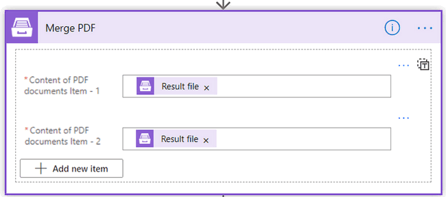

Create file
-----------

This is the last action of our Flow. We'll save the result merged PDF to the OneDrive folder. You can save the result file to any other storage system or, for example, send an email with the file attached.

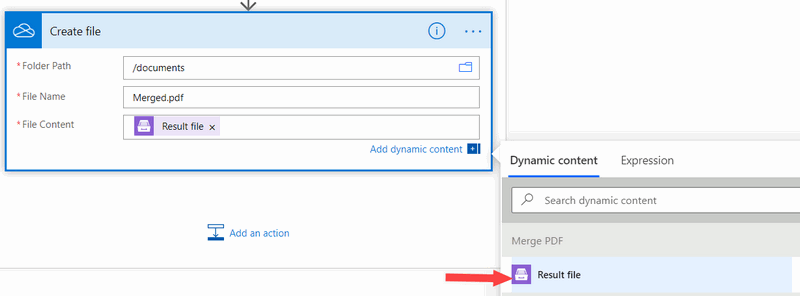

*Note*: Don't forget to put the file extension in the file name.

Conclusion
~~~~~~~~~~

That's it. The Flow is ready, it may seem a bit long, but nothing fancy there - all the steps are simple to understand and configure. 

As a result, you'll get the Microsoft form, including attachments, converted to one PDF file. 

.. hint:: You can combine the approch described in the articles `Create Word and PDF documents from Microsoft Forms <../../../user-guide/processes/examples/create-word-and-pdf-documents-from-microsoft-forms.html>`_ and `Create Excel and PDF documents from Microsoft Forms <../../../user-guide/processes/examples/create-excel-and-pdf-documents-from-microsoft-forms.html>`_ with this one to implement more complex scenarios.

