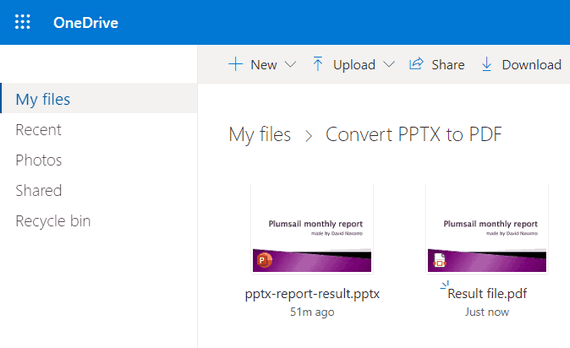

.. title:: Convert PPTX to PDF using Power Automate (Microsoft Flow)

.. meta::
   :description: Automatically convert PowerPoint presentations to PDF using Power Automate and Azure Logic Apps

Convert PPTX to PDF in Power Automate (Microsoft Flow) and Azure Logic Apps
===========================================================================

From this article, you will learn how to convert PPTX PowerPoint documents to PDF format and receive the pixel-perfect output as a result of this conversion. To achieve the aim, we'll use the `Plumsail Documents <https://plumsail.com/documents>`_ connector for `Power Automate <https://flow.microsoft.com>`_.

We'll take a company report as a sample PPTX file:

Use `this link <../../../_static/files/document-generation/demos/pptx-report-result.pptx>`_ to download it.

The document has to be stored somewhere. Power Automate (Microsoft Flow) has a lot of connectors for various systems. Here are just a few of them:

- SharePoint
- Salesforce
- Box
- OneDrive
- Google Drive
- Dropbox
- SFTP
- File System

You can store your source file anywhere. In this example, we will store our document in OneDrive. Our Flow will get a file from OneDrive, convert it to PDF, and store generated file back to OneDrive. 

This is how the Flow looks:

Below is a step-by-step description for the Flow.

**Flow trigger**

You can actually pick any trigger. We use "Manually trigger a flow" trigger here to simplify the Flow.

**Get file content**

This action gets the file content of the specified file from the OneDrive folder.

You can use any other connector to get files from your system.

**Convert XLSX to PDF**

This is an action from `Plumsail Documents connector <https://emea.flow.microsoft.com/en-us/connectors/shared_plumsail/plumsail-documents/>`_. It will convert our PowerPoint presentation, and we'll receive the pixel-perfect PDF output. 

Just put PPTX file content from the output of the previous action and receive PDF file content as an output of this action.

You can find more information about this action `here <../../actions/document-processing.html#convert-pptx-to-pdf>`_.

**Create file**

Now you need to store the resulting PDF somewhere. In our example, we use "Create file" action from the OneDrive connector to store the PDF document. 

You can use any other connector to store PDF documents into your system.

.. hint:: You may like the article `How to create PowerPoint presentations from a template <../../../user-guide/processes/examples/create-pptx-from-template-processes.html>`_.