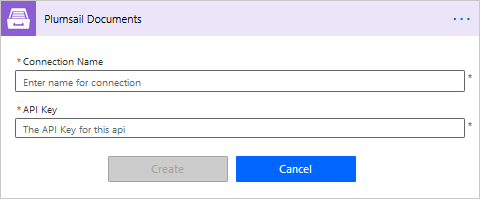
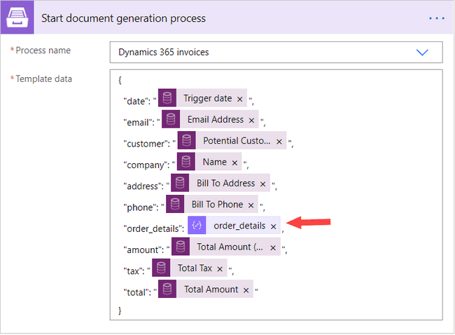
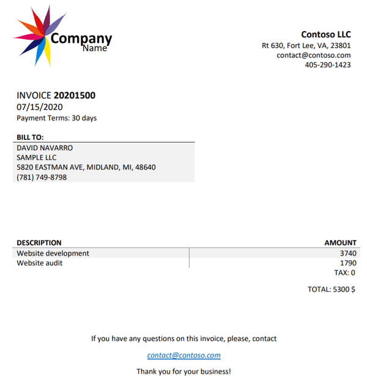

.. title:: Create custom PDF invoices with logo from Microsoft Dynamics CRM with Plumsail Documents in Power Automate

.. meta::
   :description: Generate custom PDF invoices with logos from Microsoft Dynamics 365 CRM in one click using Plumsail Documents in Power Automate.

How to create custom invoices from Microsoft Dynamics 365 CRM in Power Automate (Microsoft Flow)
================================================================================================

This article shows how to generate customized invoices for a selected order in Dynamics 365 CRM using Power Automate (Microsoft Flow). 
Sometimes Dynamics 365 functionality for creating invoices is not enough if you need to include some additional information or even a company logo. 

In this example, we will use the `Plumsail Documents <https://plumsail.com/documents/>`_ connector for Power Automate to create customized documents populated with Dynamics 365 CRM data. 

Our Flow to do the job is simple:

Now let's look into each step.

.. contents::
    :local:
    :depth: 2

Configure process
~~~~~~~~~~~~~~~~~

Before you proceed to create the Flow, you need to create and configure the process which will generate PDF invoices from a DOCX template. 

To start, register or login to your `Plumsail account <https://account.plumsail.com/>`_. Then select *Documents* and go to the `Processes section <https://account.plumsail.com/documents/processes>`_. 

Create new process
------------------

Click on the *Add Process* button.

.. image:: ../../../_static/img/user-guide/processes/how-tos/add-process-button.png
    :alt: add process button

Give a name to the process and upload the invoice template you'd like to use. 

Feel free to `download an invoice template <../../../_static/files/flow/how-tos/invoice-template-d365.docx>`_ used in this example.

To compose a template satisfying your demands and your circumstances, please, get acquainted with `how Plumsail Documents Word DOCX templates work <../../../document-generation/docx/index.html>`_. 
There's nothing complex here - everything between such curly :code:`{{ }}` brackets is variables where the templating engine will apply your specified data. 
The syntax is easy yet powerful - it supports lists, tables, charts, and many more.

Configure template
------------------

You clicked the *Create* button, and found yourself in the first step of the process - *Configure template*.

It includes two substeps:

- Editor;
- Settings.

In `Editor <../../../user-guide/processes/online-editor.html>`_, you can work on the template online, make necessary modifications, and instantly check how they would affect the result. 

To see how the resulting file will look, click on *Test template*. 

Insert source data in JSON into the appeared dialog. This JSON data tells the templating engine what it should place into :code:`{{ }}` brackets instead of object names. It's essential that this data must correspond to tokens from the template.

.. image:: ../../../_static/img/flow/how-tos/test-template-dynamics.png
    :alt: Test template to see how the resulting file will look

If you're using the invoice template from this example, you can copy and paste sample JSON presented below.

.. note:: This is JSON for testing. We will pass data from Dynamics 365 CRM to the process. See the `Start process section <#start-process>`_. 

.. code:: json

    {
      "date": "2020-07-15",
      "email": "d.navarro@contoso.com",
      "customer": "David Navarro",
      "company": "Sample LLC",
      "address": "5820 Eastman Ave, Midland, MI, 48640",
      "phone": "(781) 749-8798",
      "order_details": [
        {
          "productname": "Website development",
          "extendedamount": 3740
        },
        {
          "productname": "Website audit",
          "extendedamount": 1790
        }
      ],
      "amount": "5530",
      "tax": "0",
      "total": "5530"
    }

Click Save & Next to proceed to **Settings**. Here you'll see the following parameters:

**Mode**. It's *Testing* by default, which means runs of this process are free of charge for you, but the resulting documents will have a Plumsail watermark. To remove it, switch mode to *Active*.

**Output filename**. To personalize it, use tokens from the template. They will work the same way as for the template. For example, we have :code:`{{customer}}` token. The real customer name will replace this token, and we'll get the file "Invoice for David Navarro". It will change dynamically according to specified data.

**Output type**. The default is the same as the template's format. It's possible to select PDF.

.. hint:: You can `protect your final PDF document with a watermark, by setting a password, or disabling some actions <../../../user-guide/processes/configure-settings.html#add-watermark>`_. 

**Test template**. Once you've customized all the settings, you can test the template to see the result as we did it previously. 

When everything is done here, click on Save & Next to set up deliveries.

Delivery
--------

It's possible to add as many deliveries as you need. For instance, you could save the resulting invoice to your SharePoint library or OneDrive folder, then send as an e-mail attachment to the customer. Check out the `full list of available deliveries <../../../user-guide/processes/create-delivery.html#list-of-available-deliveries>`_.

We'll add an email delivery for demonstrating purpose. It will deliver the invoice completed with Dynamics 365 data to the customer.

We put token :code:`{{email}}` as a recipient's email address. So, it will adjust dynamically every time according to the specified data. We'll pull it from Dynamics 365 CRM. 

We filled in the subject and email body. 

Start process
-------------

We'll start the process from Power Automate (Microsoft Flow).

Create Flow
~~~~~~~~~~~

We've decided to trigger the Flow for a selected record (order) in Dynamics 365 CRM. 

For that, we use **Common data service - When a record is selected**. 

When a record is selected
-------------------------

The environment parameter is Default, the entity name is Orders:

Besides, we added an input *date* to be able to use the trigger date in the template.

The trigger is done, the next step is - **Get a record**.

Get a record
------------

This action is from Common data service too. We need to assign it to pull the details on the order products and their properties as the trigger alone won't provide us with this data.

- **Entity name** - Orders;
- **Item ID** - Select :code:`Order` from the dynamic content of the trigger output.
- It's important to expand advanced settings and customize **Odata query**. Insert :code:`order_details` into the Expand Query field. Otherwise, the Get a record action will return the same data as the trigger - without information about products related to the order.

Now save the Flow and launch a test run. After it ran successfully, copy JSON data from outputs of Get a record.

You'll need it in the next action - **Parse JSON**.

Parse JSON
----------

We assign this action to pull out data on products separately from other data we don't need.

- **Content** - Select :code:`Body` from the dynamic content of Get a record outputs.
- **Schema** - Click on *Generate from sample* and paste JSON you've copied earlier into the dialog. 

We're moving to the last step - **Start document generation process**.

Start document generation process
---------------------------------

This is the action from the `Plumsail Documents connector <https://emea.flow.microsoft.com/en-us/connectors/shared_plumsail/plumsail-documents/>`_ for Power Automate - it will start the process we've configured. 

If it's your first time using Plumsail Documents actions in Flow, be ready to create a new connection and provide Power Automate with *Connection name* and *Access key*:

You can type any name for the connection. For example, *Plumsail Documents*.

Then `create an API key in your Plumsail Account page <https://account.plumsail.com/documents/api-keys>`_, copy and paste it to *Access Key* field.

The *Start Document generation process* has two parameters:

- **Process name** - Just select from the dropdown.
- **Template data** - specify it with dynamic content from the trigger, which pulls data from Dynamics CRM. To specify products array, insert :code:`order_details` - you can find it in dynamic content of the Parse JSON output. No need to wrap it with quotation marks.

That's it. To launch the Flow, select an order you need to generate an invoice for -> in the top navigation menu go to Flows -> and choose the Flow:

Once the Flow ran successfully, the customer receives a personalized email with the invoice attached:

Use ready invoices in Flow
~~~~~~~~~~~~~~~~~~~~~~~~~~

It's possible to continue working with the generated invoices from Dynamics 365 further in Flow. For example, you can send them for approval. Just add the result file returned by *Start document generation process* action as an attachment:

Conclusion
~~~~~~~~~~

Now you know how to generate customized invoices with logos from Microsoft Dynamics 365 using Plumsail Documents in Power Automate Flow. Utilize this approach to create any custom documents from any entities in Dynamics 365.

.. hint:: You may find the article `How to create Microsoft Dynamics 365 leads from fillable PDF forms <./create-d365-leads-from-pdf-form.html>`_ useful. 

