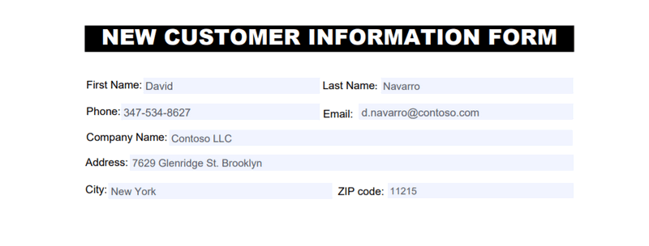
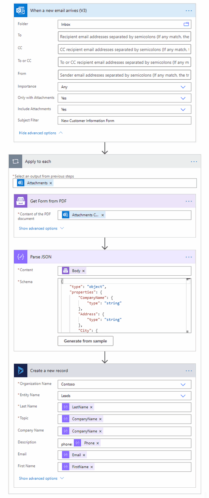
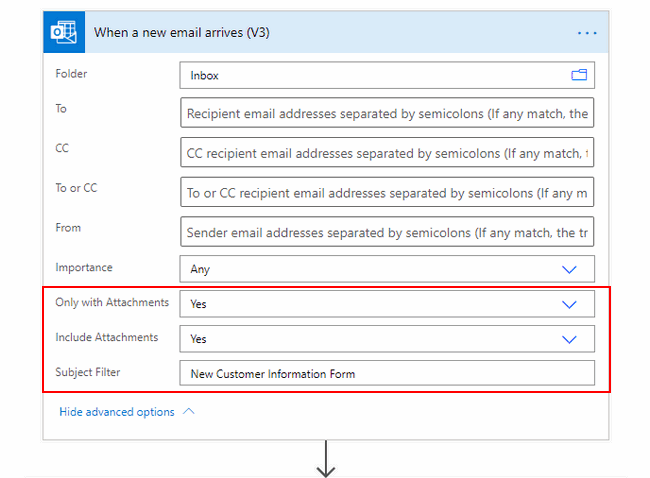
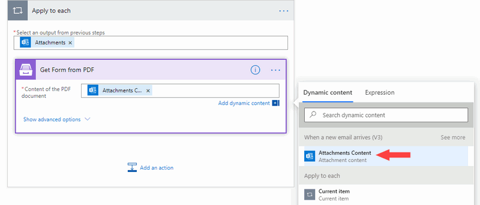
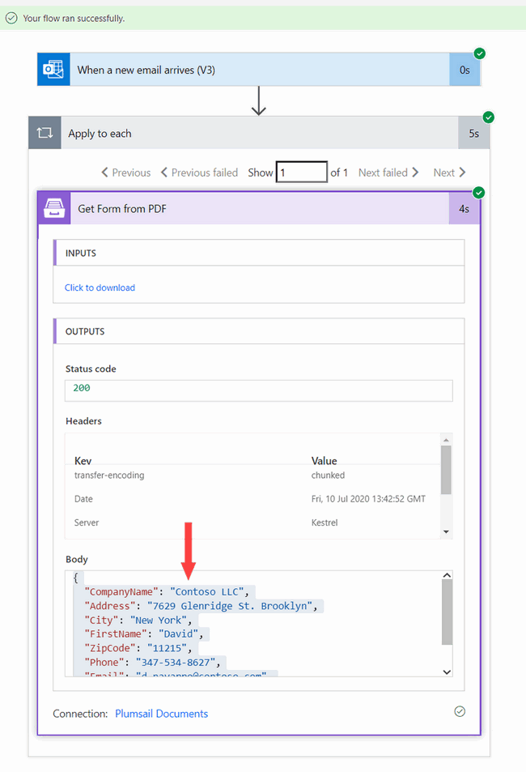
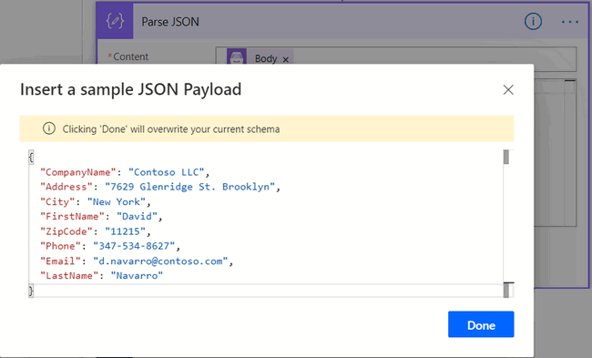
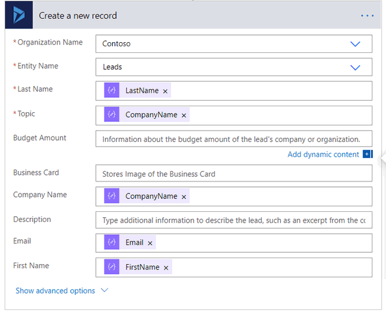
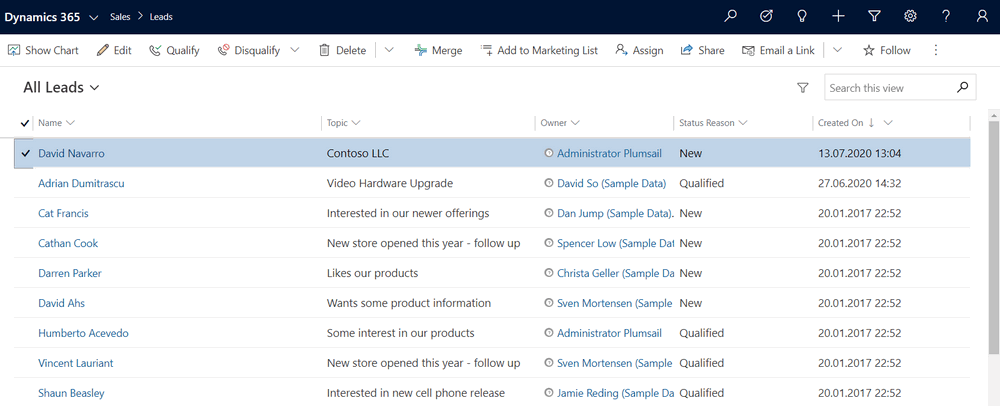

.. title:: Collect PDF form data and create Microsoft Dynamics CRM leads using Power Automate

.. meta::
   :description: Instantly create Microsoft Dynamics 365 CRM leads from fillable PDF forms. Automate the processes with the help of Plumsail Documents connector for Power Automate.

Extract data from fillable PDF forms and automatically create new leads in Microsoft Dynamics 365 CRM using Power Automate or Azure Logic Apps
==============================================================================================================================================

In this article, we’ll look into how to collect data from filled PDF forms and create Microsoft Dynamics 365 leads automatically using Power Automate or Azure Logic Apps. We will use `Get Form from PDF <../../actions/document-processing.html#get-form-from-pdf>`_ action from the `Plumsail Documents <https://plumsail.com/documents/>`_ connector.

Let us say you have a PDF form to gather contact and other information from new customers. 
You need to bring this data to your Dynamics 365 CRM and create new leads for each completed form.

.. contents::
    :local:
    :depth: 2

Overview of PDF form
~~~~~~~~~~~~~~~~~~~~

We’ve prepared a PDF contact form for new customers:

You can prepare your own form - read our detailed instructions on `how to create fillable PDFs <../../../document-generation/fillable-pdf/index.html>`_. 

Or `download PDF contact form <../../../_static/files/flow/how-tos/customer-information-form.pdf>`_ from this example to test the case. 

Create Flow
~~~~~~~~~~~

This is how the completed Flow looks:

Here is a step-by-step description. 

Flow trigger
------------

We assigned **When a new email arrives** in Office 365 Outlook to trigger the Flow. 
We set filters – the email must contain attachments and "New Customer Information Form" in the subject line.

As a result, our Flow will start only for emails we’re interested in – emails with new customer PDF forms attached. 

You can use any other trigger – for instance, from OneDrive or Dropbox connectors.

Get Form from PDF action
------------------------

This action is from the `Plumsail Documents connector <https://emea.flow.microsoft.com/en-us/connectors/shared_plumsail/plumsail-documents/>`_ for Power Automate. "Get Form from PDF" extracts data from PDF forms. 

If it's the first Plumsail Documents action for you, Power Automate will request to provide *Connection Name* and *Access Key*.

.. image:: ../../../_static/img/getting-started/create-flow-connection.png
    :alt: create flow connection

You can type any name for the connection. For example, *Plumsail Documents*.

Then `create an API key in your Plumsail Account page <https://account.plumsail.com/documents/api-keys>`_, copy and paste it to *Access Key* field.

The action *Get Form from PDF* has one parameter - Content of the PDF document. 
There we insert the output from the trigger - :code:`Attachments content`. 

You may notice that the action is automatically placed into the loop. 
It happens because an incoming email can include multiple attachments. We need to process them all.

Save the Flow and perform the test run. For that, you'll need to send the email with the filled-in PDF form attached. The subject line should contain *New Customer Information Form*.

Ok, our test ran successfully.

You can see the JSON that the *Get Form from PDF* action has returned. It is the data extracted from the PDF. Copy it, we'll need this data in the next action of our Flow - **Parse JSON**.

Parse JSON action
~~~~~~~~~~~~~~~~~

This is an action from the Data operation connector. The action has two parameters:

1. **Content**. Insert the output of the previous step - :code:`Body`.
2. **Schema**. Click on *Generate from sample* and paste the data you've copied previously into the dialog. It will create the required JSON schema.

Now we're ready to proceed to create new leads based on PDF form data.

Create a new record in Dynamics 365
~~~~~~~~~~~~~~~~~~~~~~~~~~~~~~~~~~~

Search for Dynamics 365 connector and action **Create a new record**.

Fill in your organization name and select the entity name. In our case, it is Leads. To specify details, use the output from the previous step.

You can leave some of the non-required fields empty as well as expand advanced options to specify even more details.

Conclusion
~~~~~~~~~~

Our Flow is ready. It automatically creates Dynamics 365 leads from PDF forms attached to newly-arrived emails.

Now you know how to collect data from fillable PDF form and create leads in Microsoft Dynamics 365 CRM. You can use the same approach to create any other entities based on PDF forms data.

.. hint:: Check out `How to generate customized invoices from a selected order in Dynamics 365 <./create-custom-pdf-invoice-from-d365.html>`_.

