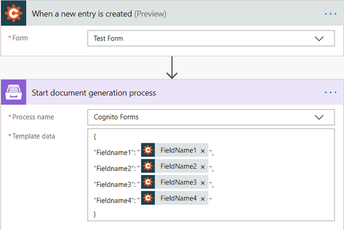
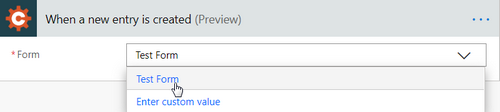
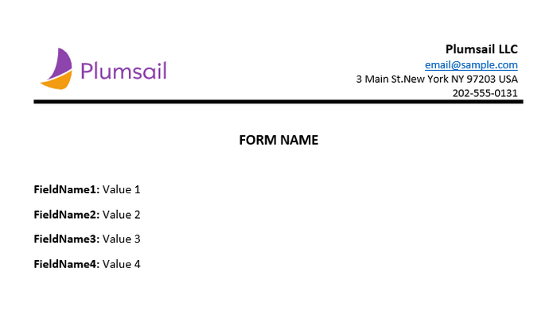

How to create Word and PDF documents from Cognito Forms in Power Automate (Microsoft Flow) and Azure Logic Apps
===============================================================================================================

In this article, you will learn how to automate the generation of documents in your company. For example, applications, orders, invoices, cards and others. We’ll show you a simple way how to create a PDF document from a DOCX template on a `Cognito Form <https://www.cognitoforms.com/>`_ submission with the help of `Processes <../../../user-guide/processes/index.html>`_ in Power Automate (Microsoft Flow) and Azure Logic Apps. 

**Processes** are a `Plumsail Documents <https://plumsail.com/documents/>`_ feature with an intuitive interface for creating documents from templates. 

**Cognito Forms** are an online form builder that allows you to create powerful forms for your website.

Let’s see how to connect them to optimize the creation of documents. 

.. contents::
    :local:
    :depth: 2

Description
-----------
In this example, we will collect data from a Cognito Form, apply the data to our template, and generate a new PDF document with the help of Processes in Power Automate (Microsoft Flow).

Configure the Process
-----------------------

To create a process, which will generate PDF documents from a DOCX template, go to `the Processes section <https://account.plumsail.com/documents/processes>`_ in your Plumsail account. 

Create a new process
~~~~~~~~~~~~~~~~~~~~

Click on the *Add process* button.

Set the Process name. 

.. image:: ../../../_static/img/flow/how-tos/create-new-process-plumsail-forms.png
    :alt: generate PDF from Plumsail Forms 

Upload the template you're gonna use. Here is the `link for downloading the template <../../../_static/files/flow/how-tos/Create-Word-and-PDF-template.docx>`_ we use in this example:

.. image:: ../../../_static/img/flow/how-tos/docx-template_forms_processes.png
    :alt: Docx template

When creating your own ones, mind the templating language. Plumsail Word DOCX templates use a different approach than most other templating solutions. It uses a minimal amount of syntax to make your work done.

In short, the templating engine thinks that everything between curly :code:`{{ }}` brackets is variables where it will apply your specified data. 
Read `this article <../../../document-generation/docx/how-it-works.html>`_ to get familiar with the templating engine.

Configure a template
~~~~~~~~~~~~~~~~~~~~

Once you're done with the first step *Create Process*, press the *Submit* button, and you’ll proceed to the next – *Configure Template*:

- Fill in the name of the result file
- Select PDF format for the output file
- `Protect the result PDF <../../../user-guide/processes/create-process.html#add-watermark>`_ if you wish

.. image:: ../../../_static/img/flow/how-tos/configure-template-forms.png
    :alt: Configure template

You can test a template as well, to see how it will look at the end. After clicking on the *Test template* button, you’ll need to ‘feed’ a template with your data in JSON format. In our case, it might be:

.. code:: json

    {
      "FieldName1": "Value1",
      "FieldName2": "Value2",
      "FieldName3": "Value3",
      "FieldName4": "Value4"
    }

.. image:: ../../../_static/img/flow/how-tos/test-template-forms-processes.png
    :alt: test template

It’s testing. We’re going to apply the data from the Cognito form to our template. 

Delivery
~~~~~~~~

The next step is delivery. For demonstrating purpose, we’ll store the result file in `OneDrive <../../../user-guide/processes/deliveries/one-drive.html>`_. But there are `other options <../../../user-guide/processes/create-delivery.html#list-of-available-deliveries>`_.

Select the folder where the ready document will be saved. Fill in the file's name. You don't need to put :code:`.extension`, it'll be done automatically based on the output file type you set on the *Configure template* step.

.. image:: ../../../_static/img/flow/how-tos/onedrive-forms.png
    :alt: create pdf from template on form submission

You can configure as many deliveries as you need.

Start the Process
~~~~~~~~~~~~~~~~~
We will start our Process from Microsoft Flow. 

Create a Flow
-------------
This is how our Flow looks:

Check out the Flow steps described below.

Flow trigger
~~~~~~~~~~~~

We need to start the Flow everytime somebody submits our Cognito Form. For that, search for *Cognito Forms* in Power Automate and set *Cognito Forms - When a new entry is created* as a trigger.

If this is your first Flow with Cognito Forms, on this step, sign in to your Cognito Account from MS Flow to use your forms inside Flows.

Then, you'll need to pick the form you want to track in the dropdown.

Start document generation process
~~~~~~~~~~~~~~~~~~~~~~~~~~~~~~~~~
This is the action from `Plumsail Documents connector <../../../getting-started/use-from-flow.html>`_. This action is suitable for starting the Process of generating documents from a template. You can find more information about this action by visiting `this page <../../../flow/actions/document-processing.html#start-document-generation-process>`_.

.. important:: This action is not available in `the global Microsoft Flow connector <https://docs.microsoft.com/en-us/connectors/plumsail/>`_ yet. To use it, you need to `add Plumsail Documents as a custom connector <../create-custom-connector.html>`_.

Using the action for the first time, you’ll be asked for *''Connection Name''* and *''Access Key''*. 

.. image:: ../../../_static/img/getting-started/create-flow-connection.png
    :alt: create flow connection

You can type any name for the connection. For example, *''Plumsail Documents''*. 

Then `create an API key in your Plumsail Account page <https://plumsail.com/docs/documents/v1.x/getting-started/sign-up.html>`_, copy and paste it to *''Access Key''* field.

The action has two parameters:

.. image:: ../../../_static/img/user-guide/processes/how-tos/start-generation-docs-action.png
    :alt: start generation documents action

- *Process name*. Select the process you need from available ones. 
- *Template data*. Specify source data in JSON format:

This object contains information from our form. We selected the dynamic content from the output of *Cognito Forms - When a new entry is created* action:

Send for approval
~~~~~~~~~~~~~~~~~

On this step, we’ll see how to use the result file from the *Start document generation process* action right in the Flow.

We'll send the ready document for approval with the *Approvals* connector - action *Create an approval*.

Add the output of the previous step as an attachment. 

.. image:: ../../../_static/img/user-guide/processes/how-tos/create-an-approval.png
    :alt: send pdf for approval

Our Flow is ready. This is how the result document generated from the form's data looks. It'll be stored in OneDrive and sent for approval as an attachment. 

.. hint:: You can generate PDFs from Web Forms even without Power Automate (Microsoft Flow). Check the article `How to generate PDF documents from a DOCX template on Plumsail Forms submission <../../../flow/how-tos/documents/create-word-and-pdf-documents-from-plumsail-forms-processes.html>`_.

