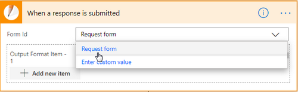
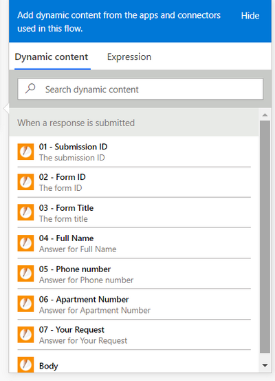
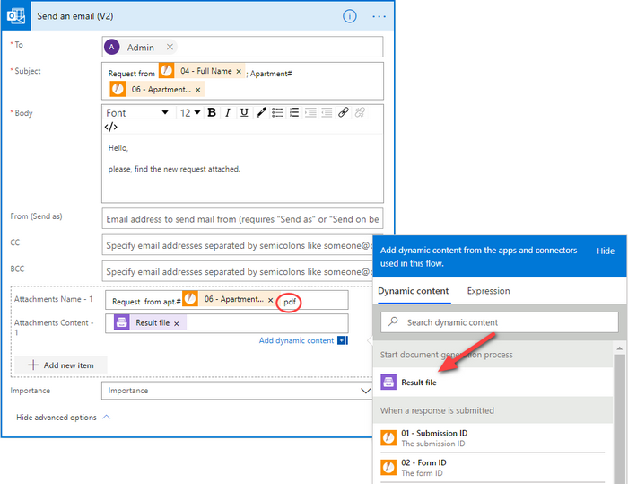

How to create Word and PDF documents from JotForm in Power Automate (Microsoft Flow) and Azure Logic Apps
=========================================================================================================

This article demonstrates how to create PDF documents from a DOCX template on a `JotForm <https://www.jotform.com/>`_ submission with the help of `Processes <../../../user-guide/processes/index.html>`_ in Power Automate (MS Flow). It may help you to automate the generation of different documents like applications, requests, orders, etc., in your company. 

**Processes** are a `Plumsail Documents <https://plumsail.com/documents/>`_ feature with an intuitive interface for creating documents from templates.

**JotForm** is an online form builder that allows you to create forms with a drag and drop creation tool and an option to encrypt user data.

We'll connect them in Power Automate (Flow) to automatically collect data from a JotForm, apply the data to our template, and generate a new PDF document.

.. contents::
    :local:
    :depth: 2

Configure the Process
---------------------

Before creating the Flow, we need to set a Process, which will generate PDF documents from a DOCX template.

Create a new process
~~~~~~~~~~~~~~~~~~~~

Go to `the Processes section <https://account.plumsail.com/documents/processes>`_ in your Plumsail account. 

Click on the *Add process* button.

.. image:: ../../../_static/img/user-guide/processes/how-tos/add-process-button.png
    :alt: add process button

Set the Process name. 

.. image:: ../../../_static/img/flow/how-tos/create-new-process-plumsail-forms.png
    :alt: generate PDF from Typeform

Upload the template you're gonna use. In this example, we'll create a guest's request. And below is our template for it. You can download it by `this link <../../../_static/files/flow/how-tos/Create-Word-and-PDF-Request-template.docx>`_.

.. image:: ../../../_static/img/flow/how-tos/create-docx-pdf-template.png
    :alt: Docx template

When creating your own ones, mind the templating language. Plumsail Word DOCX templates use a different approach than most other templating solutions. It uses a minimal amount of syntax to make your work done.

In short, the templating engine thinks that everything between curly :code:`{{ }}` brackets is variables where it will apply your specified data. 
Read `this article <../../../document-generation/docx/how-it-works.html>`_ to get familiar with the templating engine.

Configure a template
~~~~~~~~~~~~~~~~~~~~

Once you're done with the first step *Create Process*, press the *Submit* button, and you’ll proceed to the next – *Configure Template*:

- Fill in the name of the result file
- Select PDF format for the output file
- `Protect the result PDF <../../../user-guide/processes/create-process.html#add-watermark>`_ if you wish

.. image:: ../../../_static/img/flow/how-tos/configure-template-forms.png
    :alt: Configure template

You can test a template as well, to see how it will look at the end. After clicking on the *Test template* button, you’ll need to ‘feed’ a template with your data in JSON format. In our case, it might be:

.. code:: json

    {
      "FullName": "Nikola Vlasic",
      "PhoneNumber": "+8987654321",
      "ApartmentNumber": "124",
      "Request": "The tap in the kitchen is dripping. Could you send a plumber, please?"
    }

.. image:: ../../../_static/img/flow/how-tos/test-template-jotform-processes.png
    :alt: test template

It’s testing. We’re going to apply the data from the JotForm to our template. 

Delivery
~~~~~~~~

The next step is delivery. For demonstrating purpose, we’ll store the result file in `OneDrive <../../../user-guide/processes/deliveries/one-drive.html>`_. But there are `other options <../../../user-guide/processes/create-delivery.html#list-of-available-deliveries>`_.

Select the folder where the ready document will be saved. Fill in the file's name. You don't need to put :code:`.extension`, it'll be done automatically based on the output file type you set on the *Configure template* step.

.. image:: ../../../_static/img/flow/how-tos/onedrive-forms.png
    :alt: create pdf from template on form submission

You can configure as many deliveries as you need.

Start the Process
~~~~~~~~~~~~~~~~~
We will start our Process from Microsoft Flow. 

Create a Flow
-------------
This is how our Flow looks:

.. image:: ../../../_static/img/flow/how-tos/jotform-processes.png
    :alt: pdf from JotForm flow

Check out the Flow steps described below.

Form is submitted
~~~~~~~~~~~~~~~~~

We've already created a JotForm. We will use data from its submission in our Flow. If you haven't created JotForms before, follow `this link <https://www.jotform.com/help/2-How-to-Create-Your-First-Web-Form>`_ to learn how to do it.

Below is a screenshot of our form:

.. image:: ../../../_static/img/flow/how-tos/JotForm.png
    :alt: JotForm

We need to start the Flow everytime somebody submits it. For that, search for *JotForm* in Power Automate and set *JotForm - When a response is submitted* as a trigger.

If this is your first Flow with JotForm, on this step, sign in to your JotForm Account from MS Flow to use your forms inside Flows.

Then, you'll need to pick the form you want to track in the dropdown.

Start document generation process
~~~~~~~~~~~~~~~~~~~~~~~~~~~~~~~~~
This is the action from `Plumsail Documents connector <../../../getting-started/use-from-flow.html>`_. This action is suitable for starting the Process of generating documents from a template. You can find more information about this action by visiting `this page <../../../flow/actions/document-processing.html#start-document-generation-process>`_.

.. important:: This action is not available in `the global Microsoft Flow connector <https://docs.microsoft.com/en-us/connectors/plumsail/>`_ yet. To use it, you need to `add Plumsail Documents as a custom connector <../create-custom-connector.html>`_.

Using the action for the first time, you’ll be asked for *''Connection Name''* and *''Access Key''*. 

.. image:: ../../../_static/img/getting-started/create-flow-connection.png
    :alt: create flow connection

You can type any name for the connection. For example, *''Plumsail Documents''*. 

Then `create an API key in your Plumsail Account page <https://plumsail.com/docs/documents/v1.x/getting-started/sign-up.html>`_, copy and paste it to *''Access Key''* field.

The action has two parameters:

.. image:: ../../../_static/img/user-guide/processes/how-tos/start-generation-docs-action.png
    :alt: start generation documents action

- *Process name*. Select the process you need from available ones. 
- *Template data*. Specify source data in JSON format:

.. image:: ../../../_static/img/flow/how-tos/JotForms-DOCX-PDF-data.png
    :alt: dynamic content of jotform is submitted

This object contains information from our form. We selected the dynamic content from the output of *JotForm- When a response is submitted* action:

Send an email
~~~~~~~~~~~~~

On this step, we’ll see how to use the result file from the *Start document generation process* action right in the Flow.

We'll send the ready document by email with the *Office 365 Outlook* connector - action *Send an email*.

Add the output of the previous step as an attachment: 

Our Flow is ready. This is how the result document generated from the form's data looks. It'll be stored in OneDrive and sent by email as an attachment. 

.. image:: ../../../_static/img/flow/how-tos/JotForms-DOCX-PDF-result.png
    :alt: Final document

.. hint:: You can generate PDFs from Web Forms even without Power Automate (Microsoft Flow). Check the article `How to generate PDF documents from a DOCX template on Plumsail Forms submission <../../../flow/how-tos/documents/create-word-and-pdf-documents-from-plumsail-forms-processes.html>`_.