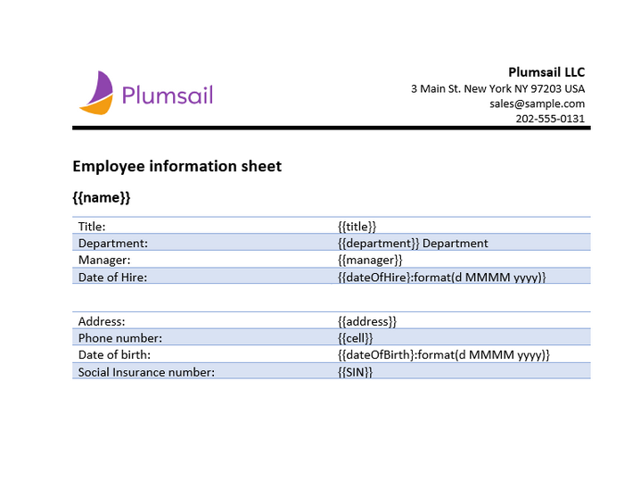
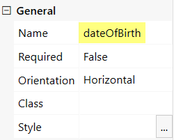
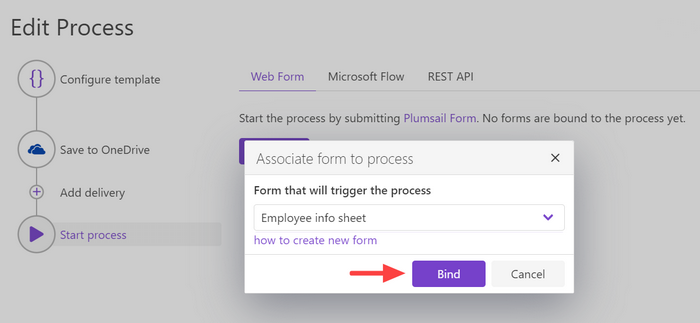
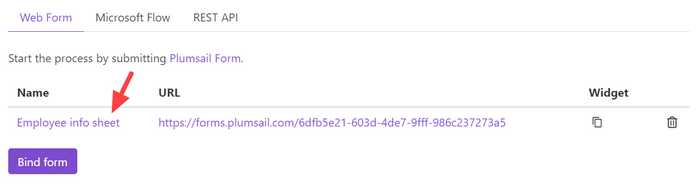

How to generate PDF documents from a DOCX template on Plumsail Forms submission
===============================================================================

In this article, you will learn how to automate the generation of documents in your company. For example, applications, orders, invoices, cards and others. We’ll show you a simple way how to create PDF documents from a DOCX template on `Plumsail Forms <https://plumsail.com/forms/>`_ submission by its integration with `Processes <../../../user-guide/processes/index.html>`_. 

**Processes** are a `Plumsail Documents <https://plumsail.com/documents/>`_ feature with an intuitive interface for creating documents from templates. 

By means of **Plumsail Forms**, you can design elegant, responsive, and highly customizable forms for SharePoint Modern UI or any web page. In our example, we will collect data from a *Web Form*, apply it to our template and generate a new PDF document with the help of *Processes*.

.. contents::
    :local:
    :depth: 2

Configure the Process
-----------------------

First of all, we need to create and configure the Process.

Create a new process
~~~~~~~~~~~~~~~~~~~~
To create a new process, which will generate PDF documents from a DOCX template, go to `the Processes section <https://account.plumsail.com/documents/processes>`_ in your Plumsail account. 

Click on the *Add process* button.

.. image:: ../../../_static/img/user-guide/processes/how-tos/add-process-button.png
    :alt: add process button

Set the Process name. 

.. image:: ../../../_static/img/flow/how-tos/create-new-process-plumsail-forms.png
    :alt: generate PDF from Plumsail Forms 

Upload the template you're gonna use. In this example, we'll create a short employee information sheet. And below is our template for it. You can download it by `this link <../../../_static/files/flow/how-tos/Create_DOCX_and_PDF_template.docx>`_. 

When creating your own ones, mind the templating language. Plumsail Word DOCX templates use a different approach than most other templating solutions. It uses a minimal amount of syntax to make your work done.

In short, the templating engine thinks that everything between curly :code:`{{ }}` brackets is variables where it will apply your specified data. 
Read `this article <../../../document-generation/docx/how-it-works.html>`_ to get familiar with the templating engine.

Configure a template
~~~~~~~~~~~~~~~~~~~~

Once you're done with the first step *Create Process*, press the *Submit* button, and you’ll proceed to the next – *Configure Template*:

- Fill in the name of the result file
- Select PDF format for the output file
- `Protect the result PDF <../../../user-guide/processes/create-process.html#add-watermark>`_ if you wish

You can test a template as well, to see how it will look at the end. After clicking on the *Test template* button, you’ll need to ‘feed’ a template with your data in JSON format. In our case, it might be:

.. code:: json

    {
      "name": "John Smith",
      "title": "Designer",
      "department": "Marketing",
      "manager": "Amanda Peterson",
      "dateOfHire": "19/02/2020",
      "address": "5th Avenue 5 apt 5",
      "cell": "+789123456",
      "dateOfBirth": "01/08/1980",
      "SIN": "011-022-033-099"
    }

.. image:: ../../../_static/img/flow/how-tos/test-template-plumsail-forms-processes.png
    :alt: test template

It’s testing. We’re going to apply the data from the form to our template. 

Delivery
~~~~~~~~

The next step is delivery. For demonstrating purpose, we’ll store the result file in `OneDrive <../../../user-guide/processes/deliveries/one-drive.html>`_. But there are `other options <../../../user-guide/processes/create-delivery.html#list-of-available-deliveries>`_.

Select the folder where the ready document will be saved. Fill in the file's name. You don't need to put :code:`.extension`, it'll be done automatically based on the output file type you set on the *Configure template* step.

You can configure as many deliveries as you need.

Start the Process on Form submission
------------------------------------

We will start our Process by submitting Plumsail Web Form.

Prepare a Form
~~~~~~~~~~~~~~

We've already prepared a Plumsail form and will use data from its submission. To learn how to create and publish Plumsail forms, read `the documentation article <https://plumsail.com/docs/forms/design.html>`_.

Below is a screenshot of our form. You may download this form `here <../../../_static/files/flow/how-tos/Employee_info_sheet.xfds>`_ , import it into `Plumsail Forms designer <https://account.plumsail.com/forms/designer>`_ and use as a template.

.. image:: ../../../_static/img/flow/how-tos/Plumsail-Form.png
    :alt: Plumsail Form

The important thing is that the templating engine needs to identify what will be pasted into brackets somehow. Please, check that the Internal names of form's fields correspond to tokens in the template. 

You can do that in the settings of each field.

Bind the Form
~~~~~~~~~~~~~

To start the process by submitting our Plumsail Form, we need to bind it. It's easy to do.

Press the *Bind* button and select the process you need from the list. 

Once we've done it, the Form will appear in the list of Plumsail Forms bound to this Process. 

Every time somebody submits the form, the Process of generating PDF documents from a DOCX template will start. It will apply the Form submission data to the template and deliver the result document to OneDrive.

See how the result file looks:

.. image:: ../../../_static/img/flow/how-tos/result-pdf-plumsail-forms.png
    :alt: create pdfs from docx on plumsail form submission

.. hint:: It's possible to implement more complex scenarios using Power Automate (Microsoft Flow). For example, you can generate PDF documents from a DOCX template on Plumsail Forms submission and use the result file right in the Flow.  Trigger your Flow with Plumsail `Form is submitted <https://plumsail.com/docs/forms-web/microsoft-flow.html>`_ and follow the steps described in `this article <../../../user-guide/processes/examples/create-pdf-from-docx-template-processes.html>`_.