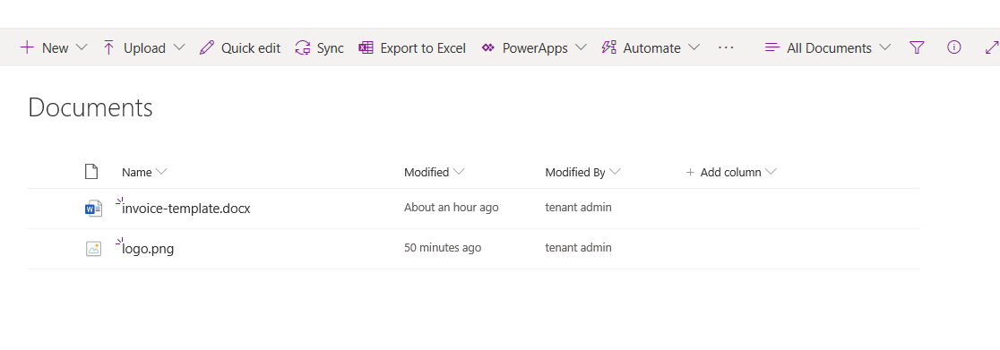
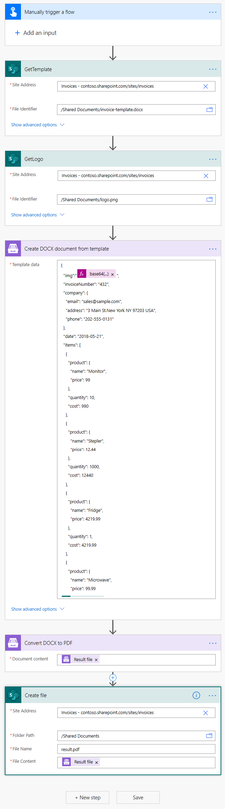
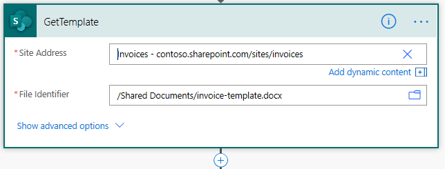
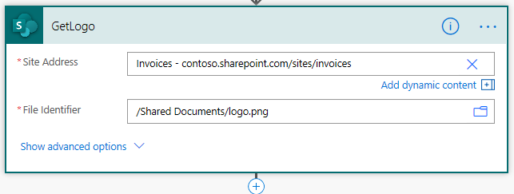
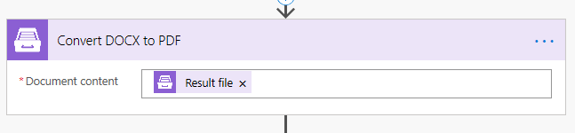
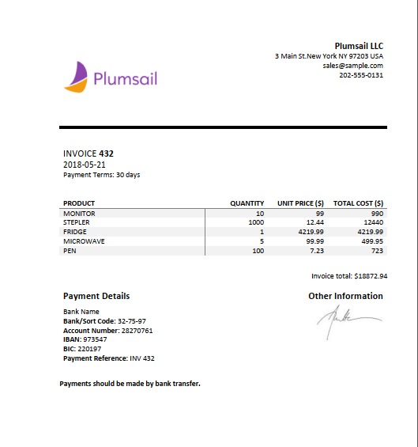

How to insert images into DOCX document
##################################################################

In this article I'm going to show how to insert images into DOCX document.

`Create DOCX from template`_  supports `Picture formatter`_: it resolves URL or base64 string and converts it to an image.
If you need to resize the picture you can specify the size

.. code-block:: json

          {{value}:picture(100,100)}

Picture formatter and URL
##################################################################

The formatter also accepts URLs, Plumsail Documents support anonymous authentication only. 
To use a link to a picture stored in SharePoint, please, 
create a guest link and replace guestacces.aspx string with download.aspx one. 
Your link should look something like this: https://yourDomain.sharepoint.com/_layouts/15/download.aspx?docid=DocID&authkey=AuthKey

.. code-block:: json

            {                     
                "value": "https://picturesite.com/pics/picture.png"
            }  

Picture formatter and base64 string
##################################################################
As it's said you can insert the image using base64 string.

.. code-block:: json

            {                     
                "value": "iVBORw0KGgoAAAANSUhEUgAAAIAAAAA9CAYAAABlamFgAA"
            }  

A common situation is getting photos from the camera in PowerApps or pen input for signatures, converting it to base64 and then inserting into a docx template.
In general, you can insert any image if you can get its base64 code in Micrisoft Flow or even using some third-party services.

Let's check out next example.

I'll create an invoice from DOCX template, insert a logo and convert the result to PDF.

The invoice template and logo reside in a SharePoint document library.

I'll use two Plumsail actions in my flow: `Create DOCX from template`_ and `Convert DOCX to PDF`_

I created this Power Automate (Microsoft Flow) 

I keep the DOCX template and the Logo in a SharePoint library. I use SharePoint Power Automate connnector to download both files.

Then I use `Create DOCX from template`_ action to create an invoice from the template.

In the template I added the tag:

.. code::

    {{img}:picture}

to the place where I need to insert the logo.

To correctly insert the Logo to the invoice I convert the SharePoint action result in to base 64 code.
To achieve this we can use next expression

.. code::

    base64(body('GetLogo'))

This is the JSON:

.. code:: json

    {
        "img":"base64(body('GetLogo'))",
        "invoiceNumber": "432",
        "company": {
            "email": "sales@sample.com",
            "address": "3 Main St.New York NY 97203 USA",
            "phone": "202-555-0131"
        },
        "date": "2018-05-21",
        "items": [
            {
                "product": {
                    "name": "Monitor",
                    "price": 99
                },
                "quantity": 10,
                "cost": 990
            },
            {
                "product": {
                    "name": "Stepler",
                    "price": 12.44
                },
                "quantity": 1000,
                "cost": 12440
            },
            {
                "product": {
                    "name": "Fridge",
                    "price": 4219.99
                },
                "quantity": 1,
                "cost": 4219.99
            },
            {
                "product": {
                    "name": "Microwave",
                    "price": 99.99
                },
                "quantity": 5,
                "cost": 499.95
            },
            {
                "product": {
                    "name": "Pen",
                    "price": 7.23
                },
                "quantity": 100,
                "cost": 723
            }
        ],
        "total": 18872.94
    }

On the next step I use `Convert DOCX to PDF`_  action and create a file in the SharePoint library.

This is the resulting PDF with the company logo

You can download the DOCX template `here`_ .

Conclusion
##################################################################

There are a lot of real situations where it's needed to insert an image into docx file.
Plumsail `Picture formatter`_ helps to achieve the goal and it's a usefull addition to `Create DOCX from template connector`_.

.. _Create DOCX from template: https://plumsail.com/docs/documents/v1.x/flow/actions/document-processing.html#create-docx-document-from-template
.. _Convert DOCX to PDF: https://plumsail.com/docs/documents/v1.x/how-tos/index-convert-to-pdf.html

.. _Picture formatter: https://plumsail.com/docs/documents/v1.x/document-generation/common-docx-xlsx/formatters.html#picture
.. _here: ./../../_static/files/flow/how-tos/invoice-template-picture-test.docx
