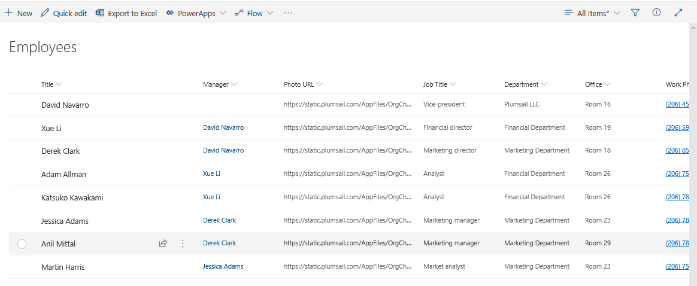
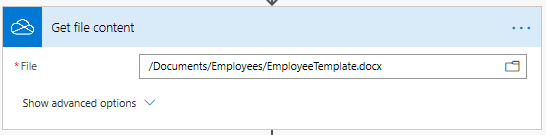
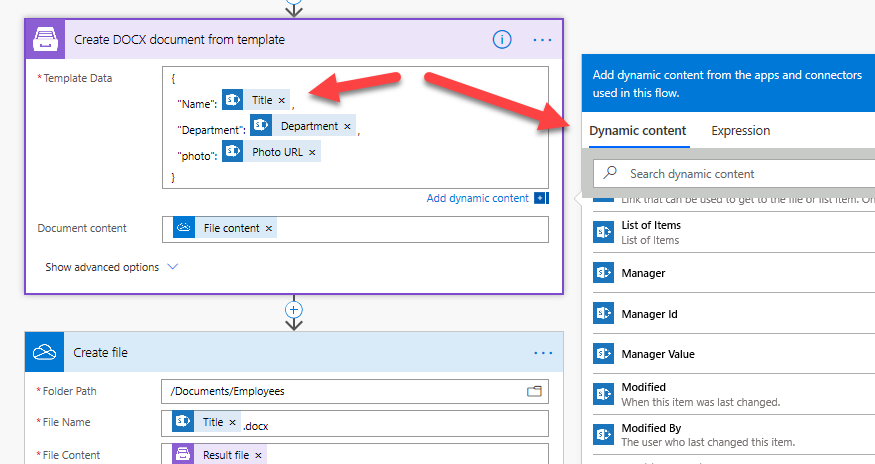

How to insert images into DOCX document
##################################################################

In this article I'm going to show how to insert images into DOCX document.

`Create DOCX from template connector`_  supports `Picture formatter`_: it resolves URL or base64 string and converts it to an image.
If you need to resize the picture you can specify the size

.. code-block:: json

          {{value}:picture(100,100)}

Picture formatter and base64 string
##################################################################
As it's said you can insert the image using base64 string.

.. code-block:: json

            {                     
                "value": "iVBORw0KGgoAAAANSUhEUgAAAIAAAAA9CAYAAABlamFgAA"
            }  

A common situation is getting photos from the camera in PowerApps or pen input for signatures, converting it to base64 and then inserting into a docx template.
In general, you can insert any image if you can get its base64 code in Micrisoft Flow or even using some third-party services.

Picture formatter and URL
##################################################################

The formatter also accepts URLs, Plumsail Documents support anonymous authentication only. 
To use a link to a picture stored in SharePoint, please, 
create a guest link and replace guestacces.aspx string with download.aspx one. 
Your link should look something like this: https://yourDomain.sharepoint.com/_layouts/15/download.aspx?docid=DocID&authkey=AuthKey

.. code-block:: json

            {                     
                "value": "https://picturesite.com/pics/picture.png"
            }  

Let's check out next example.

I have a list with employees in my SharePoint tenant and each time new employee is added to the library I want to create a docx file
with some information about this new member.

I created this Microsoft flow 

.. image:: ../../../_static/img/flow/how-tos/picture-test-flow.png
   :alt: Microsoft Flow

The flow is started automatically when a new item is added to the employees list.

.. image:: ../../../_static/img/flow/how-tos/new-employee.png
   :alt: Adding new employee

Then it downloads a prepared docx template from OneDrive folder

On the next step I use `Create DOCX from template connector`_  with `Picture formatter`_.
I use dynamic content from SharePoint connector.

On the last step The flow creates a result DOCX file with the information from Employees list.

You can download the DOCX template `here`_ .

Conclusion
##################################################################

There are a lot of real situations where it's needed to insert an image into docx file.
Plumsail `Picture formatter`_ helps to achieve the goal and it's a usefull addition to `Create DOCX from template connector`_.

.. _Create DOCX from template connector: https://plumsail.com/docs/documents/v1.x/flow/actions/document-processing.html#create-docx-document-from-template
.. _Picture formatter: https://docs.microsoft.com/en-us/connectors/signnow/
.. _here: ./../../_static/files/flow/how-tos/EmployeeTemplate.pdf
