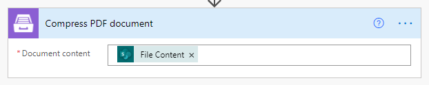

.. title:: Optimize PDF size using Power Automate Power Automate (Microsoft Flow)

.. meta::
   :description: Optimize PDF size using Automate (Microsoft Flow), Azure Logic Apps, and PowerApps

Optimize PDF size using Power Automate (Microsoft Flow)
==========================================================

Sometimes you need to reduce a PDF file size and it's easy to do with `Compress PDF document <https://plumsail.com/docs/documents/v1.x/flow/actions/document-processing.html#compress-pdf-document>`_ from `Plumsail Documents <https://plumsail.com/documents/>`_ package.

In this example, we will work with files from a SharePoint documents library and use the default SharePoint trigger and actions. You can use some other system. Power Automate (Microsoft Flow) has a lot of connectors for different systems. Here are just a few of them:

- SharePoint
- Box
- OneDrive
- Google Drive
- Dropbox
- SFTP
- File System

The plan is the following:

- The flow will start with a SharePoint trigger **When a file is created or modified in a folder**

- Then we pass the file content to `Compress PDF document <https://plumsail.com/docs/documents/v1.x/flow/actions/document-processing.html#compress-pdf-document>`_ action
  

- And save the result to a SharePoint folder

.. note:: Please don't forget to specify the **.pdf** extension.

This is the flow

Conclusion
-------------

We showed one simple example where you can use `Compress PDF document <https://plumsail.com/docs/documents/v1.x/flow/actions/document-processing.html#compress-pdf-document>`_ action.
The same action could be used to compress many PDF files in one flow. You can get all files from one folder and compress them in a loop.