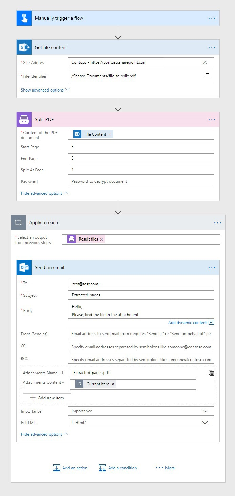
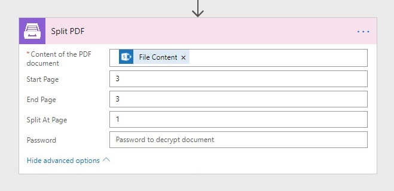

.. title:: How to split PDF documents into multiple ones in Power Automate (Microsoft Flow), Azure Logic Apps, and PowerApps

.. meta::
   :description: Split single PDF file into smaller multiple PDFs using Automate (Microsoft Flow), Azure Logic Apps, and PowerApps

Split PDF files in Power Automate
=================================

This article demonstrates how to separate PDF pages with the help of `Power Automate (Microsoft Flow) <https://emea.flow.microsoft.com/>`_.

In this example, we will read a PDF file, split the file to get a particular page and send this page by email. 

This approach can be used to extract a page or a section of a PDF document. For example, you may extract specific pages from a contract and send it for approval to the responsible person.

Our source PDF file has to be stored somewhere. Power Automate (Microsoft Flow) has a lot of connectors for different systems.

Here are just a few of them:

- SharePoint
- Salesforce
- Box
- OneDrive
- Google Drive
- Dropbox
- SFTP
- File System

You can store your files anywhere. In this example, we will store our source PDF file in SharePoint, but you can get data from other sources. 

This is how our flow looks:

Below is a step by step description of the flow.

Splitting a PDF file
--------------------

Flow trigger
~~~~~~~~~~~~

You can actually pick any trigger. For example, you can start Flow on file creation in a SharePoint document library. We use *Manually trigger a flow* trigger here to simplify the Flow.

Get file content
~~~~~~~~~~~~~~~~

This action gets file content of the specified file from a SharePoint document library. You just specify **SharePoint site URL** and **path** to your file. We use this action to read our sample PDF file.

You can use any other connector to get files from your system.

You may use `this link <../../../_static/files/flow/how-tos/file-to-split.pdf>`_ to download our sample 10 pages PDF file.

Split PDF
~~~~~~~~~

This is an action from `Plumsail Documents connector <https://plumsail.com/documents/>`_.

Put PDF file content from the output of the previous action. In the **Start Page** field, specify the first page to start the split, in the **End Page** field, specify the last page to split (inclusive) and enter a number of pages per partition into the **Split At Page** field. In our example, we extract just one page of the document, to do that we set the fields as shown in the screenshot below:

As an output of this action, we receive an array of Result files. In our case, we have just one file in the array.

Find `more detailed information about *Split PDF* action <https://plumsail.com/docs/actions/v1.x/flow/actions/document-processing.html#split-pdf>`_.

Send an email
~~~~~~~~~~~~~

Once the result file is generated, we send an email using Send email action from Office 365 Outlook connector. We fill in the **email fields**; in the **Attachments** section, we add a name for the new PDF file and choose **ResultFileContents - Item** as an output from previous steps. This will automatically transform this action into repeating one which will be performed for each Result file. In our case, there is just one file.

Conclusion
----------

That is all, the flow is configured. These few simple steps can help to ease the work with documents.

.. hint::
  You may also be interested in the `article explaining how to Merge PDF files in Power Automate (Microsoft Flow) and Azure Logic Apps <https://plumsail.com/docs/actions/v1.x/flow/how-tos/documents/merge-pdf-files.html>`_.