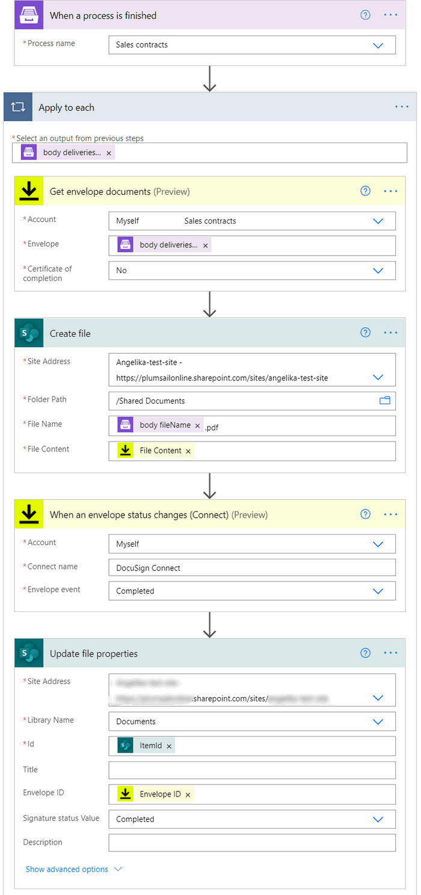
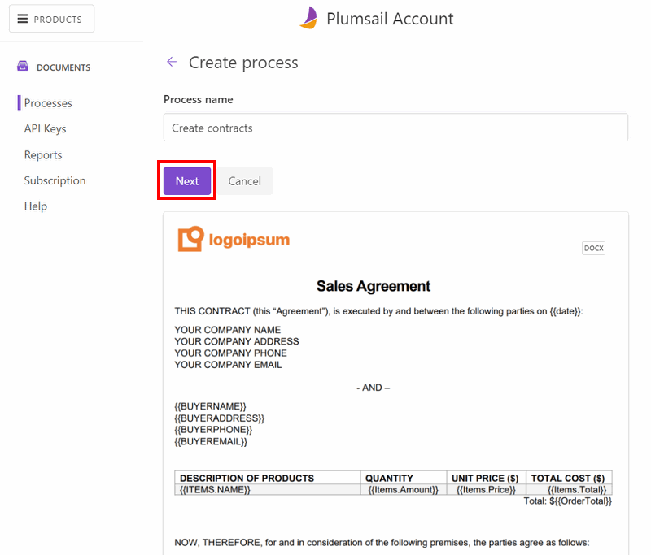
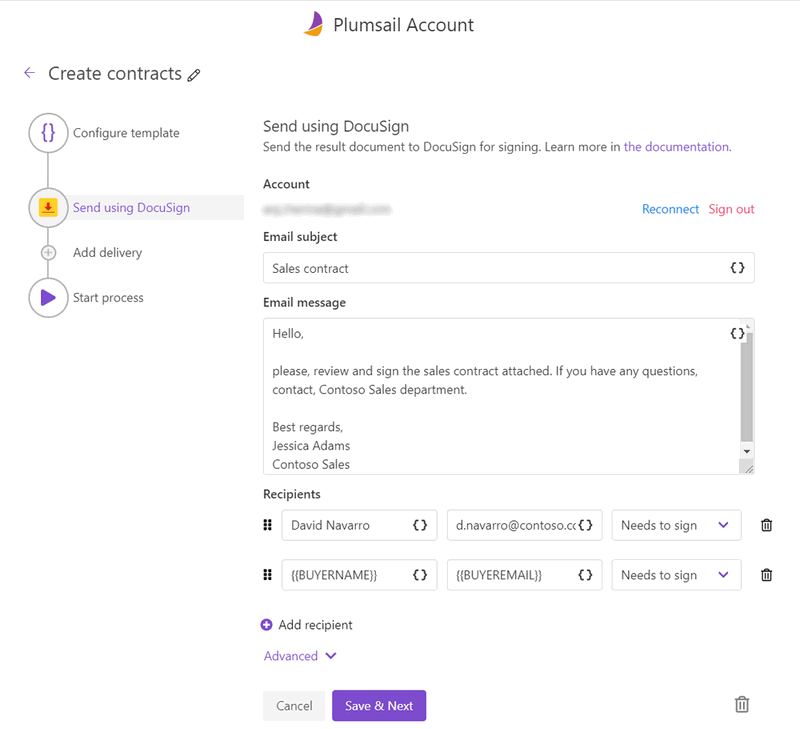
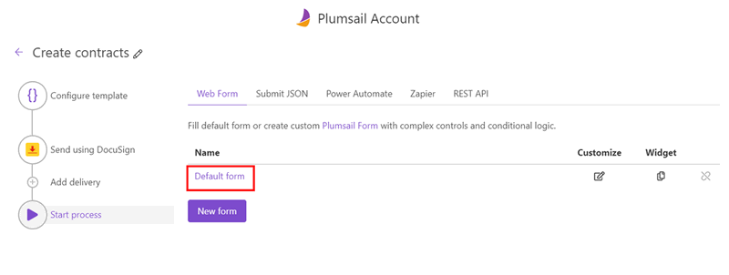
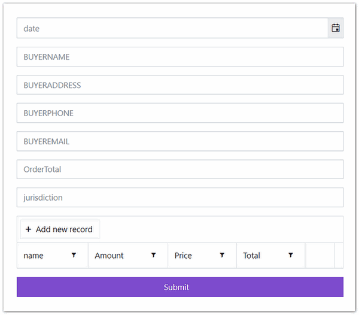
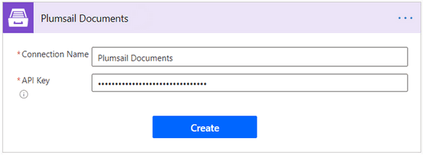
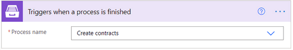
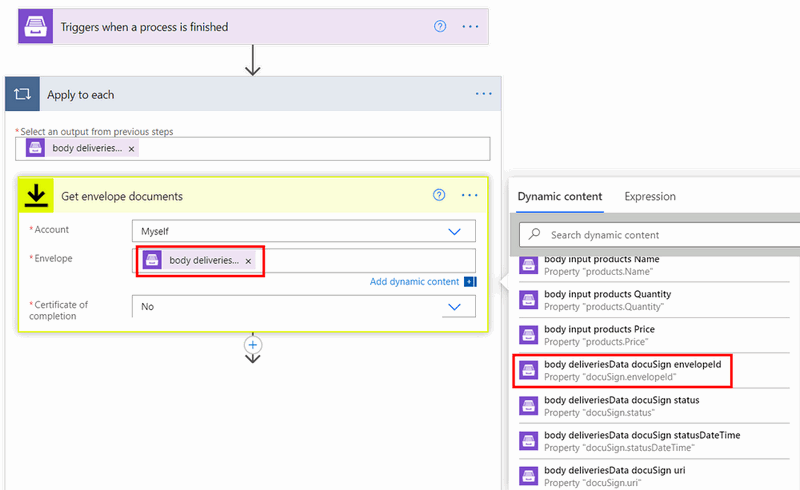
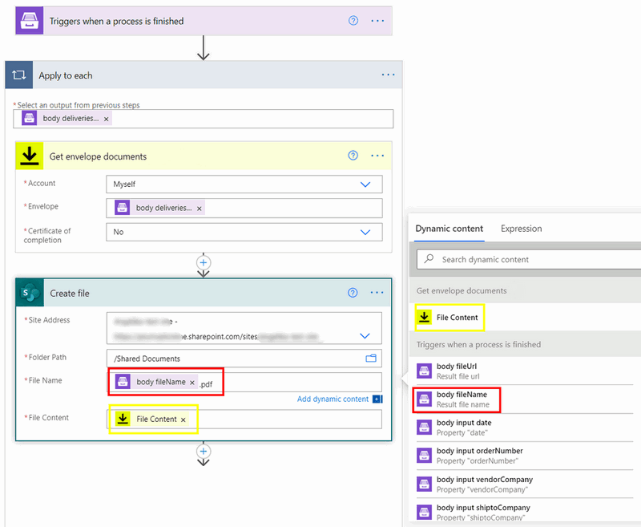
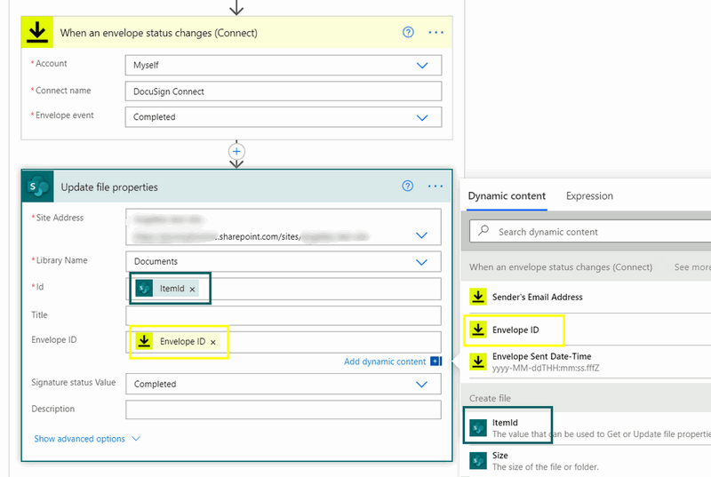

Track DocuSign Envelope status, save and update documents in SharePoint using Power Automate Flow
===================================================================================================

.. contents::
  :local:
  :depth: 1

Let’s consider such a scenario: you generate contracts, then send them to DocuSign for e-signing, you want to save documents from DocuSign envelope to a SharePoint library, and once the contract status changes, update the property of the corresponding document and receive a notification. 

As the DocuSign connector for Power Automate (formerly Microsoft Flow) doesn’t return any data helpful in locating the document in SharePoint, it’s impossible to extract the name of the documents in the envelope. Thus, you can’t update the particular document in the library. 
Also, it prevents you from creating meaningful notifications on which document has been signed, declined, voided, etc.

But the goal is reachable. What we're going to do:
  
1. We’ll use `Plumsail Documents <https://plumsail.com/documents/>`_ to create and deliver contracts to DocuSign.
2. We’ll create a Power Automate Flow that will save documents from a DocuSign envelope into a SharePoint library and will track the envelope status. Once it changes, the properties of the corresponding document will get updated.

We’ll describe the most simple logic that can be adapted. This is how our Flow may look: 

Trigger When a process is finished 
~~~~~~~~~~~~~~~~~~~~~~~~~~~~~~~~~~

This trigger is from the Plumsail Documents connector for Power Automate Flow. 
To make this trigger fire, we need to create a document generation process. 

Create process inside Plumsail Documents 
-----------------------------------------

It’s quite simple. `Log in to or register a Plumsail account <https://auth.plumsail.com/account/Register?ReturnUrl=https://account.plumsail.com/documents/processes/reg>`_. In the Processes section, add a new process. 

For demonstrating purposes, we’ll create the process from one of the premade templates – a sales agreement template. For that, click 'Add process' => 'Start from template' => Select 'Sales contract' template.

You can select any other template and adjust it to your requirements. Alternatively, you can upload your custom documents and replace data supposed to be dynamic with :code:`{{placeholders}}`.

For example, if you have a customer name in your document, place :code:`{{customerName}}`.

Later you can populate them with your data. 
We won't go into much detail on how Plumsail Documents templating language works. You can `learn it from the documentation <../../../document-generation/docx/index.html>`_.

Add DocuSign delivery
----------------------

The next step is to add a DocuSign delivery. Select DocuSign from other deliveries, connect to your DocuSign account to proceed to delivery settings.

In the picture above, you can see how we configured DocuSign delivery settings. More details in the `DocuSign delivery documentation <../../../user-guide/processes/deliveries/docusign.html>`_.

Run Plumsail Documents process
-------------------------------

You can add as many deliveries as you need. We're moving to the final step here - Start document generation process. 
We'll fill in a data collection form to launch the process. This form is available on the 'Start process' step.

Click on it, a data capture form will open in a new tab:

You can share the form link or embed the form to your site.

.. hint:: Launch the process using Power Automate or Zapier to populate your custom data from third systems into documents. See the corresponding tabs on the 'Start process' step. They include ready-to-go workflow templates. 

We're ready to create a Power Automate Flow. 

Add 'When a process is finished' trigger
-----------------------------------------

.. note:: Currently, the action is only available in a custom connector. Please `find out how to create one <https://plumsail.com/docs/documents/v1.x/flow/create-custom-connector.html>`_.

Go to `Your Flows in Power Automate <https://emea.flow.microsoft.com/manage/flows>`_.
Add a new automated Flow. Select 'Triggers when a process is finished' from the custom Plumsail Documents connector you've recently created.

If this is your first time using Plumsail Documents in Power Automate Flow, you'll be asked to create a connection:

Assign any name to the connection. As for an API key, you need to `create it inside your Plumsail account <https://account.plumsail.com/documents/api-keys>`_. 

Select a process you'd like to associate with this Flow from a dropdown.

The trigger is set. 

Get envelope documents and save to SharePoint
~~~~~~~~~~~~~~~~~~~~~~~~~~~~~~~~~~~~~~~~~~~~~~~

Next, we add an action from the DocuSign connector for Power Automate Flow. The action is 'Get envelope documents'. 

Again, if this is your first time using DocuSign in Power Automate Flow, you'll be asked to sign in to your DocuSign account from Power Automate. 
After that, you can proceed to configure the action. For Envelope, select dynamic output from the trigger - :code:`docuSign envelopid`. 
It will pass IDs of envelopes that are created by the DocuSign delivery in Plumsail Documents.

The 'apply to each' loop will apply automatically. Continue adding steps inside the loop. 

The next step is to save documents to a SharePoint library. We use the action 'Create file' from the SharePoint connector for Power Automate Flow. 

For File Name, we use the dynamic output from the trigger. Do not forget to specify :code:`.pdf` extension for it. Otherwise, the file won't be readable. 

For File Content, we select dynamic output from the 'Get envelope documents' action.

Thus, all documents generated by the Plumsail Documents process and sent to DocuSign for signing will be saved into a SharePoint library. 

Update file properties when DocuSign envelope status changes
~~~~~~~~~~~~~~~~~~~~~~~~~~~~~~~~~~~~~~~~~~~~~~~~~~~~~~~~~~~~~~

By next two actions, we'll track DocuSign envelope status and once documents are signed, we'll update the properties of the corresponding document in the SharePoint folder. 

Add 'When an envelope status changes' from the DocuSign connector. 
Type in anything for Connect Name. For Envelope Event, we set 'Completed'. It's possible to track any other status.

Then add another action from the SharePoint connector - 'Update file properties'. For ID, select Itemid from the dynamic output of the 'Create file' action.

Our SharePoint library has columns for Envelop ID and status properties. We specified them accordingly. 

We will stop here, but, of course, you can continue and add customized notifications that will include filenames instead of just saying 'Some envelope was signed'. 

If you have any questions or want to share ideas, please, feel free to drop us a line at `support@plumsail.com <mailto:support@plumsail.com>`_. 

