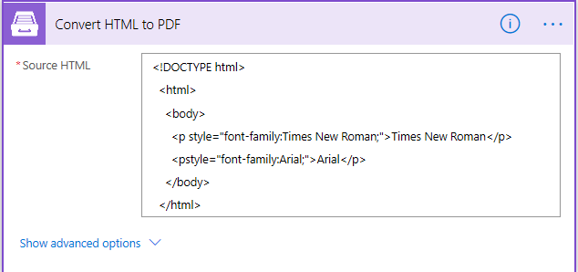
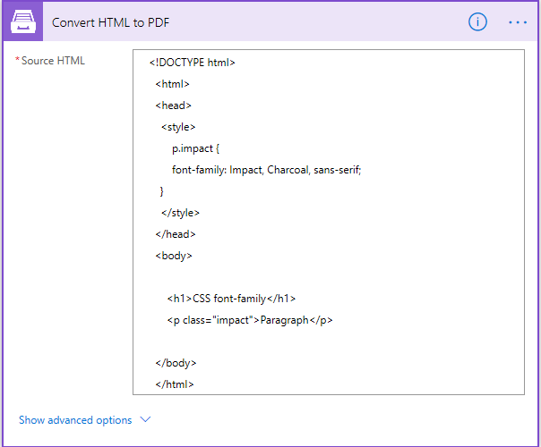
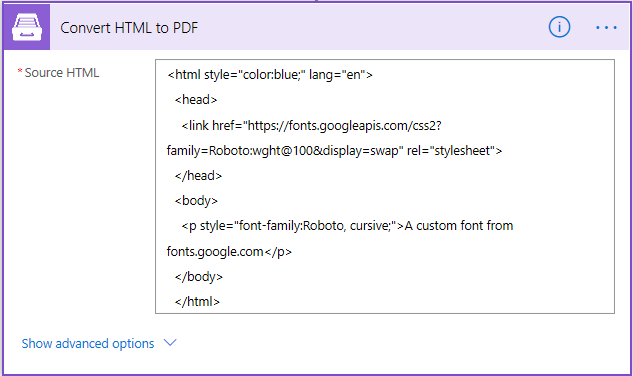
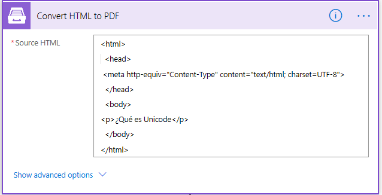
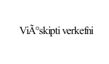
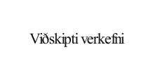

.. title:: HTML to PDF conversion with custom fonts and multi-lingual support in Plumsail Documents connectos for Power Automate

.. meta::
   :description: Plumsail Documents HTML2PDF ensures the result PDF has the same fonts as in the initial file. It converts foreign characters correctly as it has multi-lingual support.

How to use custom fonts and add multi-lingual support to converting HTML to PDF
===============================================================================

In this article, I'll show how Plumsail Documents action `Convert HTML to PDF <https://plumsail.com/docs/documents/v1.x/flow/actions/document-processing.html#convert-html-to-pdf>`_
works with different fonts and how to convert foreign characters correctly.

.. contents::
    :local:
    :depth: 1

Using custom fonts
-------------------

Plumsail Documents action `Convert HTML to PDF <https://plumsail.com/docs/documents/v1.x/flow/actions/document-processing.html#convert-html-to-pdf>`_
supports several common fonts out of the box. For example, Times New Roman or Arial:

.. code::

  <!DOCTYPE html>
  <html>
    <body>
      
Times New Roman

      <pstyle="font-family:Arial;">Arial

    </body>
  </html>

Also, It's possible to use CSS inside HTML code to set a default font or apply the font to a specific section of the document:

.. code::

  <!DOCTYPE html>
    <html>
    <head>
      
    </head>
    <body>

        <h1>CSS font-family</h1>
        
Paragraph

    </body>
    </html>

Using external fonts
-------------------

Convert HTML to PDF supports external fonts as well. It's a common case when you need to include external fonts, 

for example, `Google fonts <https://fonts.google.com/>`_. The Source HTML might be the following:

.. code::

  <html style="color:blue;" lang="en">
  <head>
    <link href="https://fonts.googleapis.com/css2?family=Roboto:wght@100&display=swap" rel="stylesheet">
  </head>
  <body>
    
A custom font from fonts.google.com

  </body>
  </html>

Support of Unicode characters
-----------------------------
Some fonts do not support foreign characters. Thus, to support a specific language 
you may need to add some specific font that supports the language.

It is possible to generate PDFs with foreign languages, or languages that contain special characters such as £.
Convert HTML to PDF supports most of what is supported by UTF-8. However, you need to add the following line in the HTML head element:

.. code::

    <meta http-equiv="Content-Type" content="text/html; charset=UTF-8"> 

Let's take this HTML:

.. code::

    <html>
      <head>
      </head>
        <body>
          
Viðskipti verkefni

        </body>
    </html>

Without this code 

.. code::

    <meta http-equiv="Content-Type" content="text/html; charset=UTF-8">

the result will look like this:

After adding this part unicode characters should be converted properly.

.. code::

    <html>
      <head>
      <meta http-equiv="Content-Type" content="text/html; charset=UTF-8">
      </head>
        <body>
          
Viðskipti verkefni

        </body>
    </html>

These are supported languages: Albanian, Arabic,
Armenian, Bulgarian, Traditional and Simplified Chinese, Croatian, Czech, Danish, 
Dutch, Esperanto, Finnish, French, Georgian, German, Greek, 
Hebrey, Hungarian, Icelandic, Igbo, Interlingua, Italian, Japanese, 
Korean, Lithuanian, Macedonian, Maltese, Mongolian, Occitan, Persian,
Polish, Portuguese, Romanian, Russian, Serbian, Slovenian, Spanish, 
Swedish, Thai, Ukrainian, Upper Sorbian, Turkish, Uyghur, Vietnamese, and Welsh.

.. Hint:: Please have a look at this article `How to convert HTML to PDF in Power Automate (Microsoft Flow) and Azure Logic Apps <../../how-tos/documents/convert-html-to-pdf.html>`_ .
