.. title:: How to pass data to Plumsail Documents from Power Apps in Microsoft Flow

.. meta::
   :description: Connect Power Apps and Plumsail Documents in your Flows to automate document generation and processing.

How to pass data to Plumsail Documents from Power Apps in Power Automate Flow
=============================================================================

In this article, we'll describe how to connect Plumsail Documents and Microsoft Power Apps in `Power Automate (Microsoft Flow) <https://flow.microsoft.com>`_ to start the process of generating documents from templates by the PowerApps application.

`Power Apps`_ enable you to build a user interface for a mobile-friendly business app without coding. Power Apps can be integrated with cloud services such as MS Dynamics 365, OneDrive, SharePoint, SQL, and Oracle databases. Though the process of building an app is fairly simple and intuitive, there are a few features that might be a bit tricky, such as sharing the app’s resources. 

.. contents::
    :local:
    :depth: 2

Case description
~~~~~~~~~~~~~~~~

We'll make the simplest app with a button to get data from a SharePoint list, apply it to the template in the Plumsail Documents processes  -  by `start document generation process` action. Let us say, we've set the process to create PDFs from a DOCX template and to deliver the ready document to the SharePoint library. The button is used to save the schedule for the booked conference rooms for today. In this example, the SharePoint list stores room title and time.

Set up Power Automate (Microsoft Flow)
~~~~~~~~~~~~~~~~~~~~~~~~~~~~~~~~~~~~~~

First, we’ll set up a Power Automate Flow. It will get triggered on the Power Apps call, get the data from the list, filter out rooms booked for today, start document generation process. 

We won't go through every step in much detail here. If you wish to get a thorough understanding of how the Plumsail Documents work in Power Automate, please consider consulting with `our documentation <../../../getting-started/use-from-flow.html>`_. 

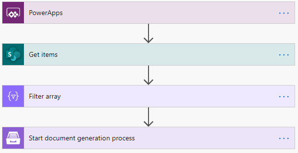

Create an app
~~~~~~~~~~~~~
After we’ve tested the flow, let’s set up the Power Apps app. We need to open the Power Apps workspace and create a new app:

|powerapps-create-app|

We *insert* a new *button control*, then select *Action* -> *Power Automate*. In a pop-up window there’ll be a list of all our workflows that have the *Power Apps* trigger. We add the flow created above and make sure to complete the *Run()* method in the formula bar. 

|powerapps-add-flow|

Then you can share your app with everyone who’s supposed to use it. We’ll add everyone in the Office365 tenant:

|powerapp-share-app|

Pass data from app into Flow
~~~~~~~~~~~~~~~~~~~~~~~~~~~~

You may want to gather some data right in the PowerApps app and pass it to the Power Automate Flow to apply it to the template in Plumsail Documents.

Requesting input for some fields from Power Apps may restrict property type that can be passed.
For example, if you ask input for the *Template data* field of a Documents action, an accordant property will be specified as a JSON object in trigger’s input schema:

|json-from-powerapps|

For such cases, ensure that your app passes a JSON object to the Flow.
Use `Power Apps JSON function <https://docs.microsoft.com/en-us/powerapps/maker/canvas-apps/functions/function-json>`_ to generate an object based on app data.
But for simple cases, you can compose an object right in the Flow.
Use a *Compose* action and request values for the one from your app.
The data type will not be restricted:

|Any|

Thus, you can pass the output of any type to flow.
Just don’t forget to name the fields the same way as the properties in your Flow. 
Below, I pass plain text output:

|Run|

The output of the *Compose* action can be passed as template data to the Documents action:

|Compose|

Share connection
~~~~~~~~~~~~~~~~
We’re almost there! However, if our end-user tries to use the shared app now, he or she may encounter an error like this one: 

|powerapps-error|

The error claims that our Plumsail Connection wasn’t shared with the end-user, so it’s time to change that.

All your connections are listed in the *Connections* tab of the *Power Automate (Microsoft Flow)* menu. (*Data* -> *Connections*)

|powerapps-flow-connections|

To share the app and the connection with the members of your Office365 tenant properly, you need to choose the connection you’re using in the Flow and select *Share*:

|powerapps-share-connection|

Select *Add everyone in my org* or choose the *users and groups* you need to share the connection with. 

|powerapps-add-everyone|

Now your connection is available for every user you’ve chosen. They can see the connection on the *Connections* tab in their Power Automate (Microsoft Flow) workspace and, more importantly, use your app right away. 

.. _Power Apps: https://powerapps.microsoft.com/

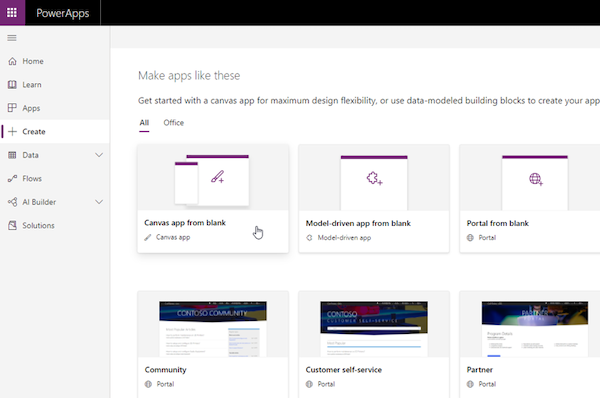
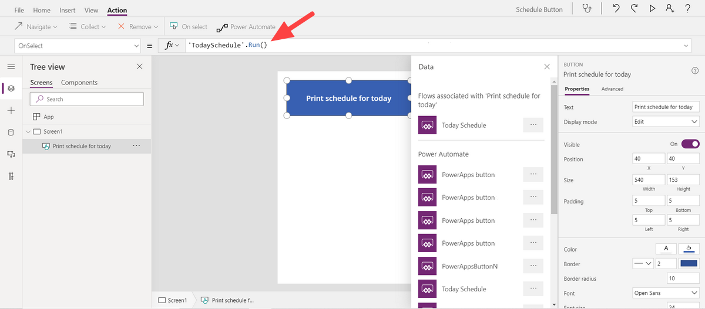
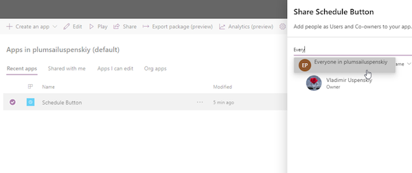
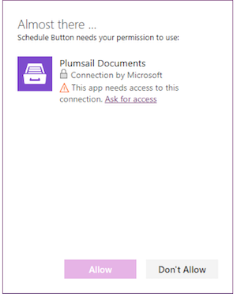
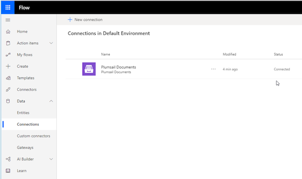
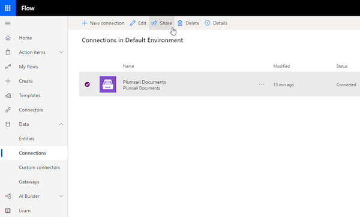
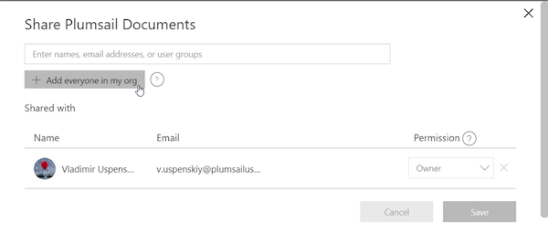
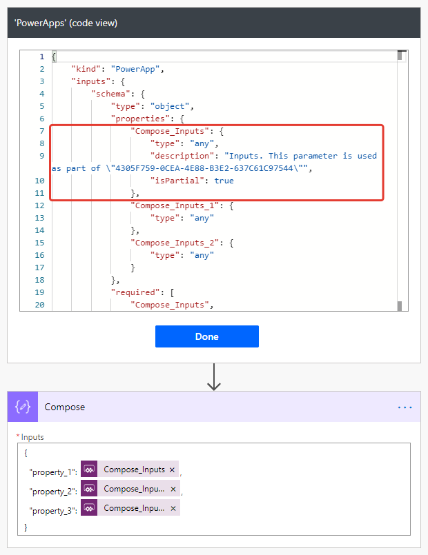
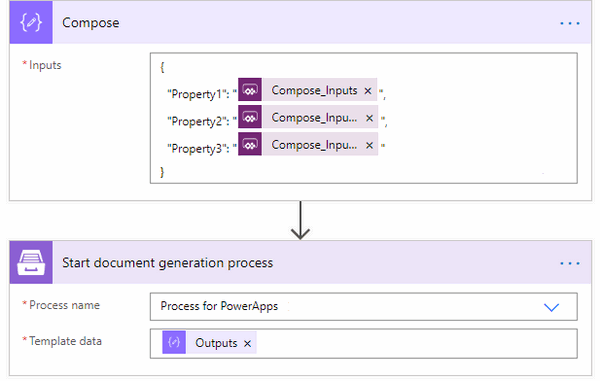
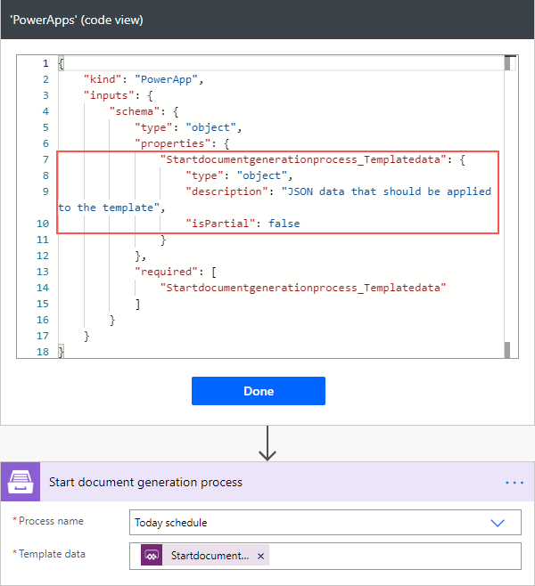
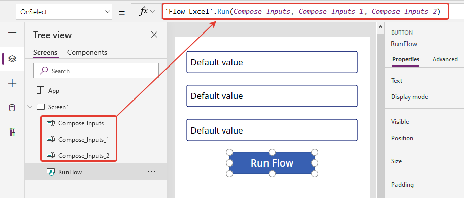
