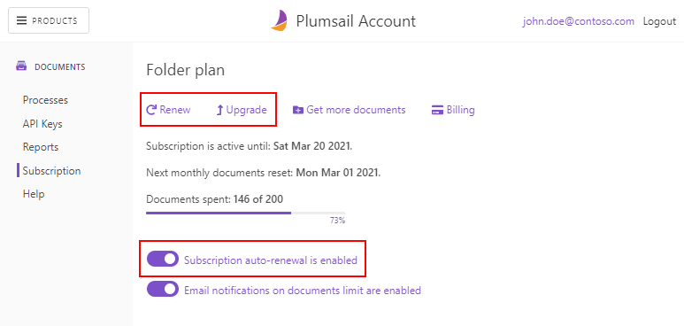
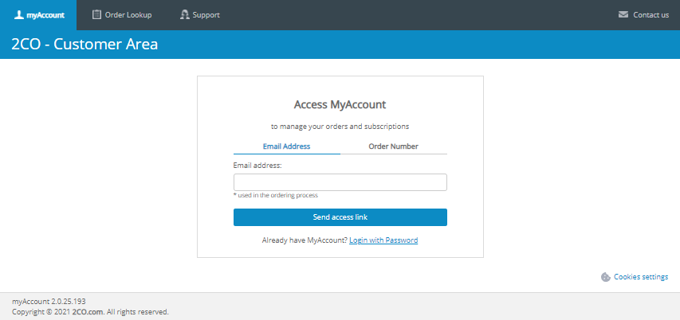
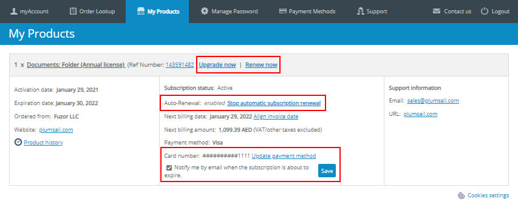

Licensing details
#################

You can choose your billing cycle — purchase for one year or pay month-to-month. The subscription is linked to an email address. It includes executions of processes, a set of actions for Power Automate (Microsoft Flow) or Logic apps, and access to REST API.

There are three plans available:

- **Folder** - you can generate up to 200 documents monthly
- **Drawer** - you can generate up to 1000 documents monthly
- **Cabinet** - you can generate up to 3000 documents monthly

If none of the plans satisfies your requirements, fill in `this contact form <https://plumsail.com/documents/store/custom-pricing/>`_ or drop us a message at sales@plumsail.com.

.. contents::
    :local:
    :depth: 2

What are documents?
-------------------

Each run of Plumsail Documents processes means a single document. Thus, even if you use processes to create a document from a template, then convert it to PDF, add a watermark and protect your PDF - we charge for just one document because it's a single run of the process to complete all these actions.

As for actions from the Plumsail Documents connector for Power Automate (Microsoft Flow) and Logic Apps, there each execution is considered one document as well. For instance,  if you use the "Split PDF" action to split a single PDF document into a few separate documents; we charge for a single document only, because it is a single execution.

What happens when all documents are spent?
------------------------------------------

You can see usage stats in your `Plumsail Documents account <https://account.plumsail.com/documents/license>`_. If you see that you most likely reach the limit this month, you can purchase `additional 100 documents <https://secure.2checkout.com/order/checkout.php?PRODS=16287655&QTY=1&CART=1&CARD=2&SHORT_FORM=1&ORDERSTYLE=nLWonJWpmHI=&PAY_TYPE=CCVISAMC&SRC=documentation&BACK_REF=https%3A%2F%2Fplumsail.com%2Fstore%2F>`_ or pay a differential cost to `start using another plan <upgrade-renew.html>`_. 

The documents amount will be reset on the 1st day of a month according to your current plan. 

How to upgrade or renew subscription
------------------------------------

Open the `Documents subscription page <https://account.plumsail.com/documents/subscription>`_ in your Plumsail account:

|subscription|

You will see a summary and controls for your current subscription.
The **auto-renewal** toggle is available when your last order was paid with a credit card.
Clicking **Renew**, **Upgrade** or **Get more documents** will start placing an accordant order.
The **Billing** link leads to a `2Checkout shopper account <https://secure.2co.com/myaccount/>`_.
To log into it, you need to enter either order reference or the email which you used when purchased Documents, and it may not match with the Plumsail account email.

|myaccount|

2Checkout is a payment processor of our store.
In the shopper account, you can do the same financial operations as on the subscription page but it also provides additional opportunities:

* managing notifications about soon expiration of the subscription,
* changing payment method,
* tracking the history of financial operations,
* access to order details,
* getting financial support.

|myproducts|

Trial subscription
------------------

Likely you start using Plumsail Documents with a trial.
It enables you to try our product on a "Drawer" plan.
The trial period lasts for 30 days.
Then, you can purchase a subscription right in the Plumsail account.
If you choose not to purchase the license, the product will stop working.

|trial|

End-User Software License Agreement
-----------------------------------

`End-User Software License Agreement <https://plumsail.com/license-agreement/>`_

.. |trial| image:: ../_static/img/general/general-licensing-trial.png
   :alt: Trial subscription