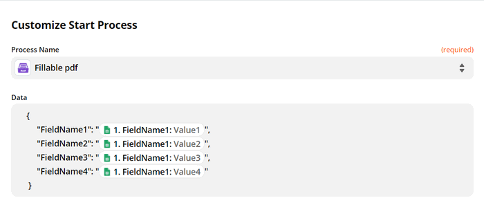

Use Zapier
==========

`Zapier <https://zapier.com/apps/plumsail-documents/integrations>`_ allows you to connect the `Processes <https://plumsail.com/docs/documents/v1.x/user-guide/processes/index.html>`_ with thousands of other web applications. 

**Plumsail Processes** are a user-friendly interface where you can configure your documents flow and make it automated. You work with templates, create documents in different formats, convert them, protect if needed, or add watermarks to PDFs, deliver the results - all actions in one place. 

.. contents::
    :local:
    :depth: 3

Introduction to Zapier
~~~~~~~~~~~~~~~~~~~~~~

**Zaps** are automated connections between apps in Zapier. Every Zap has a **trigger** - an event that makes this Zap start. And after the trigger, an **action** or a series of actions follow to bring the desired result.

Some apps integrated with Zapier have both triggers and actions. Some have either triggers or actions.

Plumsail Documents includes an action **Start Process**.

.. image:: ../../_static/img/user-guide/processes/start-process-zapier.png
    :alt: Start process in Zapier

Create zaps with Plumsail Documents
~~~~~~~~~~~~~~~~~~~~~~~~~~~~~~~~~~~

You can generate personalized documents based on data from thousands of apps in Zapier. Various events can trigger an automated connection of apps - a Zap. It can be web form entries, new rows in sheets, new events in calendars, new opportunities in CRM - the list is never-ending. 

We'll show how to handle Plumsail Documents action - **Start Process** - in Zapier.  

Let us say you have a Google Calendar for conferences. You need to generate personalized invitations. 

This is how our Zap looks:

.. image:: ../../_static/img/user-guide/processes/sample-zap.png
    :alt: sample zap

Set trigger
-----------

The first step is a trigger. In this particular case, it's a new event in the Google Calendar. 

When a new event is added to the Google Calendar, the process of generating tickets for this event will start.

Start Process in Plumsail Documents
-----------------------------------

After setting a trigger, add an action Start process. For that, search for Plumsail Documents, choose an action Start Process.

.. image:: ../../_static/img/user-guide/processes/zapier-start-process-action.png
    :alt: sample zap

Click Continue. If this is your first Zap, at this point, you'll need to Sign in to your `Plumsail Account <https://auth.plumsail.com/account/login>`_ from Zapier to establish a connection between the app and your account. If you already have a Plumsail account tied to the app, you can add another one at this step, and use it instead.

Choose the process you want to start by this Zap from the dropdown. 

.. image:: ../../_static/img/user-guide/processes/select-process-zapier.png
    :alt: select process

The next step is to customize Start Process.

Customize Start Process
-----------------------

Zapier pulls data on tokens from a document template when you create a new process and save the template. All you need to do is to fill the fields to populate the template. 
Use the output from the trigger to specify values for populating the template:

.. image:: ../../_static/img/user-guide/processes/JSON-data-Zapier.png
    :alt: JSON data in Zapier

Multiple line items
*******************

Sometimes you need to display a collection of items. For example, a collection of products in the invoice. You used nested tags with a dot operator (like :code:`{{products.name}}`, :code:`{{products.cost}}`, etc.) to let the process know that you want to display properties from some object. 

In Zapier, the object will be outlined. As the Plumsail Documents integration supports `line items <https://zapier.com/help/create/basics/use-line-items-in-zaps>`_, it's possible to use the output arrays from the trigger to specify values:

.. image:: ../../_static/img/user-guide/processes/line-items-zap.png
    :alt: line items example

The templating engine will automatically add information for each item. 

.. image:: ../_static/img/user-guide/processes/how-tos/template-table-result.png
    :alt: Template table result

Fillable PDF and HTML templates
*******************************

If your process has a PDF form as a template or an HTML file as a template, the "Customize Start Process" step will differ a bit. You'll need to specify data for populating the template in JSON format.
Nothing fancy here, use the following format:

.. code:: json

    {
        "FieldName1": "Value1",
        "FieldName2": "Value2",
        "FieldName3": "Value3",
        "FieldName4": "Value4"
    }

To specify values, you can use the trigger output as well:

Use the result file in Zapier
~~~~~~~~~~~~~~~~~~~~~~~~~~~~~

It's possible to use the output of the Start process action further in the zap. 

You'll be able to add the result file as an attachment:

.. image:: ../../_static/img/user-guide/processes/result-file-zapier.png
    :alt: use result file in Zapier

