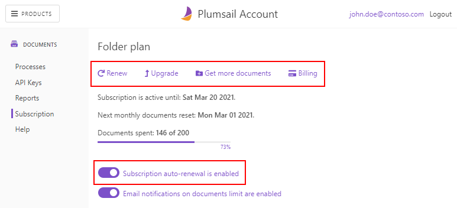
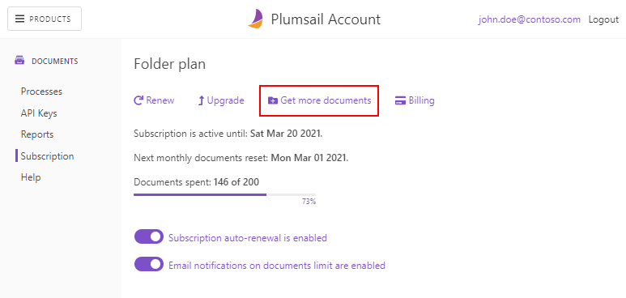
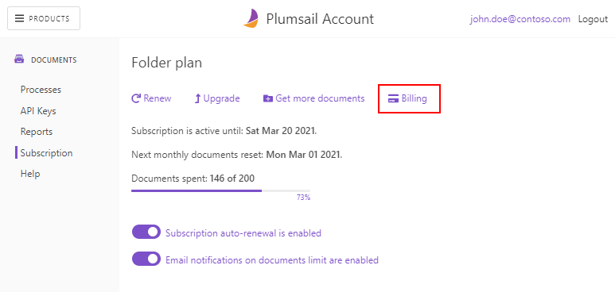
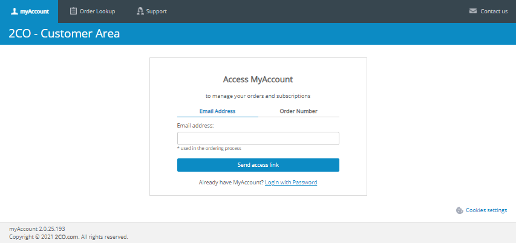
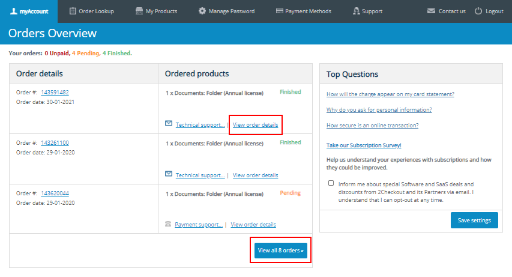
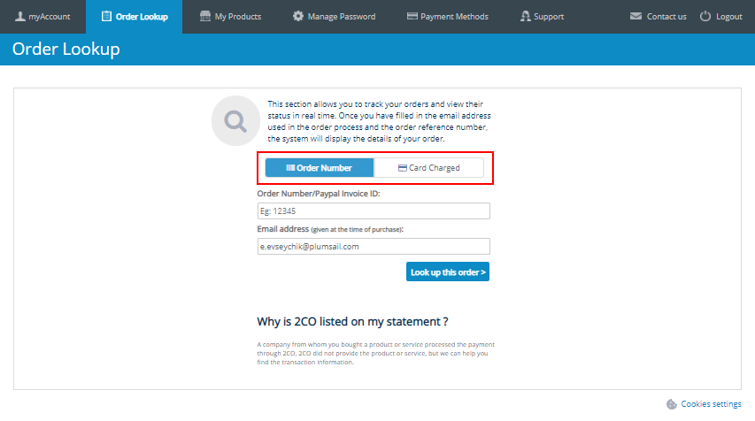
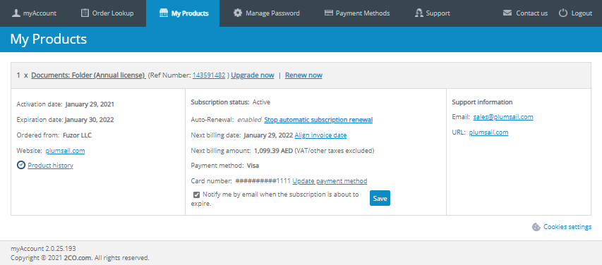

Subscription and notifications
==============================

.. contents::
    :local:
    :depth: 2

Email notifications
-------------------

On a `subscription page`_ of the Plumsail account, switch the **notifications toggle** to change the preference.
You will receive messages to the account's email when:

* less than 30% of documents are left,
* less than 10% of documents are left,
* all documents were exhausted.

Please make sure that they don't get to your spam folder.

|notifications|

How to manage subscription
--------------------------

On the `subscription page`_, click **Renew** or **Upgrade** to place an accordant order.
The **auto-renewal toggle** is available when your last order was paid with a credit card.

|subscription|

How to increase the monthly limit of documents
----------------------------------------------

On the `subscription page`_, click **Get more documents** to purchase additional 100 documents.
The replenished documents will not remain after another monthly reset or renewal.

|limit|

How to manage billing
---------------------

On the `subscription page`_, click **Billing** to sign into a `2Checkout shopper account`_.
2Checkout is a payment processor of our store.
In the account, you can manage the subscription as well and get access to financial information and managing expiration notifications.

|billing|

You will need to enter either an order reference or the email which you used when purchased Documents.
It may not match with the Plumsail account email.

|myaccount|

On the **myAccount** tab, you will find the list of the recent orders.
You can display all of them or view details and request a refund of a certain one.

|orders|

On the **Order Lookup** tab, you can seek orders by their numbers or the credit card if it was used.

|lookup|

On the **My Products** tab, you will find the list of subscriptions with detailed information on them.
Here, you can:

* renew or upgrade a subscription,
* enable or disable automatic billing,
* change a payment method for a certain subscription,
* enable or disable expiration notification.

|myproducts|

.. _`subscription page`: https://account.plumsail.com/documents/subscription
.. _`2Checkout shopper account`: https://secure.2co.com/myaccount/

.. |notifications| image:: ../_static/img/general/documents-email-notifications.png
   :alt: Notifications toggle

