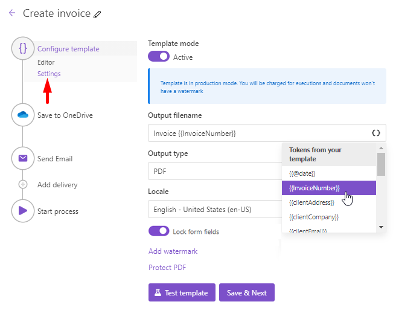

Configure output file format and other settings
===============================================

After you've finished `working on the template <./edit-test-template.html>`_, you proceed to the Configure template substep - *Settings*.

Here you customize the following settings:

- :ref:`Mode <process-mode>`
- :ref:`output-filename`
- :ref:`output-type`
- :ref:`lock-form-fields`
- :ref:`add-watermark`
- :ref:`protect-pdf`

.. _process-mode: 

Mode
----

It is *Testing* by default. It means you won't be charged for executions of this process but result documents will have a Plumsail watermark. Change it to "Active" to remove the watermark.

.. _output-filename:

Output filename
---------------

The filename of the result document. You can use tokens inside this field.

.. include:: tokens-description-part.rst

.. _output-type:

Output type
-----------

Type of the output file. By default, it is the same as your template but you can change it to PDF.

.. _lock-form-fields:

Lock form fields
----------------

The option locks the form fields once your process is completed. It's activated by default.
If you want to edit fields in the result PDF file - disable the option.

.. _add-watermark:

Add watermark
-------------

You can see this option if you selected PDF as an output type. Click on the *Add watermark* and upload a PNG image for your watermark. 
You will see the watermark configuration dialog:

.. image:: ../../_static/img/user-guide/processes/add-watermark-dialog.png
    :alt: Watermark dialog

You can specify position and opacity of your watermark.

.. _protect-pdf: 

Protect PDF
-----------

You can see this option if you selected PDF as an output type. 
It allows you to protect your PDF by setting a password, disabling printing, etc. Just click on the *Protect PDF* link and specify settings you need:

.. image:: ../../_static/img/user-guide/processes/protect-pdf-dialog.png
    :alt: Protect PDF dialog

.. Note:: Once you finished configuration of the template you can `proceed to add deliveries <create-delivery.html>`_ (email, OneDrive, eSignatures, etc). Just click the *Save & Next* button in the *Configure template* step.