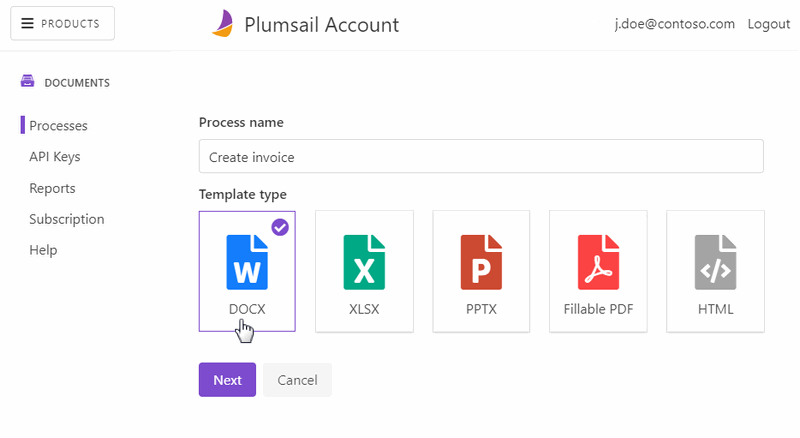

Create a new process
====================

To create a new process, navigate to `Processes <https://account.plumsail.com/documents/processes>`_ section of your account and click *Add process*:

.. image:: ../../_static/img/user-guide/processes/create-process-view.png
    :alt: Create process button

Fill in the process name and upload a blank file in a required format for future document template. It can be Word, Excel, PowerPoint, or HTML files - depending on what kind of a template you need. 

The processes support fillable PDFs as templates. If you have a PDF form as a template, upload it. 

Then click the *Create* button:

.. Note:: Once the process is created, you will proceed to `prepare and test the template <./edit-test-template.html>`_.