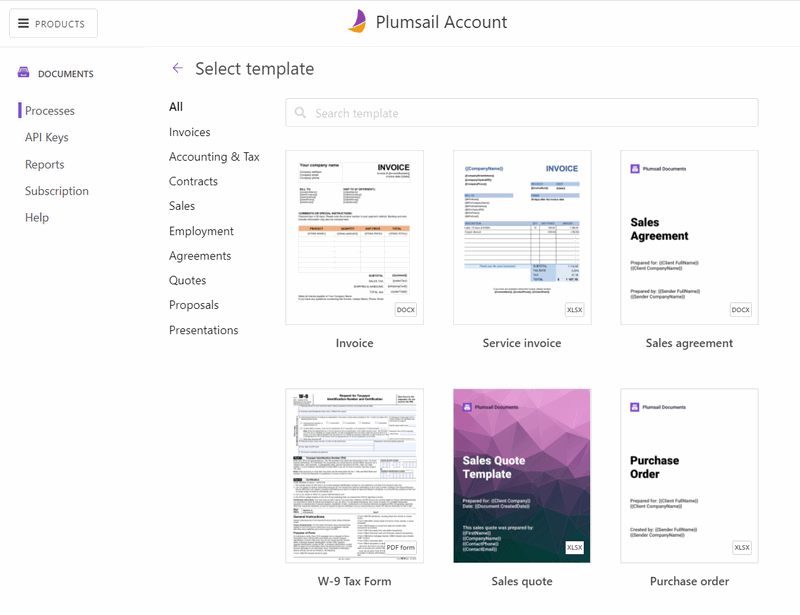

Create a new process
====================

To create a new process, navigate to the `Processes <https://account.plumsail.com/documents/processes>`_ section of your account and click **Add process**:

You can choose to start from one of the premade document templates. Then adjust it to your business and personal requirements:

Or start from blank. You'll be asked to select one of the template types:

- Word DOCX
- Excel XLSX
- PowerPoint PPTX
- Fillable PDF forms
- HTML

.. image:: ../../_static/img/user-guide/processes/create-process-form.png
    :alt: Create process form

Click on the **Next** button to continue.  

.. Note:: Once the process is created, you will proceed to `prepare and test the template <./edit-test-template.html>`_.