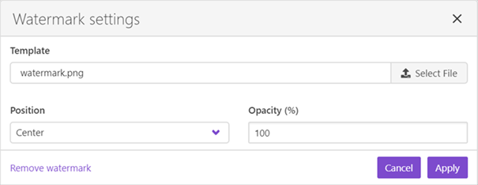
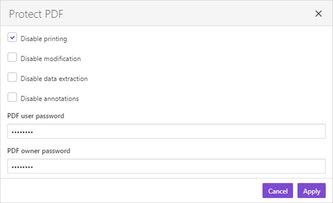

Create a new process
====================

Once you `created a document template <create-template.html>`_ you can create a new process. Navigate to `Processes <https://account.plumsail.com/documents/processes>`_ section of your account and click *Add process*:

.. image:: ../../_static/img/user-guide/processes/create-process-view.png
    :alt: Create process button

Fill in the process name and upload your template. Here we use `the DOCX template for invoice <../../_static/files/user-guide/processes/invoice-template.docx>`_. 

Then click the *Create* button:

.. image:: ../../_static/img/user-guide/processes/create-process-form.png
    :alt: Create process form

Configure template
------------------

Once you created the process, its first step *Configure template* will appear on the screen. It has two substeps - *Editor* and *Settings*. 

We will take a closer look at them.

Editor substep
~~~~~~~~~~~~~~
On this substep first, you see the preview of the document template.

.. image:: ../../_static/img/user-guide/processes/configure-template-step.png
    :alt: Configure template step

As you can see, it’s possible to upload a new file as a template from here. 
And download the template if you need it, say, for offline editing or storing. 

The editor enables you to make changes to the document template online – right in your Plumsail account. 

For that, click on the *Edit online*, and you will proceed to the editing mode.
Now it’s possible to make any necessary changes to the document template. 

.. image:: ../../_static/img/user-guide/processes/online-editor-mode.png
    :alt: Online editor mode on

The online editor provides a full-screen mode for more convenience in working with the template. 
Enter and exit it by simply clicking on the button. 

Once you’ve done with editing; you can exit the online editor by clicking on *Exit editor*. 
You will return to the preview of the template. 

.. note:: If you exit the online editor, you confirm the changes. After exiting you won’t be able to undo changes, only to make new ones.

Online editor for Word, Excel, and PowerPoint templates is supported by Google Docs. 
For editing HTML templates, it uses CodeMirror with HTML Mixed mode. For more information, you can visit the `Online editor reference page <./online-editor.html>`_. 

Settings substep
~~~~~~~~~~~~~~~~

.. image:: ../../_static/img/user-guide/processes/settings-of-template.png
    :alt: Settings of template substep

Here you customize the following settings:

- :ref:`Mode <process-mode>`
- :ref:`output-filename`
- :ref:`output-type`
- :ref:`add-watermark`
- :ref:`protect-pdf`

.. _process-mode: 

Mode
~~~~

It is *Testing* by default. It means you won't be charged for executions of this process but result documents will have a Plumsail watermark. Change it to "Active" to remove the watermark.

.. _output-filename:

Output filename
~~~~~~~~~~~~~~~

The filename of the result document. You can use tokens inside this field.

.. include:: tokens-description-part.rst

.. _output-type:

Output type
~~~~~~~~~~~

Type of the output file. By default, it is the same as your template but you can change it to PDF.

.. _add-watermark:

Add watermark
~~~~~~~~~~~~~

You can see this option if you selected PDF as an output type. Click on the *Add watermark* and upload a PNG image for your watermark. 
You will see the watermark configuration dialog:

You can specify position and opacity of your watermark.

.. _protect-pdf: 

Protect PDF
~~~~~~~~~~~

You can see this option if you selected PDF as an output type. 
It allows you to protect your PDF by setting a password, disabling printing, etc. Just click on the *Protect PDF* link and specify settings you need:

.. Note:: Once you finished configuration you can `test the template <test-template.html>`_.