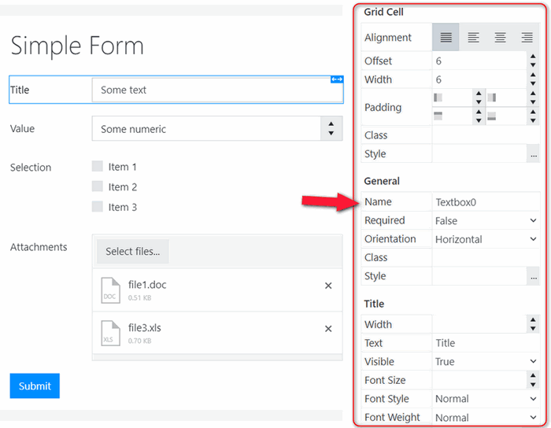
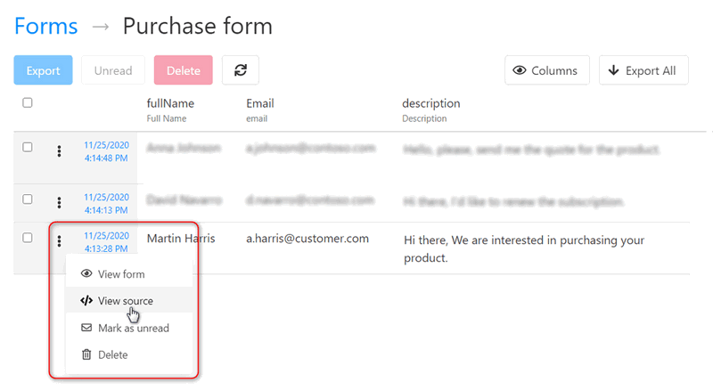
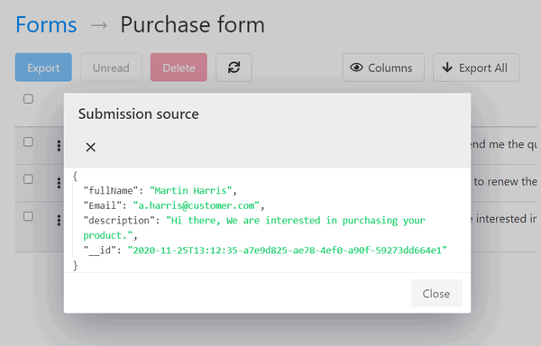

Customize forms using Plumsail Forms
====================================

.. contents::
    :local:
    :depth: 1

The process pulls tokens from the document template and creates a web form based on them. 

With the help of `Plumsail Forms <https://plumsail.com/forms/public-forms/>`_, it's possible to create a custom form using the auto-generated one as a basis.
You can add more complex controls and conditional logic to it.

Create custom form using Plumsail Forms
~~~~~~~~~~~~~~~~~~~~~~~~~~~~~~~~~~~~~~~

To create a new form based on the default one, go to the step 'Start process' and click the 'Customize icon' opposite the default form:

.. image:: /_static/img/user-guide/processes/customize-form-icon.png
   :alt: customize form icon

**OR** click on the 'New form' button and select 'Create new form':

.. image:: /_static/img/user-guide/processes/create-new-form.png
   :alt: create new form 

.. note:: At this point, you'll be notified that you're starting using Plumsail Forms under a `free Scooter plan <https://plumsail.com/forms/store/public-forms/>`_. It includes 100 submissions in a month and has some limitations of file storage. Switch to a higher plan at any time.

After that, you'll be redirected to the web designer of Plumsail Forms. There you can customize the default form according to your needs.

Find out more about `how to design Plumsail web forms <https://plumsail.com/docs/forms-web/design.html>`_.

Bind existing form to the process
~~~~~~~~~~~~~~~~~~~~~~~~~~~~~~~~~

In case you need to assosiate the existing Plumsail web form with your process, click the 'New form' button and select 'Bind existing form'.

.. image:: /_static/img/user-guide/processes/bind-form-button.png
   :alt: bind existing form

Understand the structure of data sent by a form
~~~~~~~~~~~~~~~~~~~~~~~~~~~~~~~~~~~~~~~~~~~~~~~

The form sends JSON data to the process when it is submitted. This data will be applied to your template. It is crucial to understand the structure of this JSON object to create the correct document template.

Each control and field that you added to your form has an internal name. This internal name will represent the property in the JSON object submitted by your form. You can change it in the designer like this:

To see the full JSON object submitted by a form, `go to the list of your forms <https://account.plumsail.com/forms/forms>`_. 
Click on the form and then pick the desired submission of it. 
Click on the dots and select </> View source:

It will open a dialog with JSON submission source:

