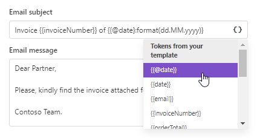
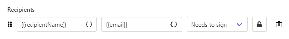

Adobe Sign delivery
===================

The `Adobe Sign <https://acrobat.adobe.com/us/en/sign.html>`_ delivery sends the resulting document to Adobe Sign for signing. 

At first, you need to connect to your Adobe Sign account from the Plumsail account:

After that, you'll be able to customize the Adobe Sign delivery settings.

.. contents::
    :local:
    :depth: 1

Main settings
-------------

**Type in the email subject and message**:

**Add recipients** - as many as you need. Assign roles to them:

.. image:: ../../../_static/img/user-guide/processes/adobe-sign-recipients.png
    :alt: add recipients

.. note:: If you select "Needs to fill form", mind that you have to enable the option "Allow senders to mark some recipients as form fillers" inside your Adobe Sign account. You can find it the Account Settings => Send Settings.

.. image:: ../../../_static/img/user-guide/processes/adobe-sign-allow-fill-form.png
    :alt: allow senders to mark recipients as form fillers

Sequential signing and other advanced settings
----------------------------------------------

You can customize more settings - for that, expand **Advanced**:

Here you can switch on **Sequential signing**, then just drag and drop recipients to define an order in which they should sign the document. Like in the gif below:

.. image:: ../../../_static/img/user-guide/processes/docusign-sequental.gif
    :alt: drag and drop recipients to change the sequence of signing

Also, you can set:

- the expiration period;
- reminders;
- a password for extra security.

Use signature and other related tags
------------------------------------

Adobe Sign integration for Plumsail Documents enables you to insert Adobe Sign text tags into a document template to set location of e-signature fields and other associated fields like initials, date, etc.

It works like this:

- you insert signature text tags into a document template;
- each signer, when receiving the document, will see fields requiring to sign and complete.

As the Adobe Sign text tags have the same format as the Plumsail Documents template tokens, you need to add a suffix to the Adobe Sign text tags to keep them work - :code:`keep-token`.
We have prepared the most popular text tags already with this suffix. But do not forget to add it when using other Adobe Sign text tags.

.. list-table::
    :widths: 20 80
    :header-rows: 1

    *   - Text tag
        - Description
    *   - :code:`{{Sig_es_:signer1:signature}:keep-token}`
        - A signature field assigned to the first signer.
    *   - :code:`{{Int_es_:signer1:initials}:keep-token}`
        - An initials field assigned to the first signer.
    *   - :code:`{{N_es_:signer1:fullname}:keep-token}`
        - A read-only field for the recipient identified as signer1 to enter his or her full name.
    *   - :code:`{{Cmpy_es_:signer1:company}:keep-token}`
        - A field for the company name of the first signer.
    *   - :code:`{{Dte_es_:signer1:date}:keep-token}`
        - A read-only field containing the date of signature.

This is how they will appear for the signer:

You can find `more examples of Adobe Sign text tags in their documentation <https://helpx.adobe.com/sign/using/text-tag.html>`_.

.. important:: When adding Adobe Sign text tags to your document template, don't forget to add a suffix :code:`keep-token`. See `the description above <./adobe-sign.html#use-signature-and-other-related-tags>`_.

Specify recipients dynamically based on your data
-------------------------------------------------

You may want to set recipients dynamically for each document. In this case, you can use tokens inside the Email field. Data passed to the process will define who will receive the document.

The token can contain not only one email address but the list of them comma- or semicolon-separated. Like this:

.. code:: json
    
    {
        "emails": "Derek Clark <d.clark@contoso.com>; Jessica Adams <j.adams@contoso.com>"
    }

Mind that if you put the list of recipients into the single field, the information you typed in the Name field will be skipped.

You can specify recipient names in the list by placing names before the email address. 

.. image:: ../../../_static/img/user-guide/processes/name-before-email.png
    :alt: name before email

Or you can omit that, and the email address will be displayed as a recipient name.

In case Sequential signing is enabled, the order in which recipients receive the document will be the same as in the list.

Use tokens inside email subject and body
----------------------------------------

.. include:: ../tokens-description-part.rst

.. note:: Review `the full list of available deliveries <../create-delivery.html#list-of-deliveries>`_.

    

  