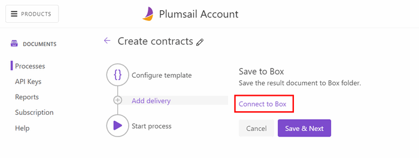
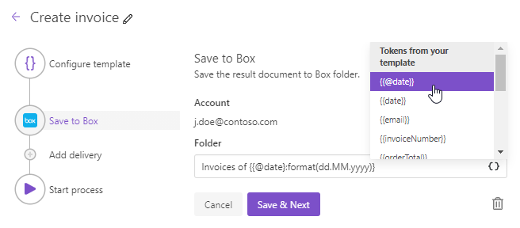

Box delivery
============

Box delivery saves a document generated by your process to a Box folder. 

After you select a Box delivery, you'll be asked to connect to your Box account. Click 'Connect to Box' to proceed:

You'll see an authorization window asking to log in and grant access to Box.

Once you're authorized, specify a Box folder name where you'd like to store documents generated by this process:

Use tokens in folder name
-------------------------

.. include:: ../tokens-description-part.rst

.. note:: Review `the full list of available deliveries <../create-delivery.html#list-of-deliveries>`_.