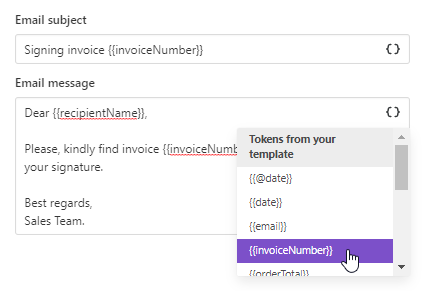
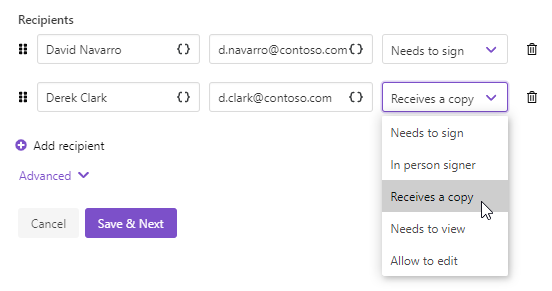
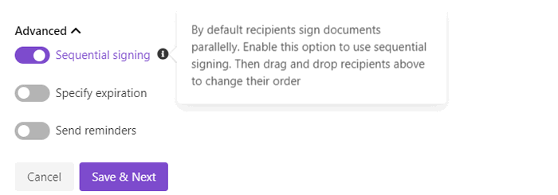
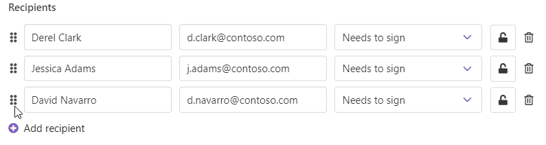

DocuSign delivery
=================

The `DocuSign <https://www.docusign.com/>`_ delivery sends the resulting document to DocuSign for signing. 

First of all, you need to connect to your DocuSign account from the Plumsail account. 

.. image:: ../../../_static/img/user-guide/processes/connect-docusign.png
    :alt: connect to DocuSign

At this step, you can select an environment - either **Sandbox** or **Production**. Sandbox environment allows you to test sending documents for signature without being charged, but documents won't be valid. Make sure you have a DocuSign demo account (it's also called a developer account) to be able to connect to DocuSign Sandbox. Otherwise, select Production.

After you connected, you can customize the DocuSign delivery settings. 

**Fill in email subject and body**:

**Add recipients** - as many as you need. Assign roles to them:

Advanced settings
-----------------

Expand **Advanced** to customize more settings:

Here you can switch on **Sequential signing**, then just drag and drop recipients to define an order in which they should sign the document.

And you can set the expiration period and sending reminders. 

Use tokens inside email subject and body
----------------------------------------

.. include:: ../tokens-description-part.rst

.. note:: Review `the full list of available deliveries <../create-delivery.html#list-of-deliveries>`_.