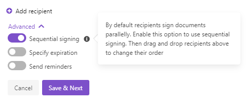
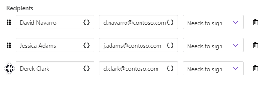
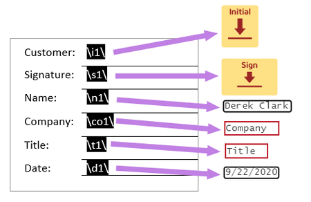

DocuSign delivery
=================

The `DocuSign <https://www.docusign.com/>`_ delivery sends the resulting document to DocuSign for signing. 

First of all, you need to connect to your DocuSign account from the Plumsail account. 

.. image:: ../../../_static/img/user-guide/processes/connect-docusign.png
    :alt: connect to DocuSign

At this step, you can select an environment - either **Sandbox** or **Production**. Sandbox environment allows you to test sending documents for signature without being charged, but documents won't be valid. Make sure you have a DocuSign demo account (it's also called a developer account) to be able to connect to DocuSign Sandbox. Otherwise, select Production.

After you connected, you can customize the DocuSign delivery settings. 

.. contents::
    :local:
    :depth: 1

Main settings
--------------

**Fill in email subject and body**:

.. image:: ../../../_static/img/user-guide/processes/docusign-email.png
    :alt: fill in email subject and body

**Add recipients** - as many as you need. Assign roles to them:

Sequential signing and other advanced settings
----------------------------------------------

Expand **Advanced** to customize more settings:

Here you can switch on **Sequential signing**, then just drag and drop recipients to define an order in which they should sign the document.

And you can set the expiration period and sending reminders. 

Use signature and other related tags
------------------------------------

DocuSign integration for Plumsail Documents enables you to place anchor text in a document template to define location of e-signatures and other associated information like initials, date signed for a particular signer.

It works this way:

- you insert anchor text (tags) into a document template;
- you change its text color to white or the background color to make anchor text invisible for viewers;
- each signer, when receiving the document, will see fields requiring to sign and complete.

Supported tags:

.. list-table::
    :header-rows: 1

    *   - Tag type
        - Signer 1
        - Signer 2
        - Signer 3
        - Signer 4
        - Signer 5
    *   - Signature
        - \\s1\\
        - \\s2\\
        - \\s3\\
        - \\s4\\
        - \\s5\\  
    *   - Initial
        - \\i1\\
        - \\i2\\ 
        - \\i3\\ 
        - \\i4\\ 
        - \\i5\\
    *   - Name
        - \\n1\\
        - \\n2\\
        - \\n3\\
        - \\n4\\
        - \\n5\\
    *   - Company
        - \\co1\\
        - \\co2\\
        - \\co3\\
        - \\co4\\
        - \\co5\\
    *   - Title
        - \\t1\\ 
        - \\t2\\ 
        - \\t3\\ 
        - \\t4\\ 
        - \\t5\\ 
    *   - Date signed
        - \\d1\\ 
        - \\d2\\ 
        - \\d3\\ 
        - \\d4\\ 
        - \\d5\\ 

See how the tags will appear in the document for signers. The name and date signed are auto-filled.

Specify recipients dynamically based on your data
-------------------------------------------------

You may want to set recipients dynamically for each document. In this case, you can use tokens inside the Email field. Data passed to the process will define who will receive the document.

.. image:: ../../../_static/img/user-guide/processes/email-token-docusign.png
    :alt: tokens inside DocuSign recipients

The token can contain not only one email address but the list of them comma- or semicolon-separated. Like this:

.. code:: json
    
    {
        "emails": "Derek Clark <d.clark@contoso.com>; Jessica Adams <j.adams@contoso.com>"
    }

Mind that if you put the list of recipients into the single field, the information you typed in the Name field will be skipped.

You can specify recipient names in the list by placing names before the email address. 

Or you can omit that, and the email address will be displayed as a recipient name.

In case Sequential signing is enabled, the order in which recipients receive the document will be the same as in the list.

Use tokens inside email subject and body
----------------------------------------

.. include:: ../tokens-description-part.rst

.. note:: Review `the full list of available deliveries <../create-delivery.html#list-of-deliveries>`_.