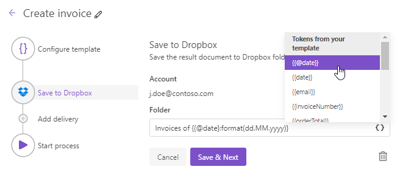

Dropbox delivery
================

The Dropbox delivery saves a file generated by your process in a Dropbox folder. First, you need to connect to Dropbox:

Then fill out the folder name where you'd like to save the generated document:

.. _use-tockens:

Use tokens in folder name
-------------------------

.. include:: ../tokens-description-part.rst

.. note:: Review `the full list of available deliveries <../create-delivery.html#list-of-deliveries>`_.
