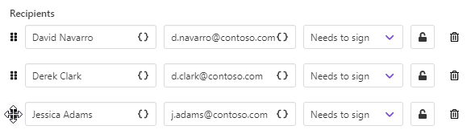
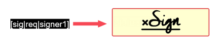

eversign delivery
=================

The `eversign <https://eversign.com/>`_ delivery sends the resulting document to eversign for signing.

To start with, you need to log in to your eversign account from the Plumsail account and authorize Plumsail Documents to access it.

.. image:: ../../../_static/img/user-guide/processes/connect-eversign.png
    :alt: connect to eversign

After that, you'll be able to customize the eversign delivery.

.. contents::
    :local:
    :depth: 1

Main settings
--------------

**Select the business** from the dropdown:

**Fill in email subject and body**:

.. image:: ../../../_static/img/user-guide/processes/eversign-email.png
    :alt: fill in email subject and body

**Add recipients** - as many as you need. They could have :code:`Needs to sign` and :code:`Receives a copy` roles:

.. image:: ../../../_static/img/user-guide/processes/eversign-roles.png
    :alt: roles of recipients in eversign delivery

In the screenshot above, you may see lock buttons. One is green, which means it's activated. Another is off.

.. image:: ../../../_static/img/user-guide/processes/locks.png
    :alt: locks to set signer PINs

Clicking on the lock, you can **set a signer PIN**. Signer PINs provide you with extra signer authentication and security. 

.. image:: ../../../_static/img/user-guide/processes/signer-pin.png
    :alt: apply signer PINs

Use tokens to specify recipients
--------------------------------

You may want to set recipients dynamically for each document. In this case, you can use tokens inside the Email field. Data passed to the process will define who will receive the document.

.. image:: ../../../_static/img/user-guide/processes/email-token-eversign.png
    :alt: tokens inside eversign recipients

The token can contain not only one email address but the list of them comma- or semicolon-separated. Like this:

.. code:: json
    
    {
        "emails": "Derek Clark <d.clark@contoso.com>; Jessica Adams <j.adams@contoso.com>"
    }

Mind that if you put the list of recipients into the single field, the information you typed in the Name field will be skipped.

You can specify recipient names in the list by placing names before the email address. 

.. image:: ../../../_static/img/user-guide/processes/name-before-email.png
    :alt: name before email

Or you can omit that, and the email address will be displayed as a recipient name.

In case Sequential signing is enabled, the order in which recipients receive the document will be the same as in the list.

Sequential signing and other advanced settings
----------------------------------------------

Expand **Advanced** to customize more settings.

.. image:: ../../../_static/img/user-guide/processes/advanced-eversign-settings.png
    :alt: advanced eversign settings

- Here you can switch on **Sequential signing**, then just drag and drop recipients to define an order in which they should sign the document:

- Enable **Require all signers to sign** to complete the document. If this option is on, all signers must sign the document in order to complete it. If at least one of them declines to sign, this document will be canceled.

- One more significant option here is to enable **Sandbox eversign mode**. With Sandbox on, you won't be charged, and signed documents won't be valid. They will have a tag :code:`[test-only-not-binding]`. Use this mode for testing purposes.

Use signature and other related tags
------------------------------------

eversign integration for Plumsail Documents offers you to use special tags to specify the location of e-signature and other related fields. 
As a result, a particular signer will see field indicators where he/she should place a signature and what fields he/she is required to complete.

Such tags are text elements wrapped in :code:`[squire brackets]` including a series of options in a specific order, divided by :code:`|` symbols. 
It's a good idea to change its color to white or the background color of the document for viewers not to see the tags. 

It's possible to specify up to 9 options.

.. list-table::
    :widths: 20 80
    :header-rows: 1

    *   - Name
        - Description
    *   - Field type
        - Available field types are :code:`sig` for Signature; :code:`init` for Initials; :code:`text` for Text; :code:`date` for Date signed; :code:`check` for Checkbox field.
    *   - Required / Non-Required
        - :code:`req` for Required and :code:`nonreq` for Non-Required.
    *   - Signer Number
        - :code:`signerX` with :code:`X` being the number of the signer this field is for.
    *   - Field Label
        - This is to display placeholders for text fields (for example, :code:`Name`)
    *   - Field identifier
        - Example: :code:`signature_2`.
    *   - Prefill Field Value
        - This value will auto-fill the field.
    *   - Field Width Override
        - By default, the field width is the same as the tag's. It's possible to override it by specifying width in pixels like :code:`125`.
    *   - Field Height Override
        - By default, the field height is the same as the tag's. It's possible to override it by specifying height in pixels like :code:`50`.
    *   - Field Validation
        - There are three types of validation: :code:`letters_only`, :code:`numbers_only`, :code:`email_address`. They are quite self-explanatory.

The most simple example is :code:`[sig|req|signer1]`, where sig means signature, req - required, signer1 - the first signer.

Here is how it appears for the signer:

You can construct more complex tags with prefilled information on the signer name, title, date signed, and other. Or you can even apply validation to your fields. 

Please, find `more examples and explanations in the eversign documentation <https://eversign.com/api/documentation/hidden-tags>`_.

Use tokens inside email subject and body
----------------------------------------

.. include:: ../tokens-description-part.rst

.. note:: Review `the full list of available deliveries <../create-delivery.html#list-of-deliveries>`_.