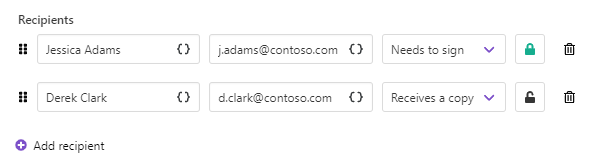
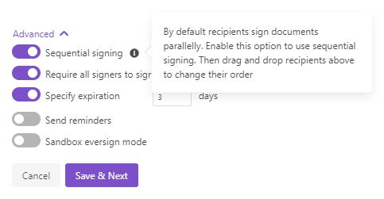

eversign delivery
=================

The `eversign <https://eversign.com/>`_ delivery sends the resulting document to eversign for signing.

To start with, you need to log in to your eversign account from the Plumsail account and authorize Plumsail Documents to access it.

.. image:: ../../../_static/img/user-guide/processes/connect-eversign.png
    :alt: connect to eversign

After that, you'll be able to customize the eversign delivery.

**Select the business** from the dropdown:

.. image:: ../../../_static/img/user-guide/processes/select-eversign-business.png
    :alt: select eversign business

**Fill in email subject and body**:

.. image:: ../../../_static/img/user-guide/processes/eversign-email.png
    :alt: fill in email subject and body

**Add recipients** - as many as you need. They could have :code:`Needs to sign` and :code:`Receives a copy` roles:

In the screenshot above, you may see lock buttons. One is green, which means it's activated. Another is off.

Clicking on the lock, you can **set a signer PIN**. Signer PINs provide you with extra signer authentication and security. 

Expand **Advanced** to customize more settings.

Use tokens inside email subject and body
----------------------------------------

.. include:: ../tokens-description-part.rst

.. note:: Review `the full list of available deliveries <../create-delivery.html#list-of-deliveries>`_.