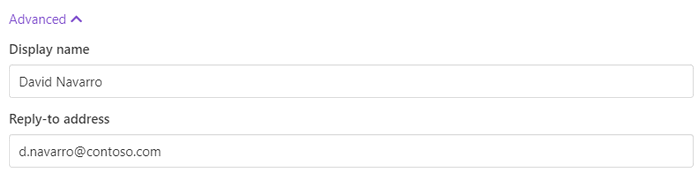

Gmail delivery
==============

The Gmail delivery sends the document generated by your process as a Gmail attachment. 
Before customizing the Gmail delivery settings, you need to connect to your Gmail account from the Plumsail account.
For that, click Connect Gmail. 

Once you're connected, you will see the Gmail delivery settings:

Just fill the **To**, **Subject**, and **Body** fields of delivery as you do in any email client. You can specify **Cc** and **Bcc** if need be.

Expand **Advanced** to set:

- **Display name**. The name which recipients see when receiving emails. Default is Plumsail Documents Delivery. You can define your custom Display name.
- **Reply-to**. The default is the currently logged-in user's email. It's possible to change it. 

Use tokens to specify recipients
--------------------------------

You can either manually specify the email address of recipients:

.. image:: ../../../_static/img/user-guide/processes/process-email-manually.png
    :alt: Email

OR enter the email address as a token if the token exists in the source template. 

.. image:: ../../../_static/img/user-guide/processes/process-email-token.png
    :alt: Email token

The token may contain several comma-separated addresses: 

.. code:: json

    {
      "email": "john.smith@contoso.com, adam.allman@contoso.com"
    }

Use tokens in email subject and body
------------------------------------

.. include:: ../tokens-description-part.rst

.. note:: Review `the full list of available deliveries <../create-delivery.html#list-of-deliveries>`_.
