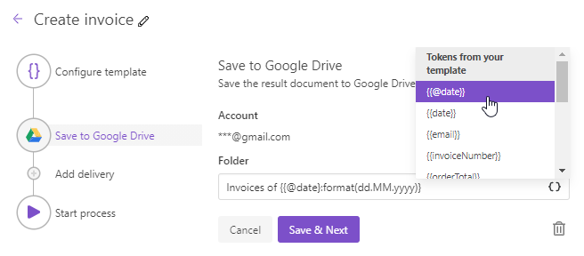

Google Drive delivery
=====================

The Google Drive delivery saves a file generated by your process in a Google Drive folder. First, you need to connect to your Google account:

Then fill out the folder name where you'd like to save the generated document:

.. _use-tockens:

Use tokens in folder name
-------------------------

.. include:: ../tokens-description-part.rst

.. note:: Review `the full list of available deliveries <../create-delivery.html#list-of-deliveries>`_.