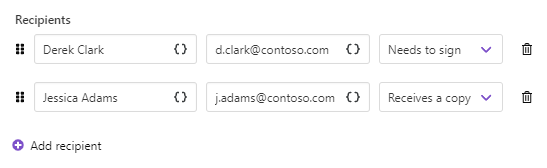
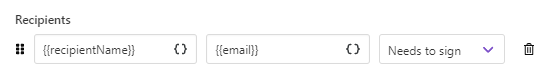

HelloSign delivery
==================

The `HelloSign <https://www.hellosign.com/>`_ delivery sends resulting documents to HelloSign for e-signatures.

To set a connection between your HelloSign and Plumsail accounts, you need to provide an API key to the HelloSign delivery:

You can create such an API key in your HelloSign account. Select *Integrations* in the left menu, then select *API* in the top menu of this section.
And there, you'll be able to create a HelloSign API key. 

Copy and paste it to the HelloSign delivery in the Plumsail account. 

After that, you can start specifying the delivery settings.

.. contents::
    :local:
    :depth: 1

Main settings
--------------

**Define the title** of the document. This title will be used inside the HelloSign account. So, it's a good idea to add something recognizable to it. 
For example, the company name you're signing a contract.

**Add a message for signers**. They will see this message when receiving the signature request email. 

**Add recipients** - as many as you need. They could have :code:`Needs to sign` and :code:`Receives a copy` roles:

Sequential signing and other advanced settings
----------------------------------------------

Expand **Advanced** to customize additional settings.

- Switch on **Sequential signing**. Then just drag and drop recipients to define an order in which they should sign the document:

.. image:: ../../../_static/img/user-guide/processes/docusign-sequental.gif
    :alt: drag and drop recipients to change the sequence of signing

- Enable **Text tags** if you're going to use special HelloSign signature tags. `See the information about them further on this page <./hellosign.html#use-signature-and-other-related-tags>`_.

- Enable HelloSign **Test mode** to test the delivery; to see how the document will appear for signers. You won't spend your HelloSign credits. 

Use signature and other related tags
------------------------------------

It's possible to specify the location of the e-signature and other related fields in the document. 
For that, you can use special text tags. 

They are a series of options and identifiers divided by the pipe symbol and wrapped in squire brackets. 

The most simple example to understand how they work is :code:`[sig|req|signer1]`.

This is how such a tag appears for signers:

The first option :code:`sig` set the field type to the signature. :code:`req` means the field is required, :code:`signer1` means the field will be shown only for the first signer.

Following this logic, you can add other types of fields:

.. list-table::
    :widths: 20 80
    :header-rows: 1
    
    
    *   - Text tag value
        - Field type
    *   - text
        - Text field
    *   - check
        - Checkbox field
    *   - date
        - Date field
    *   - initial
        - Signer's initial field
    *   - sig
        - Signer's signature field

Find more information on HelloSign text tags in `the HelloSign documentation <https://faq.hellosign.com/hc/en-us/articles/360021976991-How-to-use-Hellosign-Text-Tags-in-Salesforce>`_.

Specify recipients dynamically based on your data
-------------------------------------------------

You may want to set recipients dynamically for each document. In this case, you can use tokens inside the Email field. Data passed to the process will define who will receive the document.

The token can contain not only one email address but the list of them comma- or semicolon-separated. Like this:

.. code:: json
    
    {
        "emails": "Derek Clark <d.clark@contoso.com>; Jessica Adams <j.adams@contoso.com>"
    }

Mind that if you put the list of recipients into the single field, the information you typed in the Name field will be skipped.

You can specify recipient names in the list by placing names before the email address. 

.. image:: ../../../_static/img/user-guide/processes/name-before-email.png
    :alt: name before email

Or you can omit that, and the email address will be displayed as a recipient name.

In case Sequential signing is enabled, the order in which recipients receive the document will be the same as in the list.

Use template tokens inside delivery
-----------------------------------

.. include:: ../tokens-description-part.rst

.. note:: Review `the full list of available deliveries <../create-delivery.html#list-of-deliveries>`_.
