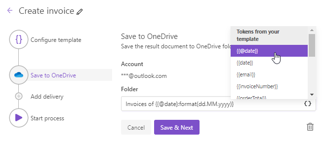

OneDrive delivery
=================

The OneDrive delivery saves a file generated by your process in a OneDrive folder. First, you need to connect to OneDrive:

Then fill in fields:

.. _use-tockens:

Use tokens in folder path and filename
--------------------------------------

.. include:: ../tokens-description-part.rst

.. note:: Review `the full list of available deliveries <../create-delivery.html#list-of-deliveries>`_.
