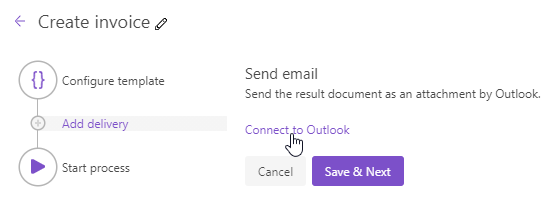

Outlook delivery
==============

The Outlook delivery will send the document generated by your process as an attachment using your Microsoft Outlook account. 
First, you need to connect to your Outlook account from the Plumsail account.
For that, click **Connect to Outlook** and provide your credentials. 

.. Note:: 
  You can connect to a personal Outlook account as well as to Outlook for business account.
  Please note that depending on the permissions policies in your company's Microsoft 365 tenant you might require admin approval to grant access to our app. 

Once you're connected, you will see the Outlook delivery settings:

Just fill the **To**, **Subject**, and **Body** fields of delivery as you do in any email client. 
You can specify **Cc** and **Bcc** if need be.

Expand **Advanced** to set:

- **Display name**. The name which recipients see when receiving emails. Default is your username from the connected Outlook account. If needed, you can change it.
- **Reply-to**. The default is the currently connected Outlook address. You also can replace it with another email address. 

.. image:: ../../../_static/img/user-guide/processes/advanced-email-settings.png
    :alt: Advanced Outlook delivery settings

Use tokens to specify recipients
--------------------------------

You can either manually specify the email address of recipients:

.. image:: ../../../_static/img/user-guide/processes/process-email-manually.png
    :alt: Email

OR enter the email address as a token if the token exists in the source template. 

.. image:: ../../../_static/img/user-guide/processes/process-email-token.png
    :alt: Email token

The token may contain several comma-separated addresses: 

.. code:: json

    {
      "email": "john.smith@contoso.com, adam.allman@contoso.com"
    }

Use tokens in email subject and body
------------------------------------

.. include:: ../tokens-description-part.rst

.. note:: Review `the full list of available deliveries <../create-delivery.html#list-of-deliveries>`_.
