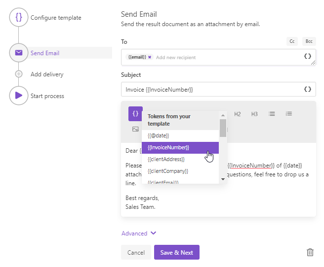

Email delivery
==============

The Email delivery sends a file generated by your process as an email attachment. This is how the email delivery step looks:

Just fill **To**, **Subject**, and **Body** fields of delivery as you do in any email client. You can specify **Cc** and **Bcc** if need be.

Expand **Advanced** to set:

- **Display name**. The name which recipients see when receiving emails. Default is Plumsail Documents Delivery. You can define your custom Display name.
- **Reply-to**. The default is the currently logged-in user's email. It's possible to change it. 

.. image:: ../../../_static/img/user-guide/processes/advanced-email-settings.png
    :alt: Advanced email delivery settings

Use tokens inside email
-----------------------

.. include:: ../tokens-description-part.rst

.. note:: Review `the full list of available deliveries <../create-delivery.html#list-of-deliveries>`_.