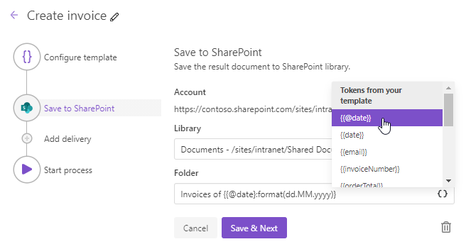

SharePoint delivery
===================

The SharePoint delivery saves a file generated by your process in a SharePoint library. First, you need to connect to SharePont:

.. image:: ../../../_static/img/user-guide/processes/connect-sp.png
    :alt: Connect to SharePoint

Then fill in fields:

.. _use-tockens:

Use tokens in filename
----------------------

.. include:: ../tokens-description-part.rst

.. note:: Review `the full list of available deliveries <../create-delivery.html#list-of-deliveries>`_.
