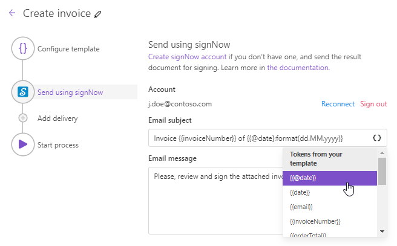
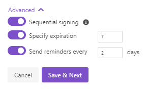
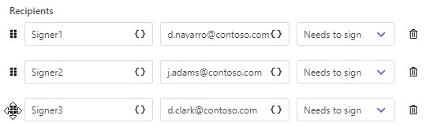
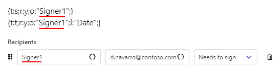

signNow delivery
================

The signNow delivery sends generated documents to `signNow <https://www.signnow.com/?utm_source=plumsail&utm_medium=cpa&utm_campaign=main&utm_content=ad1>`_ for electronic signing. 

Once you've added the signNow delivery to your process, you'll be asked to connect to your signNow account and grant Plumsail Documents access to it:

.. image:: ../../../_static/img/user-guide/processes/connect-signnow.png
    :alt: connect to signNow account

After that, you'll see the signNow delivery settings. How to customize them, learn from this instruction. 

.. contents::
    :local:
    :depth: 1

Main settings
~~~~~~~~~~~~~

**Fill in the email subject and body**. You can use tokens from the document template inside these fields to personalize them. 

**Add as many recipients as you need**. Specify their roles, email addresses, and assign actions they're required to complete - either *Needs to sign* or *Receives a copy*:

Sequential signing and other advanced settings
~~~~~~~~~~~~~~~~~~~~~~~~~~~~~~~~~~~~~~~~~~~~~~

If you expand **Advanced**, you'll see a few settings you can optionally enable. 

If you enable **Sequential signing**, it means that recipients will receive and sign the document in a strict order - as they go one after another in your list above.
You can change the sequence of signing by simply dragging and dropping recipients:

Also, you can specify:

- the expiration period;
- sending reminders.

.. important:: Your document template must have `signNow text tags <#use-signature-and-other-related-tags-aka-signnow-text-tags>`_ to be successfully sent to signNow for signing. 

Use signature and other related tags (aka signNow text tags)
~~~~~~~~~~~~~~~~~~~~~~~~~~~~~~~~~~~~~~~~~~~~~~~~~~~~~~~~~~~~

SignNow text tags are special combinations of symbols that preset the location, type, size, and other settings of such fields as Signature, Initials, Date, and more. 

You need to add signNow text tags to the document template before uploading the document to signNow, which means before starting the process that triggers the signNow delivery.

Let's review a couple of the most common examples of text tags:

1. :code:`{t:s;r:y;o:"Signer1";}` - a text tag for a required signature field.
2. :code:`{t:t;r:y;o:"Signer1";l:"Date";}` - a text tag for a required date field. 

Both are for the signer having the role 'Signer1'. This is how the tags will appear for him/her:

Now, let's see what we have inside these text tags:

    **t** stands for **Type**, s means Signature, t means Text.

    **r** stands for **Required**, y means Yes, the field is required.

    **o** stands for **Role**, "Signer1" means the fields are meant for the first signer.

    **l** stands for **Label**, "Date".

.. important:: signNow text tags should have roles and this role must be exactly the same as you indicated in the signNow delivery. 

Consider more options:

.. list-table::
    
    *   - t
        - TYPE of the field
        - s (for signature)
          
          i (for initials)
          
          t (for text)
          
          d (for dropdown)
          
          c (for checkboxes) 
        - For every field
    *   - r
        - REQUIRED
        - y (for required)
        
          n (for optional)
        - For every field
    *   - o
        - ROLE
        - " "
        - For every field
    *   - l
        - LABEL
        - " "
        - For every field
    *   - dd
        - DROPDOWN
        - "option1, option2, option2, ...."
        - Only for Drop down fields
    *   - f
        - FILE
        - " ".pdf"
        - File attachment
    *   - w
        - WIDTH
        - w (width)
        - For every field
    *   - h
        - HEIGHT
        - h (height)
        - For every field
    *   - v
        - VALIDATOR_ID
        - v (validator_id)
        - Only for Text field

.. note:: We recommend you enclose signNow text tags in single curly brackets - :code:`{ }` - instead of double ones to avoid any conflicts with Plumsail Documents tokens.

Find more detailed explanations and more examples in the `signNow documentation article <https://help.signnow.com/docs/how-to-generate-text-tags-on-a-document/?utm_source=plumsail&utm_medium=cpa&utm_campaign=main&utm_content=ad1>`_.

Specify recipients dynamically based on your data
~~~~~~~~~~~~~~~~~~~~~~~~~~~~~~~~~~~~~~~~~~~~~~~~~

You may want to set recipients dynamically for each document. In this case, you can use tokens inside the Email field. Data passed to the process will define who will receive the document.

.. image:: ../../../_static/img/user-guide/processes/email-token-docusign.png
    :alt: tokens inside eversign recipients

The token can contain not only one email address but the list of them comma- or semicolon-separated. Like this:

.. code:: json
    
    {
        "emails": "Signer1 <d.clark@contoso.com>; Signer2 <j.adams@contoso.com>"
    }

Mind that if you put the list of recipients into the single field, the information you typed in the Role field will be skipped.

You need to specify recipient roles by placing them before the email address. 

In case Sequential signing is enabled, the order in which recipients receive the document will be the same as in the list.

Use tokens inside email subject and body
~~~~~~~~~~~~~~~~~~~~~~~~~~~~~~~~~~~~~~~~

.. include:: ../tokens-description-part.rst

.. note:: Review `the full list of available deliveries <../create-delivery.html#list-of-deliveries>`_.